# Characteristics of Living Organisms

### 1.1

### MRS. H. GREN

- they require nutrition
  - Living organisms need nutrients to provide them with energy and raw materials for growth and repair
  - nutrients include things like:
    - protein
    - fats
    - carbohydrates
    - vitamins
    - minerals
- they respire
  - Organisms release energy from their food by process called respiration
- they excrete their waste
  - waste product such as carbon dioxide and urine have to be removed
  - removal of waste is called excretion
- they respond to their surroundings
  - living organisms can react to changes in their surroundings
- they move
  - organisms move towards things like water and food, and away from things like predators and poisons
  - even plants can move a bit
- they control their internal conditions
  - internal conditions include temperature and water content
  - homeostasis
- they reproduce
  - Organisms have to produce offspring (children) in order for their species to survive
- they grow and develop
  - even smallest organisms have to grow and develop into their adult form

# Variety of Living Organisms

### 1.2 common features shown by eukaryotic organisms: plants, animals, fungi and protoctists

#### Def:
- Eukaryotic cells - complex (include all animal and plant cells)
- prokaryotic cells - smaller and simpler (bacteria cells)

| | Prokaryotes | Eukaryotes |
| -- | -- | --|
| Type of cell | Always unicellular | Unicellular and multi-cellular |
| Nucleus | Absent | Present |
|Mitochondria| Absent | Present|
| Reproduction | Asexual | Both asexual and sexual |

- Plants:
  - multi-cellular organisms
  - their cells contain chloroplasts and are able
    to carry out photosynthesis
  - cells have cellulose cell walls
  - store carbohydrates as starch or sucrose
  - ex. flowering plants - cereal (ex. maize), and herbaceous legume (peas or beans)

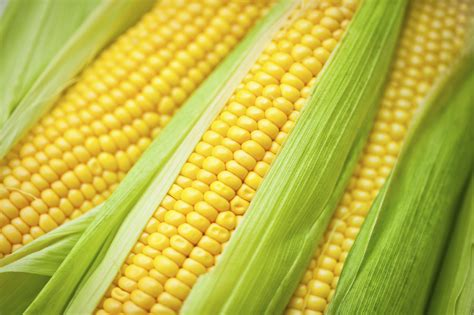

- Animals
  - multi-cellular organisms
  - cells do not contain chloroplasts and are not able to carry out photosynthesis
  - have no cell walls
  - usually have nervous co-ordination and are able to move from one place to another
  - often store carbohydrate as glycogen
  - Ex. mammals (ex. humans), insects (ex. mosquito)

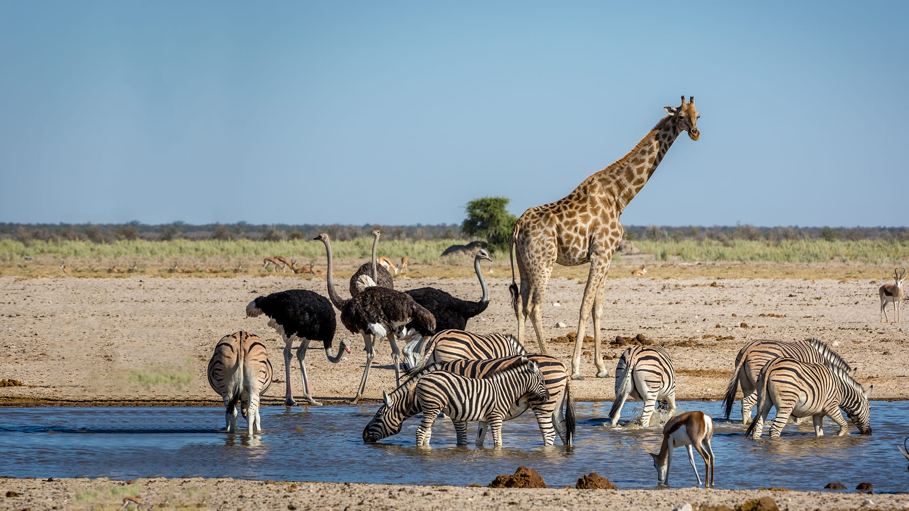

- Fungi:
  - organisms that are not able to carry out photosynthesis
  - body is usually organized into a mycelium made from thread-like structures called hyphae
    which contain many nuclei
  - some are single-celled
  - their cells have walls made of chitin
  - feed by extracellular secretion of digestive enzymes onto food material and absorption of the organic products
    - this is known as saprotrophic
    nutrition
  - may store carbohydrate as glycogen
  - ex. Mucor (has the typical fungal hyphal structure), yeast(single-celled)

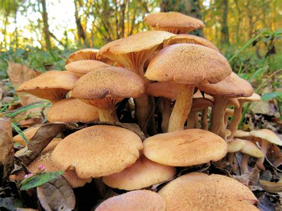

- Protoctists:
  - microscopic single-celled organisms
  - some like Amoeba have features like an animal cell
  - others like Chlorella have chloroplasts and are more like plants
  - Pathogenic ex. Plasmodium (responsible for causing malaria)

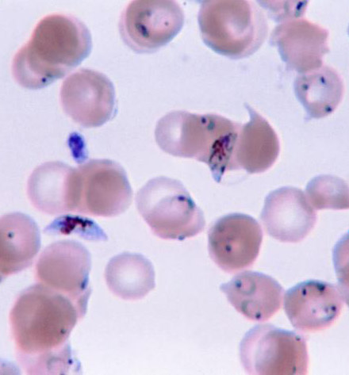

### 1.3 common features shown by prokaryotic organisms such as bacteria

- Bacteria:
  - microscopic single-celled organisms
  - have a cell wall, cell membrane, cytoplasm and plasmids
  - lack a nucleus but contain a circular chromosome of DNA
  - some bacteria can carry out photosynthesis but most feed off other living or dead organisms
  - Ex. Lactobacillus Bulgaricus (rod-shaped bacterium used in the production of yoghurt from milk), Pneumococcus (spherical bacterium that acts as the pathogen causing pneumonia)

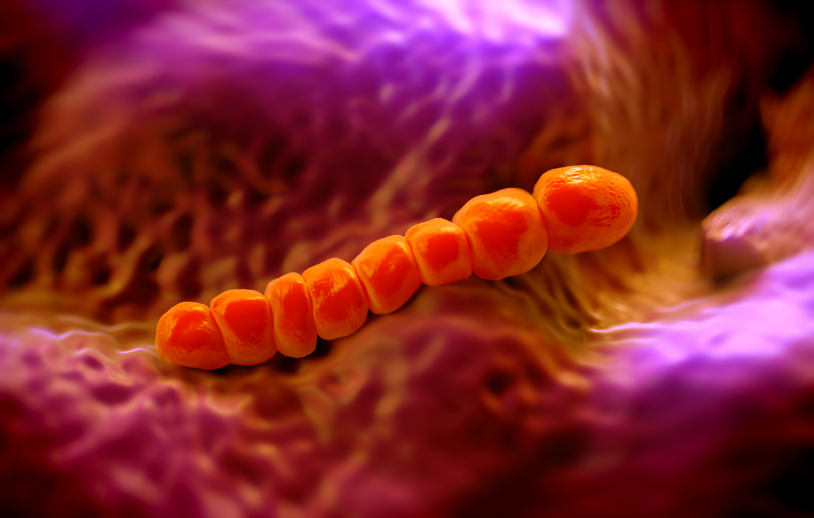

### 1.4.a pathogen may include fungi, bacteria, protoctists or viruses

#### Def:
- Pathogens: agent that cause disease

### 1.4.b Understand the term pathogen and know that pathogens may include fungi, bacteria protoctists or viruses

- Viruses:
  - not living organisms
  - small particles, smaller than bacteria
  - parasitic and can reproduce only inside living cells
  - infect every type of living organism
  - wide variety of shapes and size
  - no cellular structure but have a protein coat and contain one type of nucleic acid, either DNA or RNA
  - ex.
    - tobacco mosaic (virus that causes discoloring of the leaves of tobacco plants by preventing the formation of chloroplasts)
    - influenza virus (causes ‘flu’)
    - HIV (virus that causes AIDS)

# Levels of Organization

### 2.1 levels of organization in organisms: organelles, cells, tissues, organs and systems

- Similar cells are organized into tissue
  - tissue is a group of similar cells that work together to carry out a particular function
  - ex. plants have xylem tissue for transporting water and mineral salts
  - tissue can contain more than one cell type
- Tissues are organized into organs
  - Organ is a group of different tissues that work together to perform a function
  - ex. lungs in animals, leaves on plants
- organs make up organ systems
  - organs work together to form organ systems
  - each system does a different job
  - ex. mammals have a digestive system
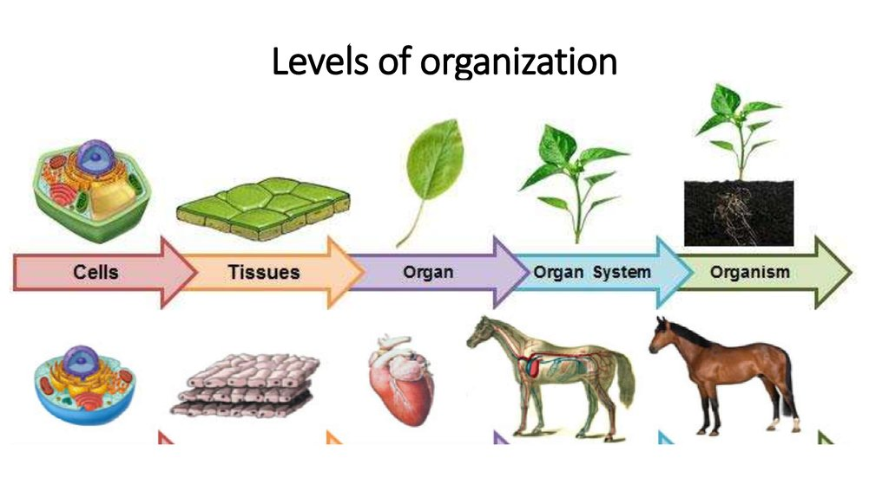

# Cell Structure

### 2.2 cell structures, including the nucleus, cytoplasm, cell membrane, cell wall,mitochondria, chloroplasts, ribosomes and vacuole
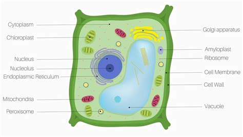
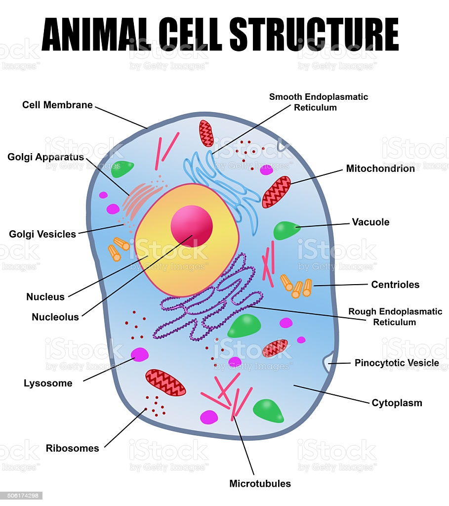

### 2.3 functions of the nucleus, cytoplasm, cell membrane, cell wall, mitochondria, chloroplasts, ribosomes and vacuole

* nucleus - carries DNA, controls the whole cell
* cytoplasm - cells are embedded, control metabolic activity
* cell membrane - partially permeable, control what goes in and out
* mitochondria - aerobic respiration
* ribosomes - small organelles here proteins are made in the cell, protein synthesis
* chloroplast - photosynthesis
* vacuole - carries water (large in plants)
* cell wall: rigid structure made of cellulose which surrounds the cell membrane
  * supports the cell and strengthens it

### 2.4 similarities and differences in the structure of plant and animal cells

- Only plant cells contain:
  - Cell Wall
  - central vacuole
  - chloroplast
Animal cells have:
  - small vacuoles
  - no cellulose
  - no chloroplasts

### 2.5B importance of cell differentiation in the development of specialized cells

- most cells don't look eactly alike as they are specialized to carry out particular function
- so structures can vary
- ex. mammal red blood cells (erythrocytes) are specialized for carrying oxygen and do not contain nucleus nor mitochondria

#### Embryonic stem cells can turn into any type of cell:
- cell differentiation is process where cell changes to become specialized for its job
- they develop different organelles and turn into different types of cells to carry out specific functions
- undifferentiated cells are called stem cells
  - can divide to produce lots more undifferentiated cells
  - can differentiate into different types of cells, depending on what instructions are given
- Stem cells are found in early human embryos
  - all types of cell found in human being have to come from those few cells in the embryo
- adults also have stem cells, but only in certain places
  - ex. bone marrow (can't turn into any cell type at all, only certain ones such as blood cells)

### 2.6B the advantages and disadvantages of using stem cells in medicine

- Stem cells from embryos and bone marrow can be grown in lab to produce clones and made to differentiate into specialized cells to use in medicine or research
  - ex. stem cell transferred from the bone marrow of a healthy person can replace faulty blood cells in patients who receive them
- Embryonic stem cells can be used to replace faulty cells in sick people
  - ex. insulin-producing cells for people with diabetes
  - ex. nerve cells for paralyzed people
- Risks:
  - stem cells grown in lab may be contaminated with virus that cold be passed on to the patient
- Opinions against stem research:
  - use of human embryos could be seen as potential human life, so people might oppose it
  - but most embryos used in research are usually unwanted ones from fertility clinics which would be destroyed if not used for research

# Biological Molecules

### 2.7 chemical elements present in carbohydrates, proteins and lipids (fats and oils)

- Lipids:
  - carbon
  - hydrogen
  - oxygen
- Carbohydrates:
  - carbon
  - hydrogen
  - oxygen
- Proteins:
  - carbon
  - hydrogen
  - oxygen
  - nitrogen
  - sulfur

### 2.8 structure of carbohydrates, proteins and lipids as large molecules made up from smaller basic units: starch and glycogen from simple sugars, protein from amino acids, and lipid from fatty acids and glycerol

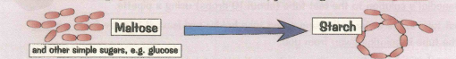

- Carbohydrates:
  - Start and glycogen (large, complex carbohydrates) are made up of smaller units
  - glucose, maltose, etc join together to make long chains

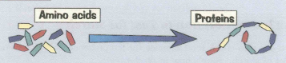

- Proteins:
  - long chain of amino acids

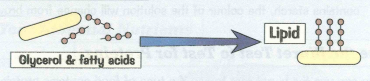

- Lipids
  - built from fatty acids and glycerol

### 2.9 practical: investigate food samples for the presence of glucose, starch, protein and fat

* Glucose - Benedict's solution
  - food sample of 5cm^3 in test tube
  - prepare water bath at 75C
  - Add Benedict's solution
  - Place test tube in water bath
  - wait 5 minutes
  - if the sample contains glucose, the color changes from blue to:
    - green or yellow at low concentrations of glucose
    - brick-red in high concentrations of glucose

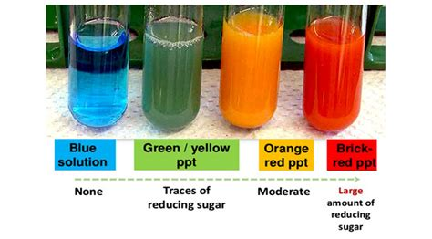

* starch - iodine solution:
  - food sample of 5cm^3 in a test tube
  - add drops of iodine solution and gently shake the tube to mix the contents
  - if the sample contains starch, color of solution change from browny-organe to:
    - black
    - blue-black

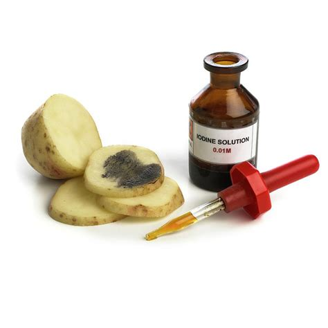

* Protein - Biuret reagent:
  - food sample of 2cm^3 in test tube
  - add 2cm^3 of biuret solution to the sample and mix the tube gently
  - if protein is present:
    solution change from blue to pink or purple

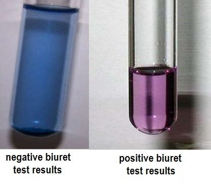

* lipids - ethanol:
  - shake it with ethanol
  - add it with water
  - if milky, lipid is present

### 2.10 role of enzymes as biological catalysts in metabolic reactions

- living things have thousands of different chemical reactions going on inside them all the time
- these reactions need to be carefully controlled
  - this gets the right amount of substances in cells
- animals can usually make a reaction happen more quickly by raising the temperature
- speed up useful reaction but also unwanted reactions too
  - but there's a limit to how far raising temperature can increase metabolic reactions until cells start getting damage
- living things produce enzymes that act as biological catalysts
- enzymes reduce the need for high temperatures and animals have enzymes to speed up useful metabolic reactions
- enzymes are all proteins and all proteins are made of amino acids
- Enzymes are very specific:
  - chemical reactions usually involves things either being split apart or joined together
  - substrate is a molecule that is changed in reaction
  - enzymes have active site - where a substrate joins on the enzyme
  - enzymes only speed up one reaction because for enzyme to work, a substrate has to be the correct shape to fit into the active site
    - called the 'lock and key' model

### 2.11 temperature changes can affect enzyme function, including changes to the shape of active site

- changing the temperature changes rate of enzyme-catalyzed reactions
- higher temperatures increase the rate at first
- when enzymes and substrates have more energy, they move more and are more likely to collide and form enzyme-substrate complexes
- But if it gets too hot, some of the bonds holding enzyme together break
  - changes the shape of the enzyme's active site so the substrate won't fit anymore
  - enzyme is denatures
- all enzymes have an optimum temperature they work best at

### 2.12 practical: investigate how enzyme activity can be affected by changes in temperature

### 2.13 enzyme function can be affected by changes in pH altering the active site

-if ph is too high or too low, it changes the shape of the active site and denatures the enzyme
- all enzymes have an optimum ph
  - often neutral ph of 7 but now always

### 2.14B practical: investigate how enzyme activity can be affected by changes in pH

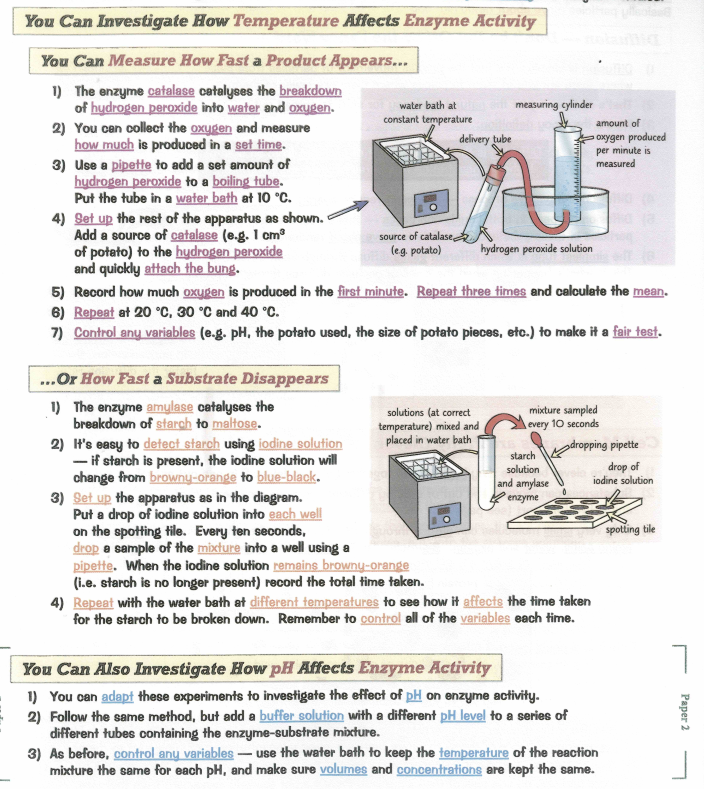

# Movement of Substances into and out of cells

### 2.15 processes of diffusion, osmosis and active transport by which substances move into and out of cells

- Diffusion
  - gradual movement of particles from high to low concentration
  - def. net movement of particles from an area of high concentration to area of low concentration
  - passive process, don't require energy
  - happens in liquids and gasses

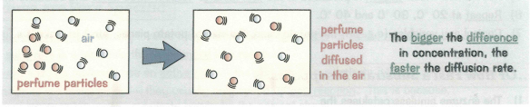

- osmosis
  - def. net movement of water molecules across a partially permeable membrane from a region of high water concentration to a region of lower water concentration
  - partially permeable membrane - very small holes that only tiny molecules can pass through and large molecules (ex. sucrose) cannot
  - cell membranes are partially permeable membrane
  - water molecules pass both ways through the membrane during osmosis
    - because water molecules move randomly all the time
  - sucrose solution get more dilute
  - water acts like it's trying to 'even up' the concentration on either side of the membrane

  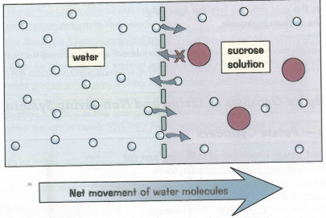

- active transport
  - def. movement of particles against a concentration gradient using energy released during respiration
  - used to move substances in and out of cells
  - ex. digestive system uses when there is low concentration of nutrients in the gut, but high concentration of nutrients in the blood
  - active transport allows nutrients to be taken into the blood, despite the fact that the concentration gradient is the wrong ways
    - essential to stop animals from starving
    - but it requires energy from respiration to make it work

### 2.16 factors affect the rate of movement of substances into and out of cells, including the effects of surface area to volume ratio, distance, temperature and concentration gradient

- Surface area to volume ration:
  - rate of diffusion, osmosis and active transport is higher in cells with large surface area to volume ratio
- Distance:
  - substances with only short distance to move will move in and out of cells faster
  - cell membranes are very thin
- Temperature:
  - warmer particles have more energy so they move faster
  - as temperature increases, cells move faster
- Concentration Gradient:
  - substances move in and out of a cell faster if there's a big difference in concentration between the inside and outside of the cell
  - only increases the rate of diffusion and osmosis
  - doesn't affect the rate of active transport

### 2.17 practical: investigate diffusion and osmosis using living and non-living systems

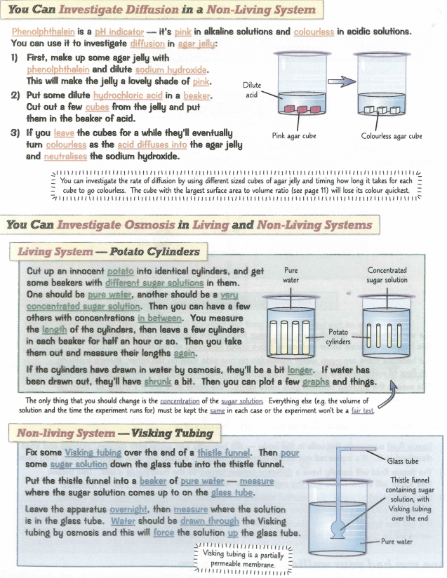
