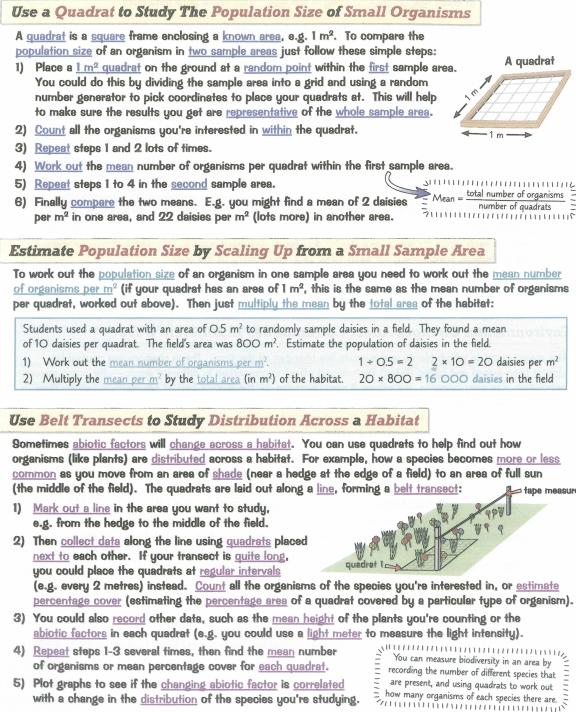
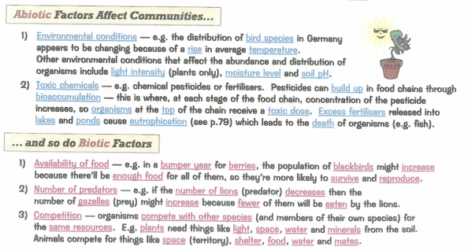
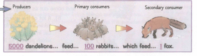
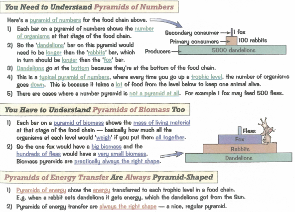
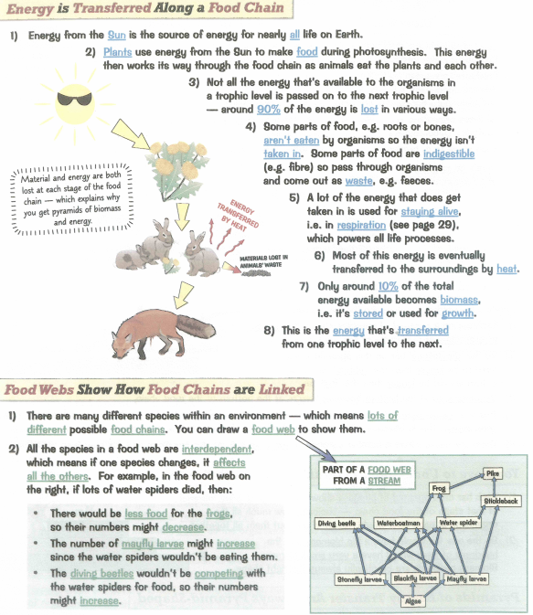
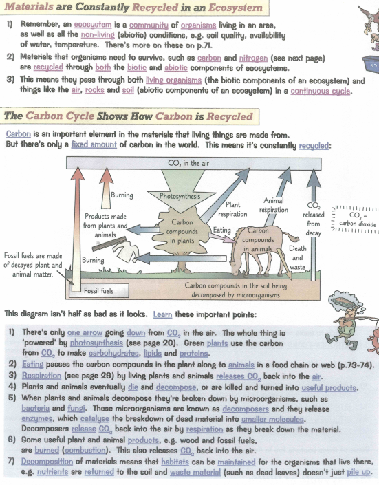
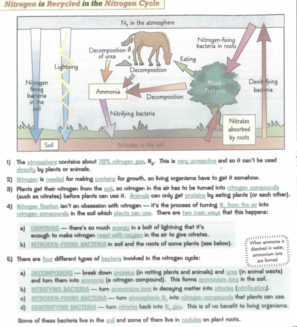
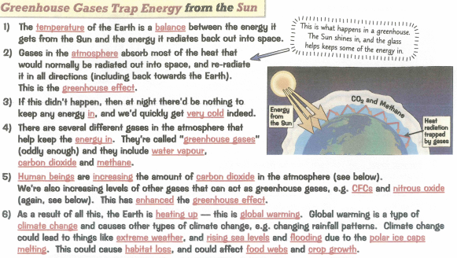
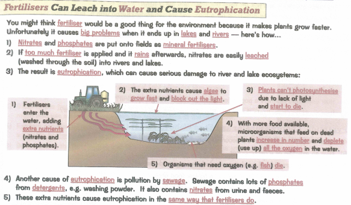
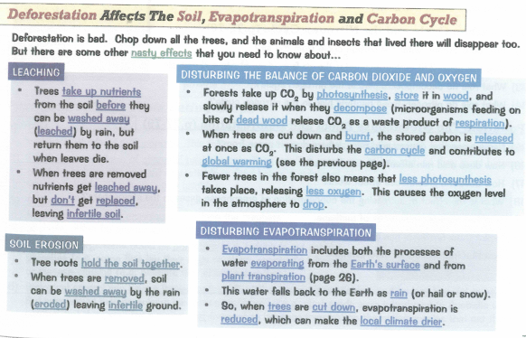

### 4.1 understand the terms population, community, habitat and ecosystem
* Population - number of same organisms
* community - links together the populations of the different species living together in the same place
* habitat - where an organisms live
* ecosystem - whole integrated mixture of biotic and abiotic components

### 4.2 practical: investigate the population size of an organism in two different areas using quadrats

### 4.3B understand the term biodiversity
* Biodiversity - range and variety of living organisms within an ecosystem

### 4.4B practical: investigate the distribution of organisms in their habitats and measure biodiversity using quadrats

### 4.5 understand how abiotic and biotic factors affect the population size and distribution of organisms

### 4.6 understand the names given to different trophic levels, including producers, primary, secondary and tertiary consumers and decomposers

* producers
  - eg. plants
  - make their own food using energy from the sun
* primary consumers
  - eats producers
  - eg. rabbits
* secondary
  - eats primary consumers
* tertiary consumers
  - eats secondary consumers
* decomposers
  - eats dead organisms
  - eg. bacteria
  - break down dead material and waste

- can be shown in trophic level

### 4.7 understand the concepts of food chains, food webs, pyramids of number, pyramids of biomass and pyramids of energy transfer
### 4.8 understand the transfer of substances and energy along a food chain

### 4.9 understand why only about 10% of energy is transferred from one trophic level to the next
* MRS H GREN

### 4.10 describe the stages in the carbon cycle, including respiration, photosynthesis, decomposition and combustion

### 4.11B describe the stages in the nitrogen cycle
* nitrogen fixing bacteria - able to convert nitrogen gas into nitrogen compounds that plants can use to make amino acids and proteins
* decomposers - cells of dead animals are broken down to ammonia and ammonium
* nitrifying bacteria - convert ammonium ions to nitrites, then to nitrates
* denitrifying bacteria - convert nitrates in the soil back into nitrogen gas

### 4.12 understand the biological consequences of pollution of air by sulfur dioxide and carbon monoxide

* Sulfur dioxide - acid rain
* carbon monoxide - prevents oxyhemoglobin

### 4.13 understand that water vapour, carbon dioxide, nitrous oxide, methane and CFCs are greenhouse gases

- Greenhouses include:
  - carbon dioxide
  - nitrous oxide
  - methane
  - CFCs

### 4.14 understand how human activities contribute to greenhouse gases

* combustion of fossil fuels
- ranching, cows

### 4.15 understand how an increase in greenhouse gases results in an enhanced greenhouse effect and that this may lead to global warming and its consequences

### 4.16 understand the biological consequences of pollution of water by sewage
* eutrophication - too much nitrates

### 4.17 understand the biological consequences of eutrophication caused by leached minerals from fertilizer
* cause algal bloom
* kills fish
* bacteria eats it
* other things die without oxygen

### 4.18B understand the effects of deforestation, including leaching, soil erosion, disturbance of evapotranspiration and the carbon cycle, and the balance of atmospheric gases

