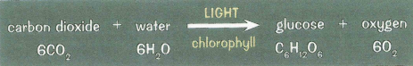
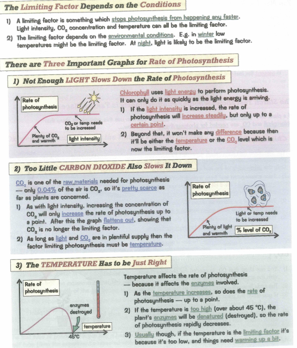
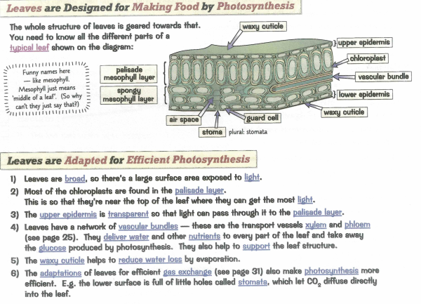
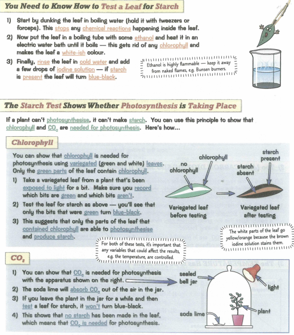
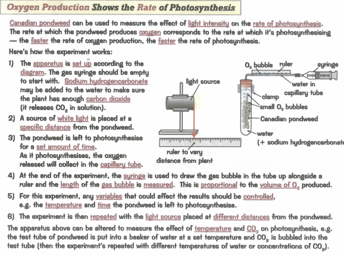

### 2.18 process of photosynthesis and its importance in the conversion of light energy to chemical energy

- Photosynthesis is process that produces 'food' in plants
  - food it produces is glucose
- photosynthesis happens in leaves ofall green plants
- happens inside of chloroplasts found in leaf cells and other green parts of a plant
  - Chloroplast contain pigment called chlorophyll which absorbs sunlight and uses its energy to convert carbon dioxide and water into glucose
- oxygen is produced (waste product)

### 2.19 know the word equation and the balanced chemical symbol equation for photosynthesis

### 2.20 varying carbon dioxide concentration, light intensity and temperature affect the rate of photosynthesis

### 2.21 structure of the leaf and explain how it is adapted for photosynthesis
* large surface area
* thinness
* mesophyll cells
	* palisade mesophyll light captured
	* spongy mesophyll allows free movement of air
* leaf xylem network
* lower epidermis - covered in tiny pores

### 2.22 plants require mineral ions for growth, and that magnesium ions are needed for chlorophyll and nitrate ions are needed for amino acids

Plants need three main mineral ions for growth
  - Nitrates:
    - contain nitrogen for making amino acids and proteins
    - needed for cell growth
    - deficiency symptoms:
      - stunted plants
      - older leaves turn yellow
  - Phosphates:
    - Contains phosphorus for making DNA and cell membranes
    - needed for respiration and growth
    - deficiency symptoms:
      - poor root growth
      - older leaves turn purple
  - Potassium:
    - help the enzymes needed for photosynthesis and respiration
    - deficiency symptoms:
      - poor flower and fruit growth
      - discolored leaves
  - Magnesium (in small amounts):
    - required for making chlorophyll
    - deficiency symptoms:
      - yellow leaves

### 2.23 practical: investigate photosynthesis, showing the evolution of oxygen from a water plant, the production of starch and the requirements of light, carbon dioxide and chlorophyll

