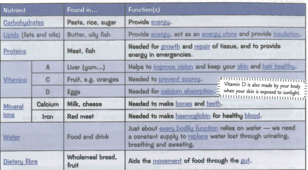
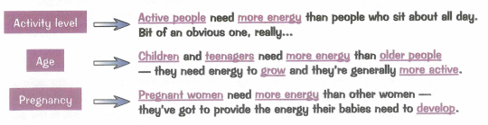
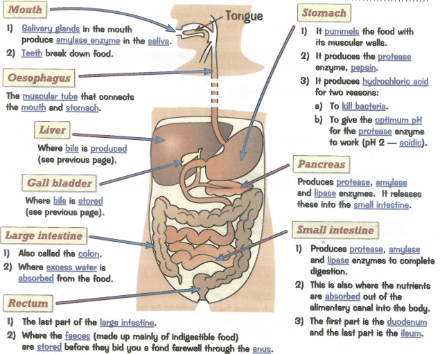
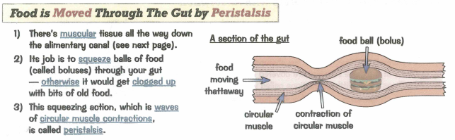
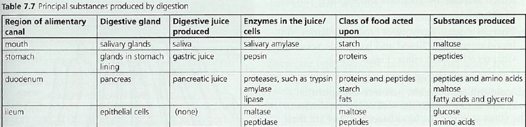
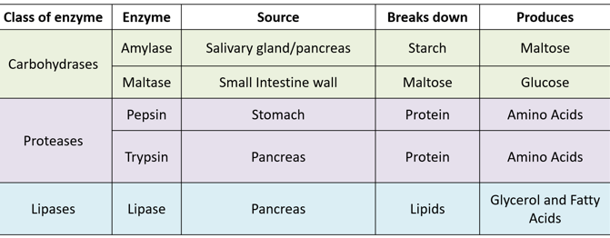
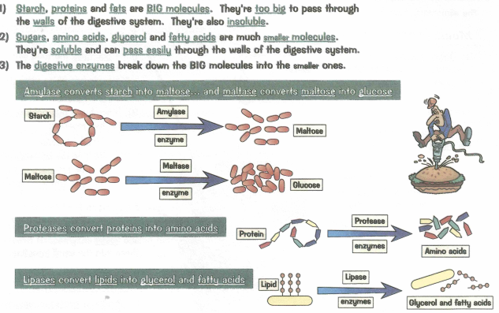
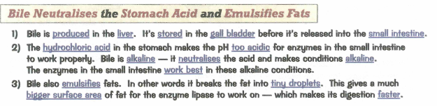
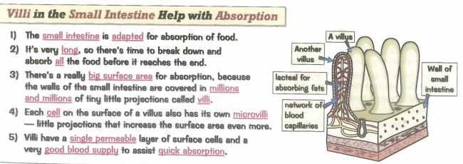
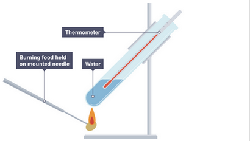

### 2.24  balanced diet should include appropriate proportions of carbohydrate, protein, lipid, vitamins, minerals, water and dietary fiber

Balanced diet needs:
- Carbohydrates
- proteins
- lipids
- vitamins
- minerals
- water
- dietary fiber

### 2.25 identify the sources and describe the functions of carbohydrate, protein, lipid (fats and oils), vitamins A, C and D, the mineral ions calcium and iron, water and dietary fibre as components of the diet

* Carbohydrates - potato, respiratoin
* protein - meat, amino acid to build body
* lipid - oil, insulation
* Vitamin A - carrots, eyes
* Vitamin C - lemon, skin
* vitamin D - liver - bones
* calcium - dairy products, bones
* iron - red meat, hemoglobin
* water - drinks - cytoplasm
* fiber - plant material, peristalsis

### 2.26 understand how energy requirements vary with activity levels, age and pregnancy

### 2.27 describe the structure and function of the human alimentary canal, including the mouth, oesophagus, stomach, small intestine (duodenum and ileum), large intestine (colon and rectum) and pancreas

#### Alimentary Canal

### 2.28 understand how food is moved through the gut by peristalsis

### 2.29 understand the role of digestive enzymes, including the digestion of starch to glucose by amylase and maltase, the digestion of proteins to amino acids by proteases and the digestion of lipids to fatty acids and glycerol by lipases

### 2.30 understand that bile is produced by the liver and stored in the gall bladder

#### Bile
- Produced by the liver
- stored in the gall bladder

### 2.31 understand the role of bile in neutralising stomach acid and emulsifying lipids

### 2.32 understand how the small intestine is adapted for absorption, including the structure of a villus

### 2.33B practical: investigate the energy content in a food sample

