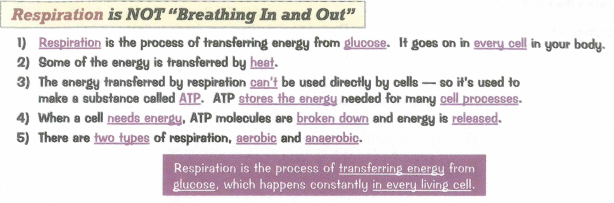
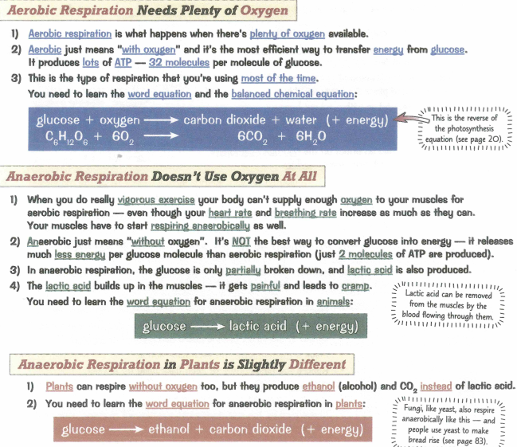
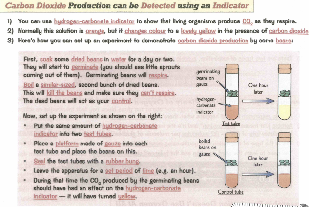
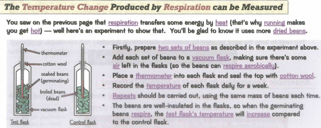
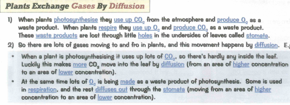
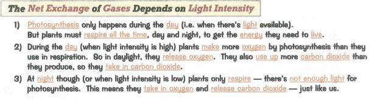
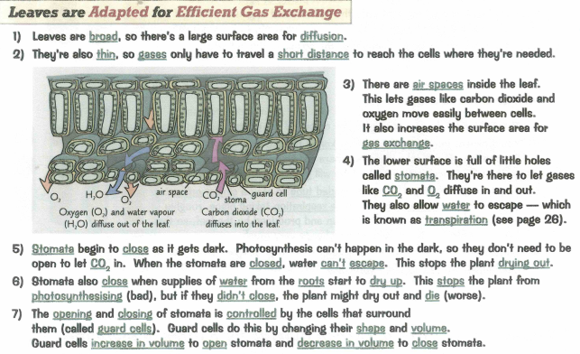
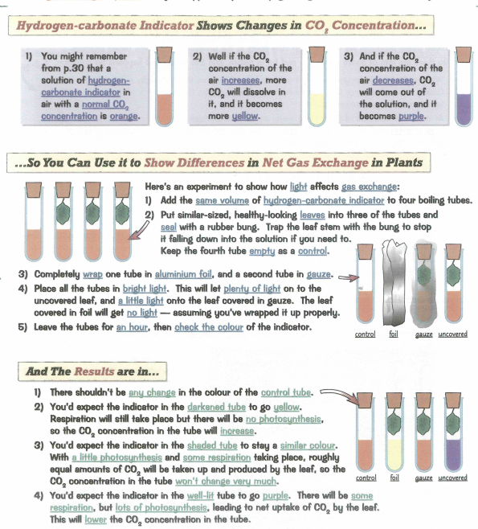

### 2.34 understand how the process of respiration produces ATP in living organisms
### 2.35 know that ATP provides energy for cells

### 2.36 describe the differences between aerobic and anaerobic respiration

- aerobic needs oxygen
- anaerobic doesn't need oxygen

### 2.37 know the word equation and the balanced chemical symbol equation for aerobic respiration in living organisms

- 602 + C6H12O6 - 6CO2 + 6H2O + ATP

### 2.38 know the word equation for anaerobic respiration in plants and in animals

- Glucose - Ethanol + Carbon dioxide + ATP
- Glucose - Lactic Acid + ATP

### 2.39 practical: investigate the evolution of carbon dioxide and heat from respiring seeds or other suitable living organisms

### 2.40B understand the role of diffusion in gas exchange

### 2.41B understand gas exchange (of carbon dioxide and oxygen) in relation to respiration and photosynthesis

### 2.42B understand how the structure of the leaf is adapted for gas exchange

### 2.43B describe the role of stomata in gas exchange

- allow air to path through by being opened by guard cells
- closes when supplies of water from the roots start to dry up
  - stops the plant from photosynthesis
- often closes at night to decrease transpiration

### 2.44B understand how respiration continues during the day and night, but that the net exchange of carbon dioxide and oxygen depends on the intensity of light

- Respiration continues during the day and night
- But net exchange of CO2 and O2 depends on intensity of light

### 2.45B practical: investigate the effect of light on net gas exchange from a leaf, using hydrogen-carbonate indicator
* Potassium hydroxide solution - takes CO2

