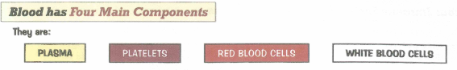
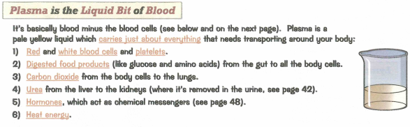
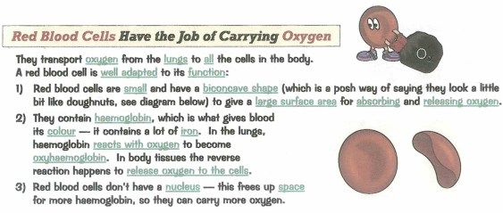
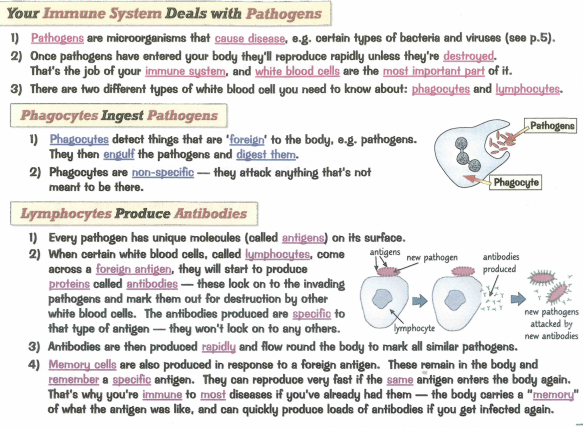
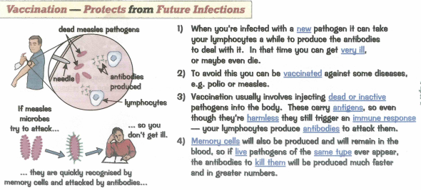
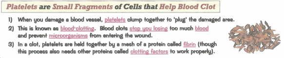
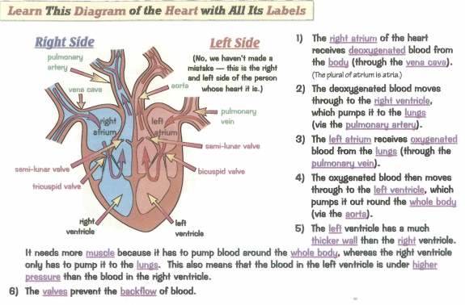
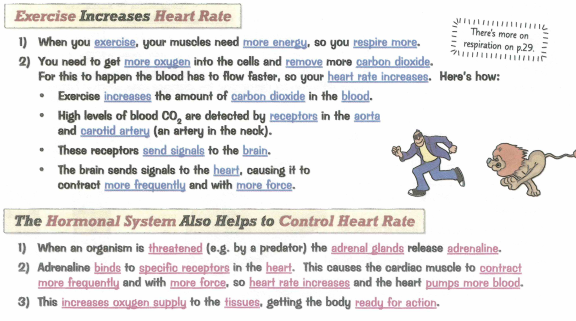
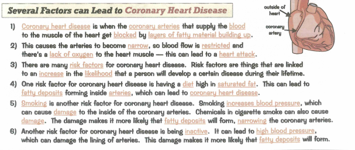
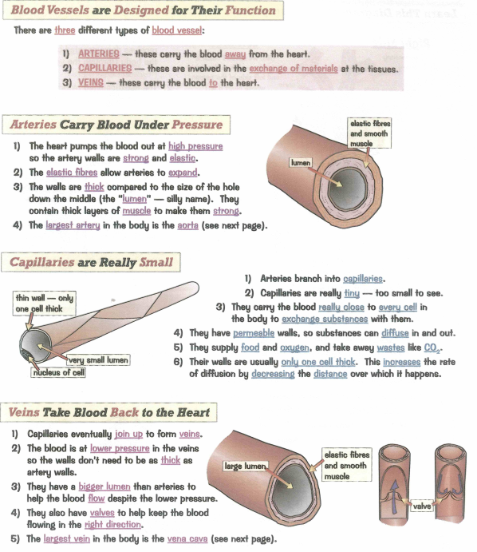

### 2.59 describe the composition of the blood: red blood cells, white blood cells, platelets and plasma

### 2.60 understand the role of plasma in the transport of carbon dioxide, digested food, urea, hormones and heat energy

### 2.61 understand how adaptations of red blood cells make them suitable for the transport of oxygen, including shape, the absence of a nucleus and the presence of haemoglobin - turns into oxyhaemoglobin

### 2.62 understand how the immune system responds to disease using white blood cells, illustrated by phagocytes ingesting pathogens and lymphocytes releasing antibodies specific to the pathogen

### 2.63B understand how vaccination results in the manufacture of memory cells, which enable future antibody production to the pathogen to occur sooner, faster and in greater quantity

### 2.64B understand how platelets are involved in blood clotting, which prevents blood loss and the entry of micro-organisms which could be pathogens

### 2.65 describe the structure of the heart and how it functions

### 2.66 explain how the heart rate changes during exercise and under the influence of adrenaline

### 2.67 understand how factors may increase the risk of developing coronary heart disease

### 2.68 understand how the structure of arteries, veins and capillaries relates to their function

### 2.69 understand the general structure of the circulation system, including the blood vessels to and from the heart and the lungs, the liver and the kidneys

