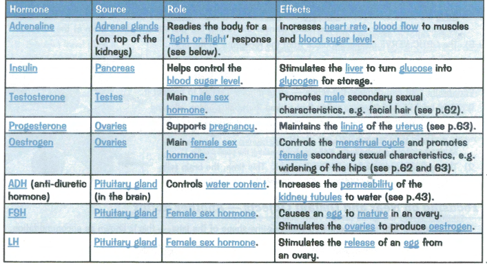

# Co-ordination in Humans

Def. Withdraw Reflex - response not requiring a conscious decision
ex. touching a hot pot and releasing the hand

### Two Control Systems: Nervous & Hormonal (Endocrine)

# Co-ordination and Control

### Co-ordination and response
### 2.80 understand how organisms are able to respond to changes in their environment

### 2.81 understand that homeostasis is the maintenance of a constant internal environment, and that body water content and body temperature are both examples of homeostasis

### 2.82 understand that a co-ordinated response requires a stimulus, a receptor and an effector

### Flowering plants

### 2.83 understand that plants respond to stimuli

### 2.84 describe the geotropic and phototropic responses of roots and stems

### 2.85 understand the role of auxin in the phototropic response of stems

### Humans
### 2.86 describe how nervous and hormonal communication control responses and understand the differences between the two systems

### 2.87 understand that the central nervous system consists of the brain and spinal cord and is linked to sense organs by nerves
### 2.88 understand that stimulation of receptors in the sense organs sends electrical impulses along nerves into and out of the central nervous system, resulting in rapid responses

### 2.89 understand the role of neurotransmitters at synapses

### 2.90 describe the structure and functioning of a simple reflex arc illustrated by the withdrawal of a finger from a hot object

### 2.91 describe the structure and function of the eye as a receptor

### 2.92 understand the function of the eye in focusing on near and distant objects, and in responding to changes in light intensity

### 2.93 describe the role of the skin in temperature regulation, with reference to sweating, vasoconstriction and vasodilation

### 2.94 understand the sources, roles and effects of the following hormones: adrenaline, insulin, testosterone, progesterone and oestrogen
### 2.95B understand the sources, roles and effects of the following hormones: ADH, FSH and LH

