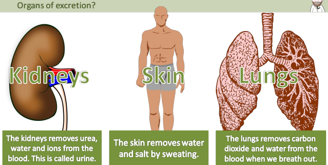
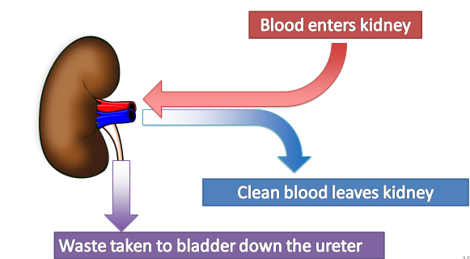
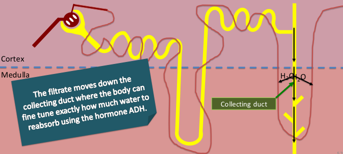
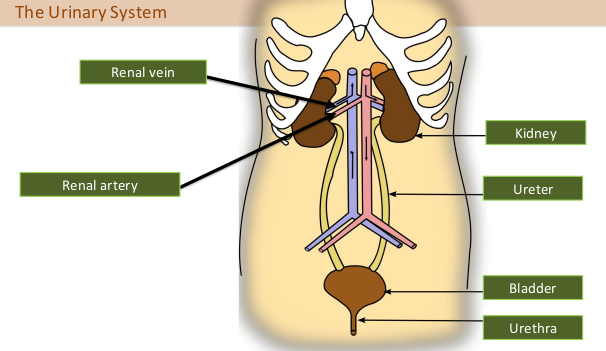
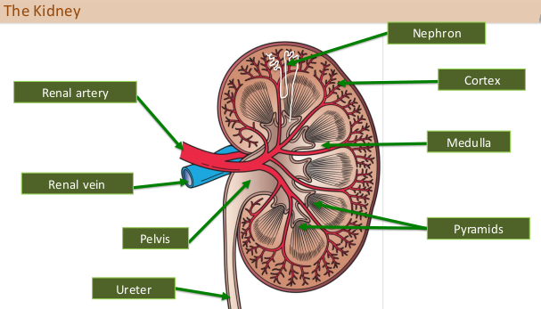
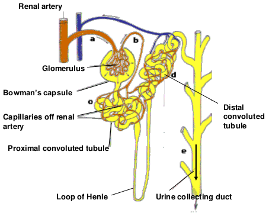
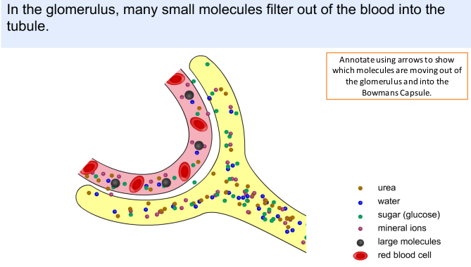
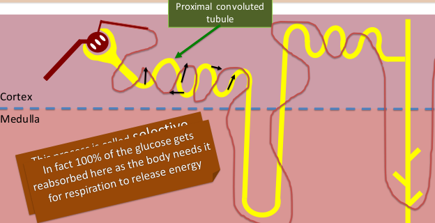
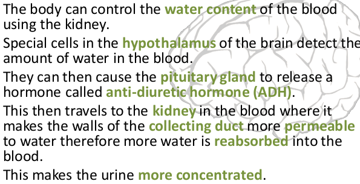

# Excretion

### Flowering plants

### 2.70 understand the origin of carbon dioxide and oxygen as waste products of metabolism and their loss from the stomata of a leaf

- Plants produce oxygen as a waste of metabolic reactions
- lost from the stomata

### Humans

### 2.71 know the excretory products of the lungs, kidneys and skin (organs of excretion)

### 2.72B understand how the kidney carries out its roles of excretion and osmoregulation

#### Excretion:
- blood enters the kidney at high pressure
from the renal artery.
- blood is filtered and then passes back out
through the renal vein.
- urine that is formed passes out through
the ureters and is stored in the bladder.
- held there by sphincters until the bladder
is full

#### Osmoregulation
The body can control the water content of the blood
using the kidney
- Special cells in the hypothalamus of the brain detect the
amount of water in the blood.
- They can then cause the pituitary gland to release a
hormone called anti-diuretic hormone (ADH).
- This then travels to the kidney in the blood where it
makes the walls of the collecting duct more permeable
to water therefore more water is reabsorbed into the
blood.
- This makes the urine more concentrated.

### 2.73B describe the structure of the urinary system, including the kidneys, ureters, bladder and urethra

### 2.74B describe the structure of a nephron, including the Bowman’s capsule and glomerulus, convoluted tubules, loop of Henle and collecting duct

### 2.75B describe ultrafiltration in the Bowman’s capsule and the composition of the glomerular filtrate

- glomerulus - ball of capillaries
- Bowman's capsule - where filtration take place
  - filtrate contains usable and wasteful products (urea, water, sugar, mineral ions)
  - anything in the blood that is not large is taken out
  - process called ultrafiltration

### 2.76B understand how water is reabsorbed into the blood from the collecting duct

- Collecting duct collects urine from nephrons and transports it to the pelvis

### 2.77B understand why selective reabsorption of glucose occurs at the proximal convoluted tubule

### 2.78B describe the role of ADH in regulating the water content of the blood

### 2.79B understand that urine contains water, urea and ions

Urine contains:
- water
- urea
- ions
