### 3.1 understand the differences between sexual and asexual reproduction

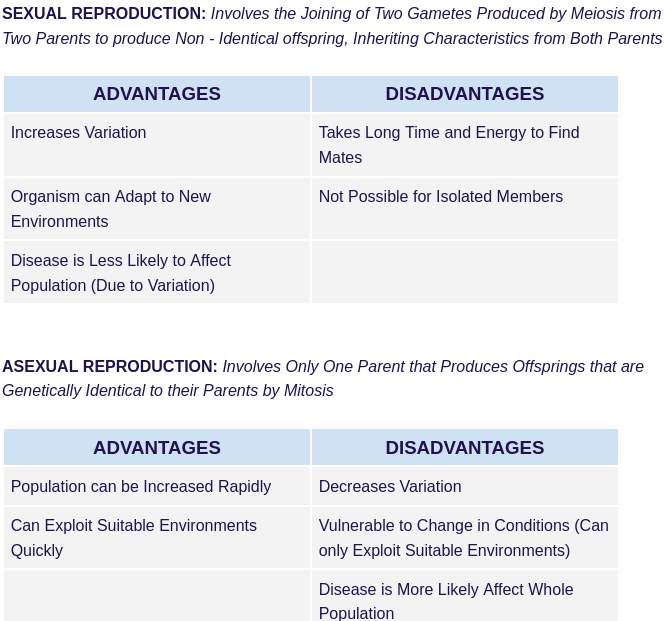

### 3.2 understand that fertilisation involves the fusion of a male and female gamete to produce a zygote that undergoes cell division and develops into an embryo

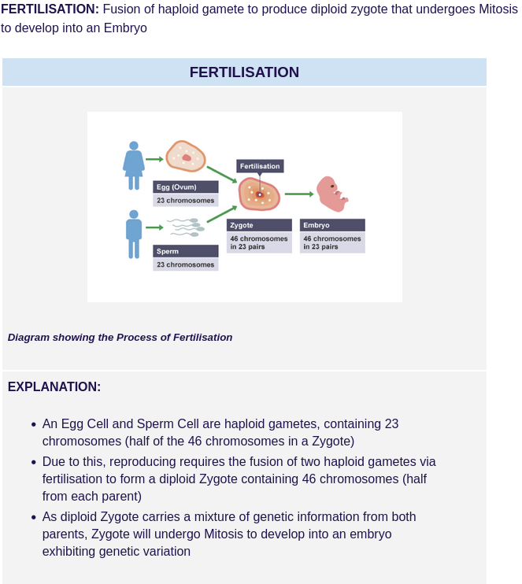

### 3.3 describe the structures of an insect-pollinated and a wind-pollinated flower and explain how each is adapted for pollination

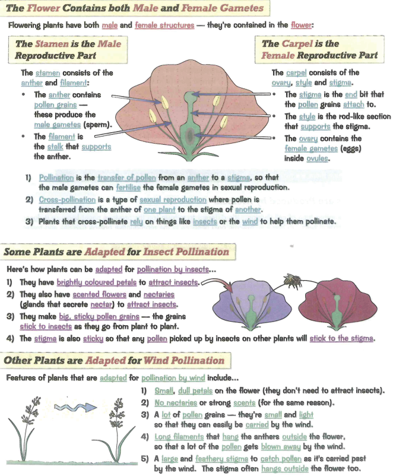

### 3.4 understand that the growth of the pollen tube followed by fertilisation leads to seed and fruit formation

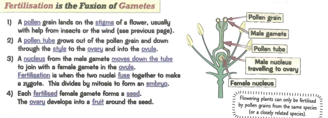

### 3.5 practical: investigate the conditions needed for seed germination

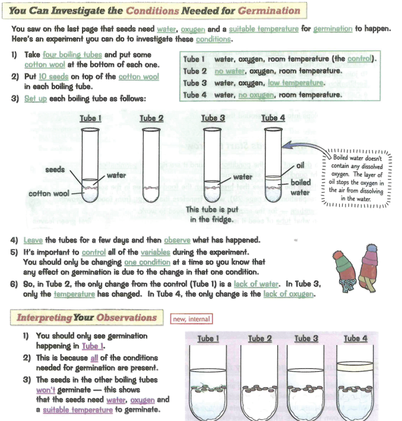
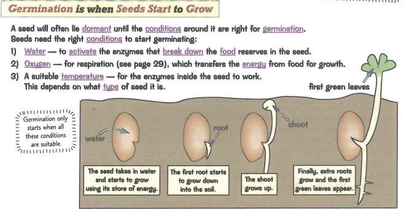

### 3.6 understand how germinating seeds utilise food reserves until the seedling can carry out photosynthesis

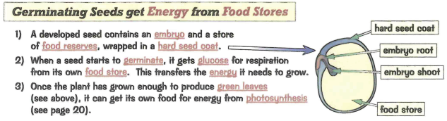

### 3.7 understand that plants can reproduce asexually by natural methods (illustrated by runners) and by artificial methods (illustrated by cuttings)

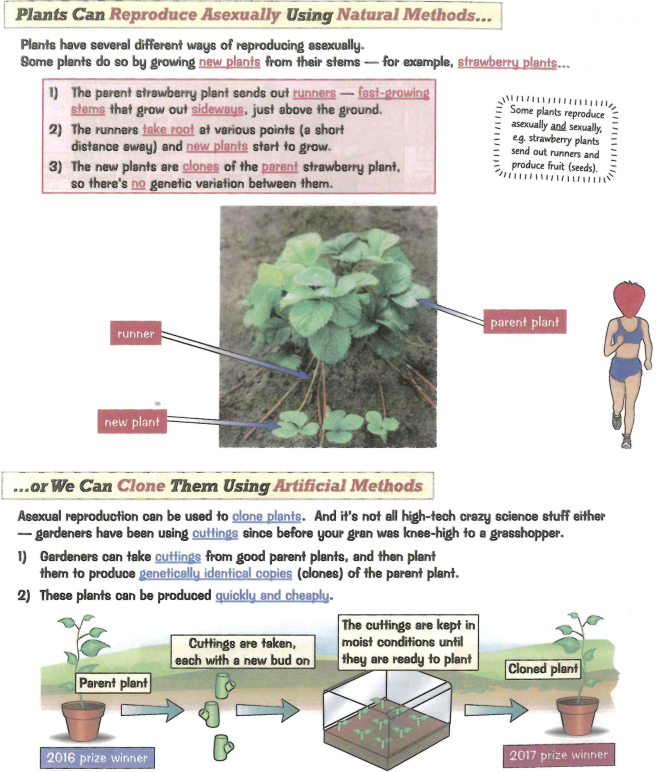

### 3.8 understand how the structure of the male and female reproductive systems are adapted for their functions

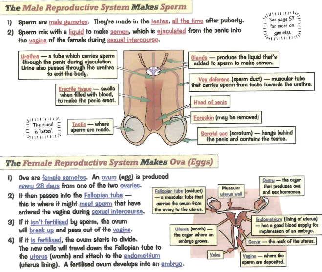

### 3.9 understand the roles of oestrogen and progesterone in the menstrual cycle
### 3.10B understand the roles of FSH and LH in the menstrual cycle

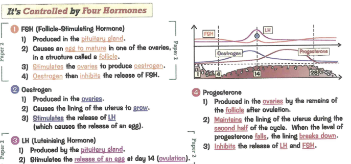

### 3.11 describe the role of the placenta in the nutrition of the developing embryo
### 3.12 understand how the developing embryo is protected by amniotic fluid

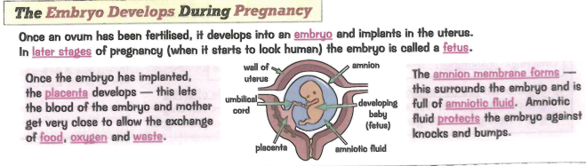

### 3.13 understand the roles of oestrogen and testosterone in the development of secondary sexual characteristics

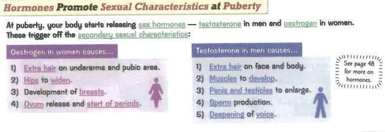
