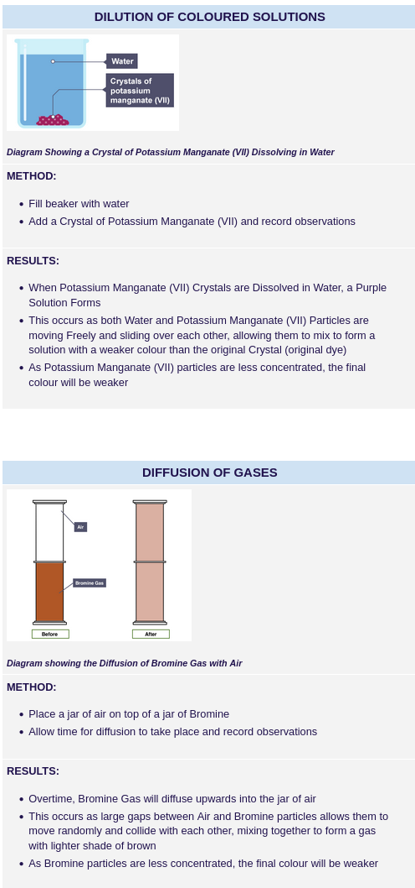

### 1.1 Three states of matter in terms of the arrangement, movement and energy of the particles

* Gas - spread out, most energy in particles moving freely
* Liquid - close particles, medium energy with particles moving freely
* Solid - particles packed with very little energy

### 1.2 Understand the Interconversions between the Three States of Matter in Terms of: The Names of the Interconversions, How they are Achieved, the Changes in Arrangement, Movement and Energy of the Particles

### 1.3 Dilution of color occurs due to diffusion. In fluids, diffusion occurs from a higher to lower concentration of a substance.

### 1.4: Know What is Meant by the Terms: Solvent, Solute, Solution, Saturated Solution

### 1.5 Solubility is measured in grams per 100 grams of solvent

### 1.6 Understand How to Plot and Interpret Solubility Curves

### 1.7 Solubility of a solid in water at a specific temperature can be measured by figuring out when the substance starts to not dissolve and stay as a solid.

* Compound - substance that contains atoms of two or more elements combined together chemically
* Mixtures - different form compounds as the different substances are not combined together chemically
* Molecule - smallest particle that can have a separate, independent existence
* Molecular formula - shows the number of atoms of different elements
* Relative formula mass (Mr) - sum of the average atomic masses of the atoms in the formula of a compound
	* work out how many atoms of each element are in the chemical formula
	* add together the Ar values for all the atoms of each element
* Relative atomic mass (Ar) - relative mass of its atoms compared to the mass of a carbon-12 atom

## Others:

