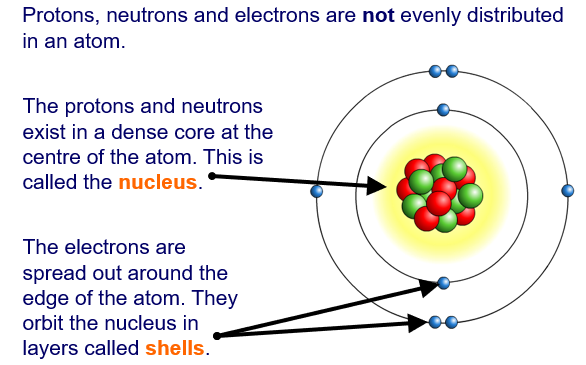
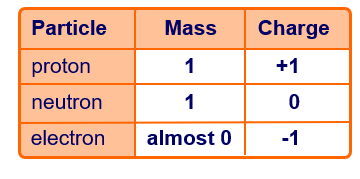
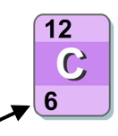
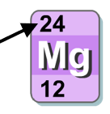
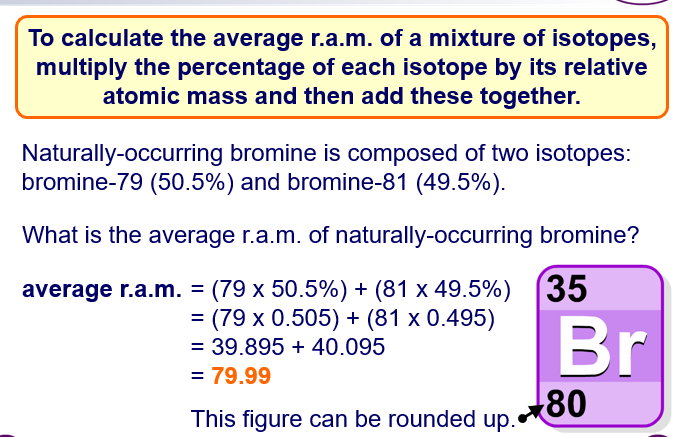
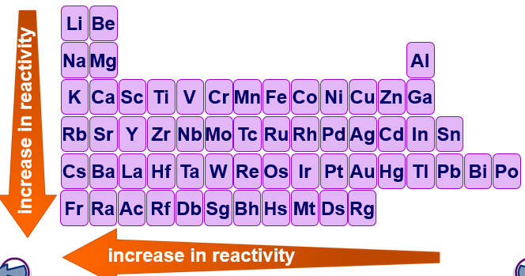
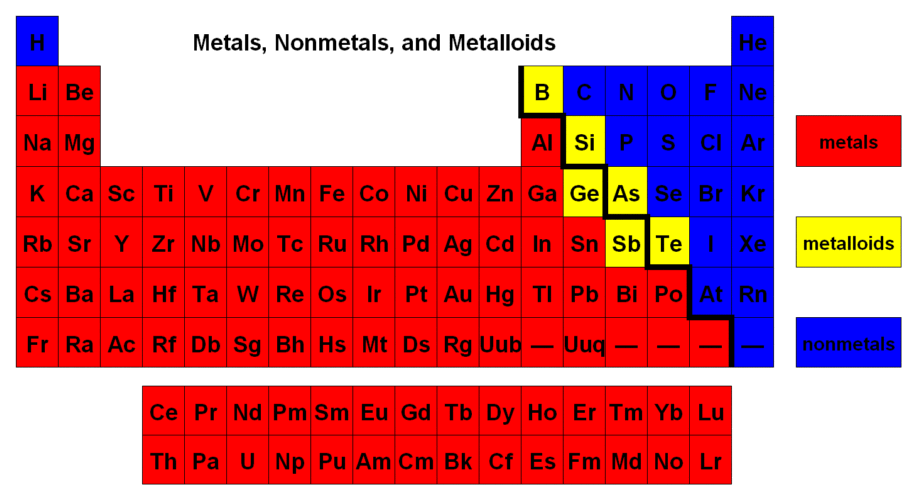

# 1.14
### Atom - smallest unit of ordinary matter that forms a chemical element

# 1.15

# 1.16
### Atomic Number (proton number) - number of protons in an atom

### Mass Number (Nuclei Number)- sum of the protons and neutrons

# 1.17
### atomic mass = [isotope(1) X abundance + isotope(2)x abundance ..... ]/2

# 1.18
### Elements with different shell levels are ordered in periods
### Elements with different valence electrons and reactivity is ordered by groups
### Atoms with the least protons are at the top of the periodic table
### Periods are horizontal, groups are vertical

# 1.19
### First three maximum electron configuration is 2,8,8

# 1.20
### Metals form base oxides and conduct electricity
### non metals form acid oxides and do not conduct

# 1.21

# 1.22
### The amount of full electron levels in a element equals the period of the element
