# 1.37
### Ions are formed by electron loss or gain

# 1.38
### Charge of atoms by groups and transition metals/Compounds
* Group 1 - +(1)
* Group 2 - +2
* Group 3 - +3
* Group 5 - -3
* Group 6 - -2
* Group 7 - -(1)
* Ag+
* Cu2+
* Fe2+
* Fe3+
* Pb2+
* Zn2+
* Hydrogen (H+)
* Ammonium(NH4 +)
* Carbonate (CO3 2-)
* Nitrate (NO3 -)
* Sulfate (SO4 2-)

# 1.40
### Dot and plot diagrams
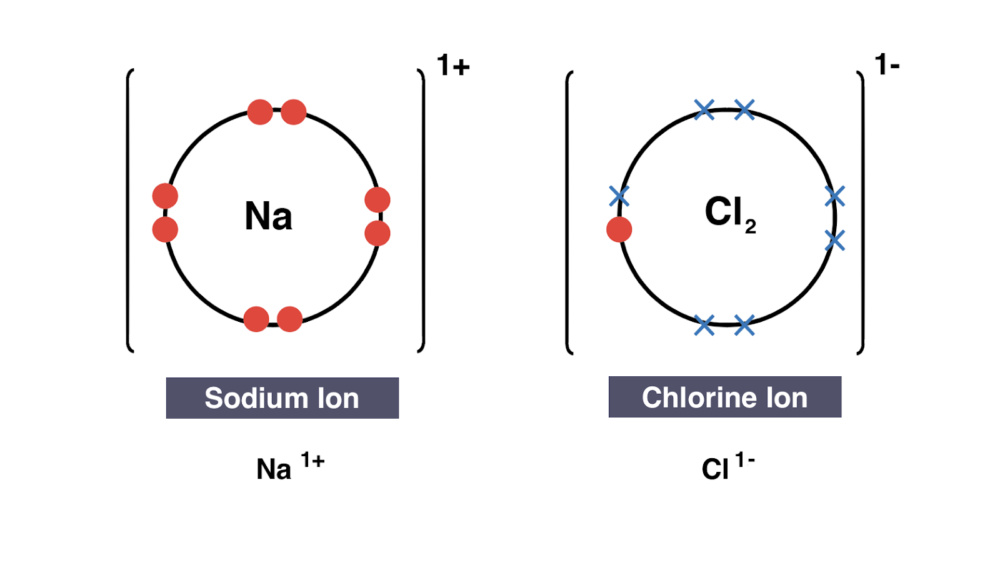
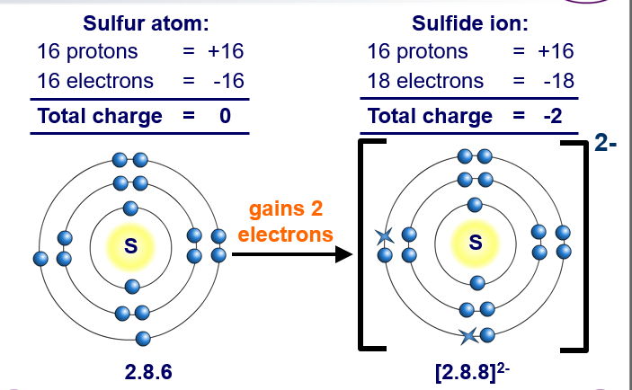
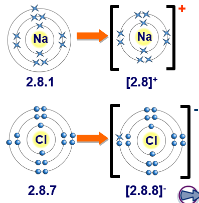

# 1.41
### Ionic Bonding - Electrostatic attraction between a negatively charged non metal ion and positively charged metal ion.
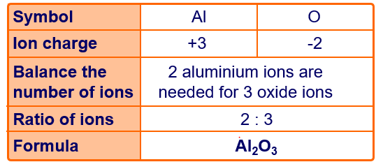
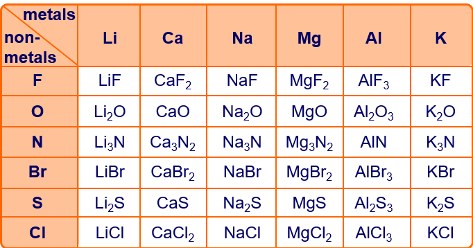
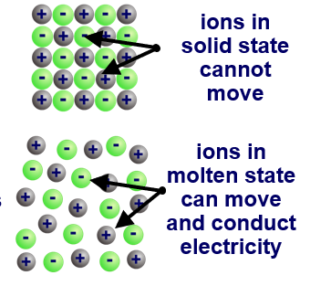

# 1.42
### Compounds with giant ionic lattices have high melting points because more bonds must be broken to boil the compound

# 1.43
### Ionic compounds do not conduct electricity when solid because the ions cannot move. They do conduct electricity when molten and ions can moved.

# 1.44
### Covalent bond is formed between atoms by sharing of a pair of electrons

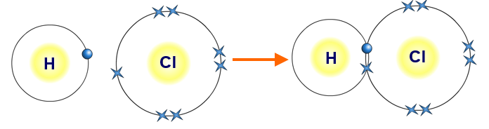

# 1.45
### Covalent bonds are electrostatic attraction between negative electrons and positive nucleolus of non metals from sharing pair of electrons.

# 1.46

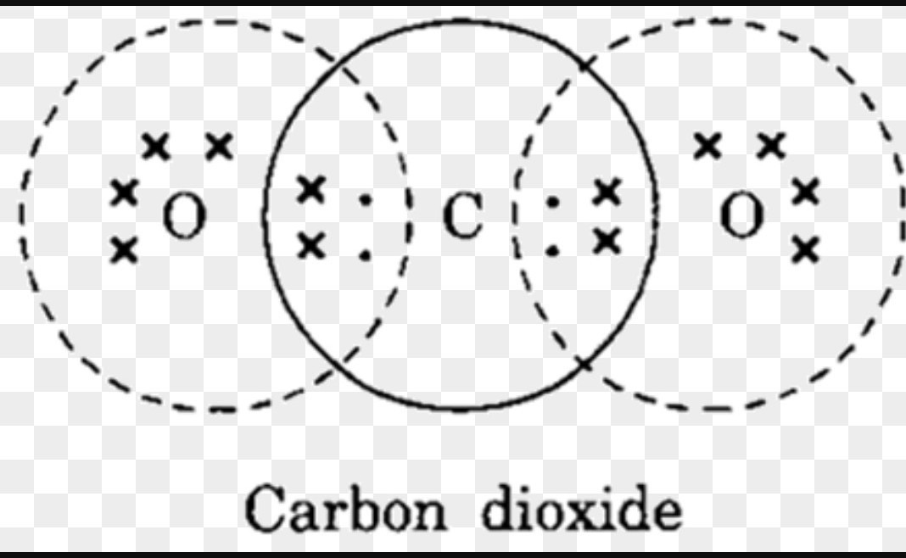
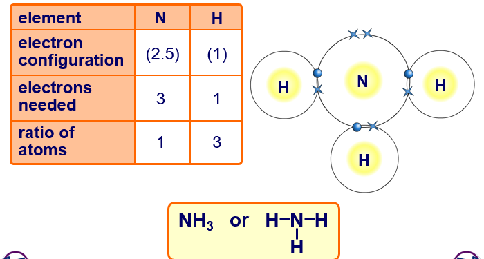
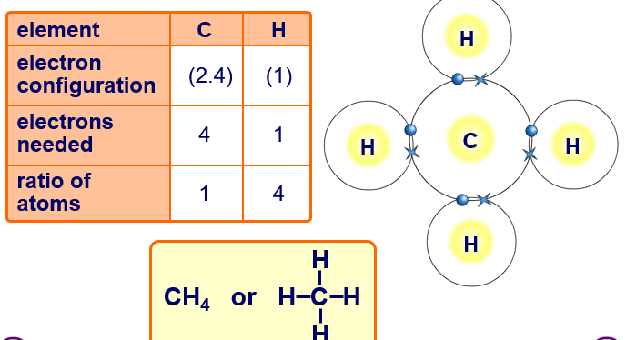

# 1.47
### Molecules with simple structure have a low boiling and melting point because the electrostatic attraction is low, making it easier to break with less energy.

# 1.48
### Melting and boiling point of substances with simple molecular structure increase, in general, with increasing relative molecular mass because there are more bonds to break in larger compounds

# 1.49
### Substances with giant covalent structures are solids with high melting and boiling points because they have a strong bond, making it difficult to be a liquid.

# 1.50
### Graphite is strong in one direction but the layers could slide due to weak attraction between the layers. It conducts electricity with free electrons delocalized. It has three covalent bonds.

### C60 fullerene (Buckministerfullerene)has a space inside and extremely strong

### Diamonds are extremely hard, very high boiling point, and cannot conduct electricity. Each carbon shares electrons with four other carbon atoms

# 1.51
### Covalent bonds do not usually conduct electricity

# 1.52
## Metallic lattice is represented by a 2-D diagram with circles with multiple plus symbols surrounded by sea of small electrons.
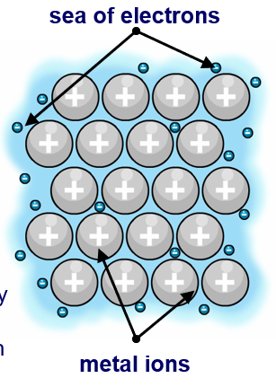

# 1.53
### Metallic bonding is electrostatic attraction between the positive ions and negative sea of delocalized electrons.

# 1.54
### Metals are shiny, ductile, conduct electricity and malleable.

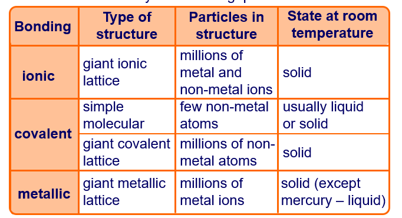
