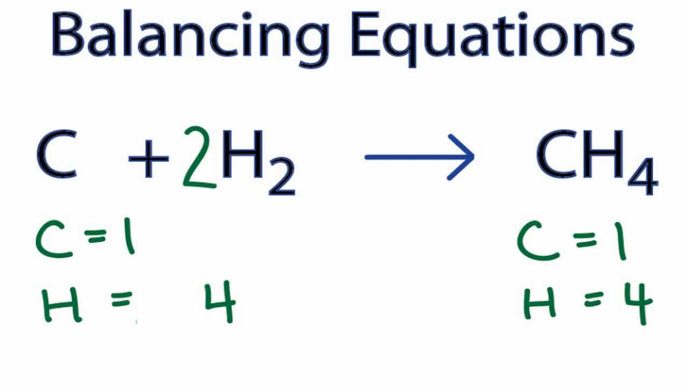
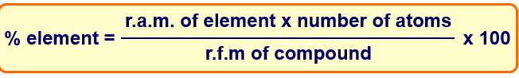
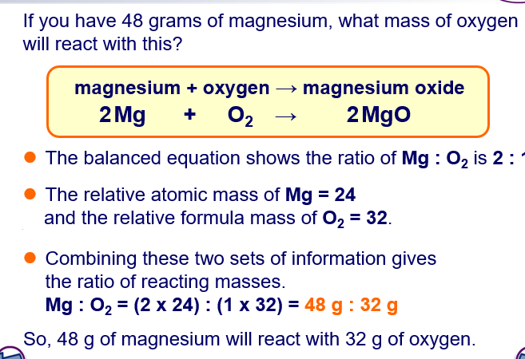
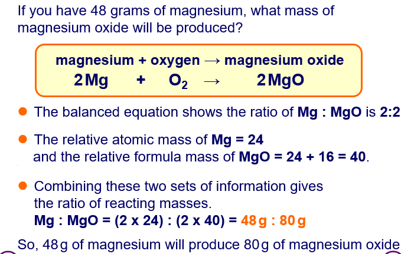
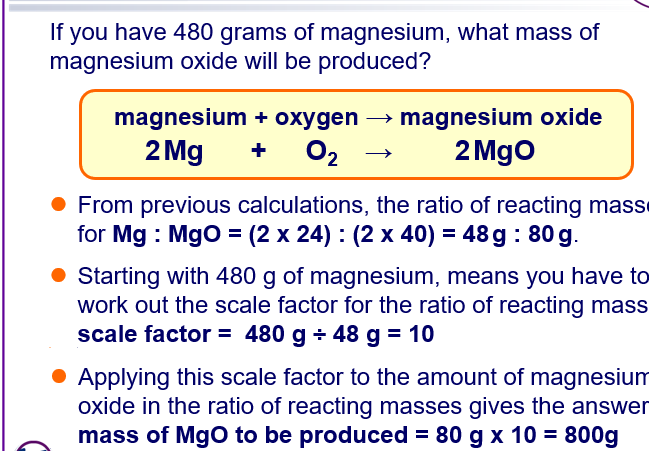
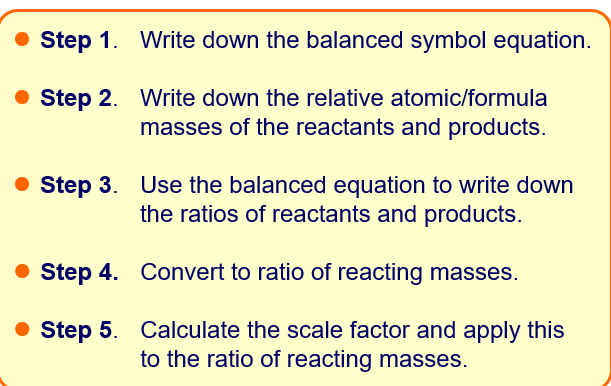
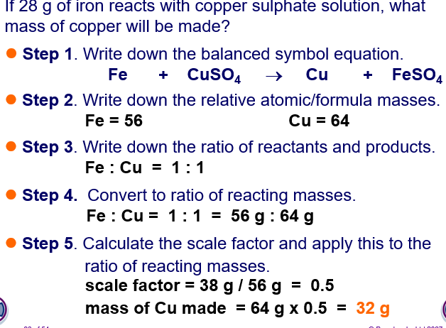
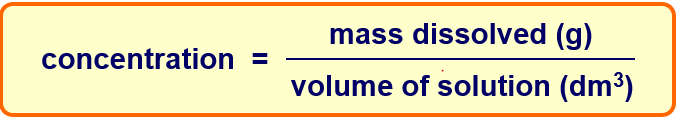
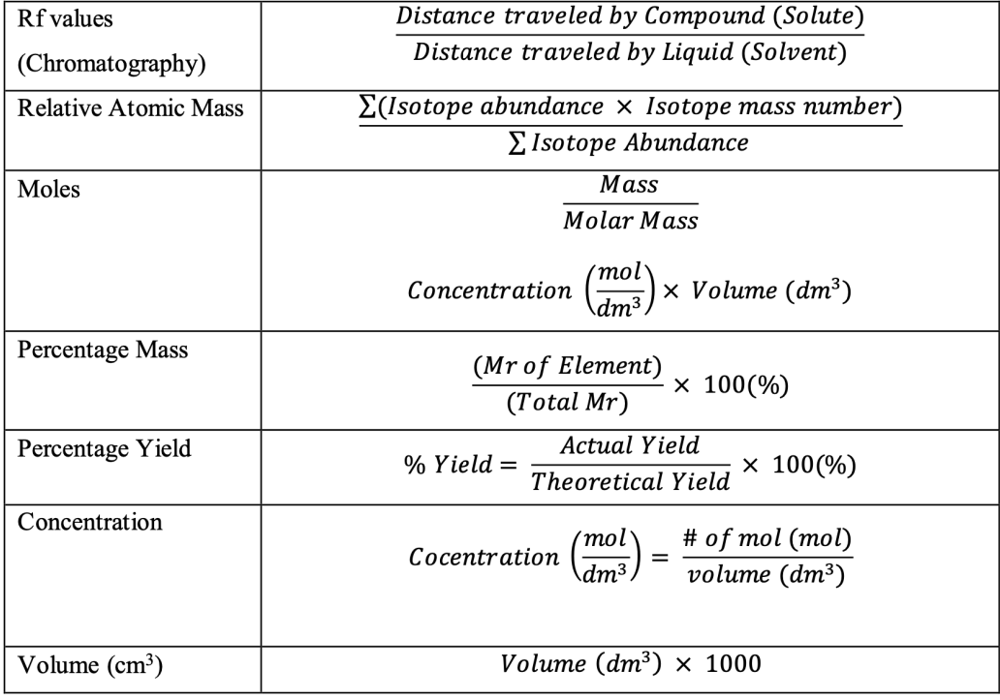

# 1.25

### Balancing equations

# 1.26

### Calculate relative formula mass (Mr) from relative atomic mass (Ar)

# 1.27

### Mol is the unit for the amount of substance

Mol = mass (g)/Ar

# 1.28

### Understand carrying out calculations involving amount of substance, relative atomic mass (Ar) and relative formula mass (Mr)

# 1.29

### Calculate reacting masses using experimental data and chemical equations

# 1.30

### percentage yield = actual yield / theoretical yield x 100

# 1.31

### Formulae of simple compounds can be obtained experimentally, including metal oxides, water and salts containing water or crystallization

# 1.32

### Empirical Formula - formula that shows the ratio of elements present in the compound, but not the actual numbers of atoms found in the molecule

### Molecular Formula - shows the number of atoms of different elements

# 1.33

### Calculate empirical and molecular formulae from experimental data

# 1.34

### Carry out calculations involving amount of substance, volume and concentration (in mol/dm^3) of solution

# 1.36

### Determine the formula of a metal oxide by combustion or by reduction

