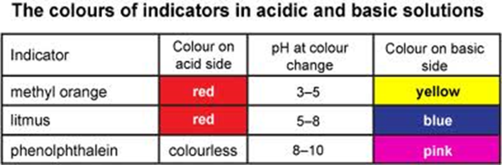
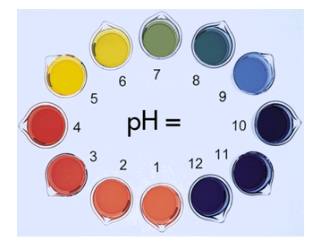
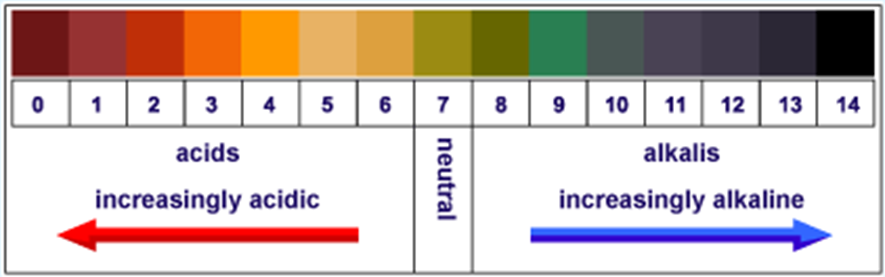
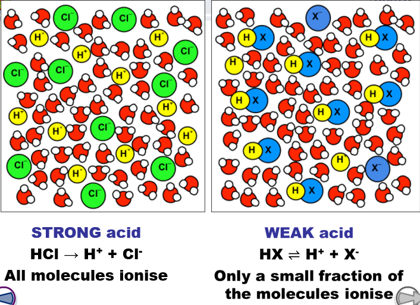
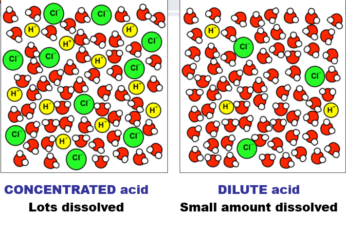
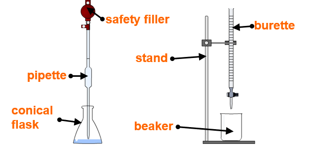
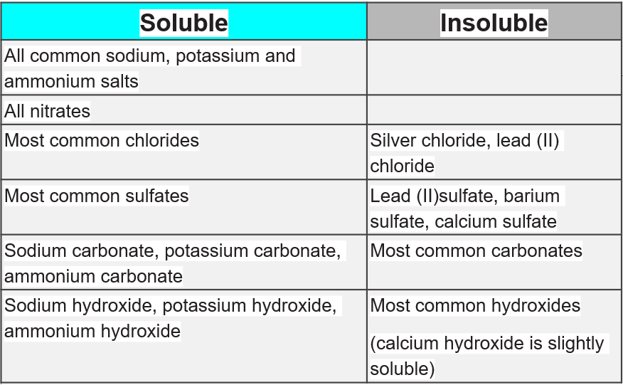

# 2.28

- Universal Indicator

# 2.29

### pH scale

- acidic 0-3
- weakly acidic 4-6
- neutral 7
- weakly alkaline 8-10
- strongly alkaline 10-14

# 2.30

### Use of universal indicator to measure the approximate pH value of an aqueous solution

# 2.31

### Acids in aqueous solution are a source of hydrogen ions and alkalies in a aqueous solution are source of hydroxide ions

# 2.32

### Alkalies can neutralize acids

# 2.33

### Procedure of acid-alkali titration

# 2.34

### General rules for predicting the solubility of ionic compounds in water:

- common sodium, potassium and ammonium compounds are soluble
- all nitrates are soluble
- common chlorides are soluble, except those of silver and lead (II)
- common sulfates are soluble, except for those of barium, calcium and lead (II)
- common carbonates are insoluble, except for those of sodium, potassium and ammonium
- common hydroxides are insoluble except for those of sodium, potassium and calcium

# 2.35

### acids and bases proton transfer

# 2.36

### acids are proton donor and base is proton acceptor

# 2.37

### Reactions of hydrochloric acid, sulfuric acid and nitric acid with metals, bases and metal carbonates to form salts

# 2.38

### Metal oxides, metal hydroxides and ammonia can act as bases, and alkalis are bases that are soluble in water

# 2.39

### Experiment to prepare a pure, dry sample of soluble salt, starting from an insolube reactant

# 2.40

### Experiment to prepare a pure, dry sample of a soluble salt, starting from an acid and alkali

# 2.41

### Experiment to prepare a pure, dry sample of an insoluble salt, starting from two soluble reactants

# 2.42

### Prepare a sample of pure, dry hydrates copper (II) sulfate crystals starting from copper oxide

# 2.43

### Prepare a sample of pure, dry lead (II) sulfate
