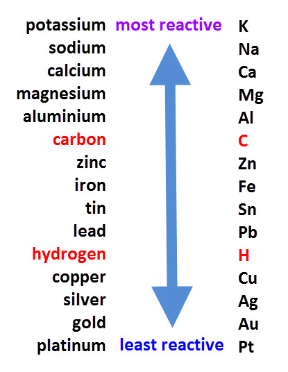

# 2.15

### Metals can be arranged in a reactivity series based on their reaction with:

- water
- dilute hydrochloric or sulfuric acid

# 2.16

### Metals can be arranged in a reactivity series based on their displacement reactions between:

- metals and metal oxides
- metals and aqueous solutions of metal salts

# 2.17

### Order of reactivity series

# 2.18

### Condition needed for iron to rust:

- Oxygen
- Water

# 2.19

### Rusting of iron prevented by:

- barrier methods
- galvanizing
- sacrificial protection

# 2.20 OILRIG

Def:

- oxidation - receiving oxygen or loss of electron
- reduction - giving oxygen or gain of electron
- redox - reaction with oxidation and reduction involved
- Oxidizing agent - substance that oxidizes, receives electron
- reducing agent - substance that reduces, giving electron

# 2.21

### Investigate reactions between dilute hydrochloric and sulfuric acids and metals
