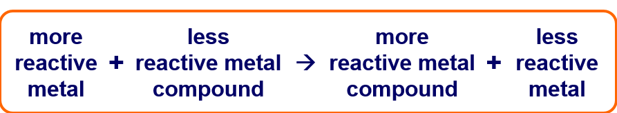
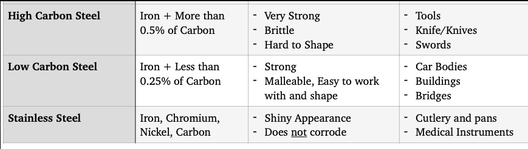

# 2.2

### Metals are extracted from ores found in Earth's crust and that unreactive metals are often found as uncombined element

# 2.3

### Method of extraction of metal is related to its position in the reactivity series

- combustion with carbon for metals lower reactivity than carbon
- electrolysis for higher metals than carbon

# 2.4

### Comment on metal extraction process, given appropriate information detailed knowledge of the processes used in the extraction of a specific metal is not required

# 2.5

### Uses

# 2.26

- Alloy - mixture of a metal and one or more elements, usually other metals or carbon

# 2.27

### Alloys are harder than pure metals because latices are distorted
