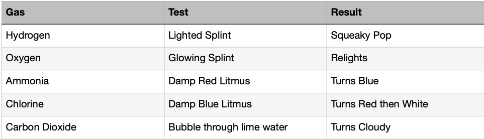
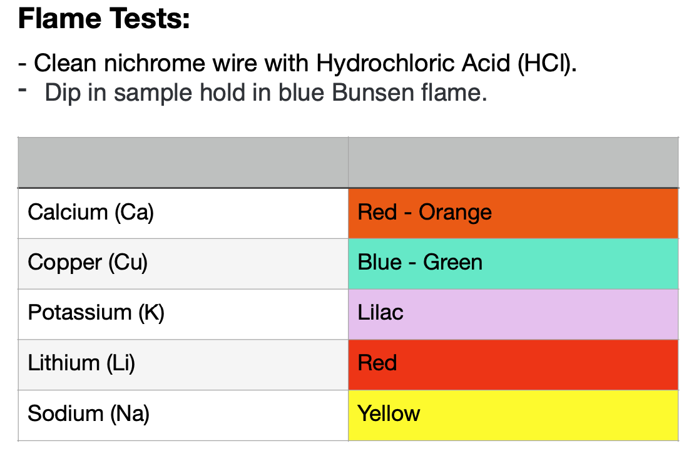
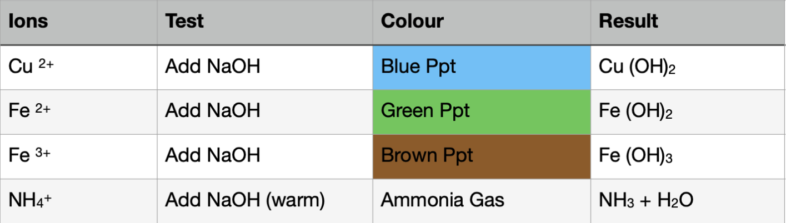
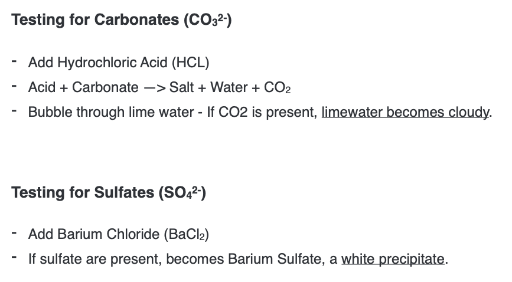
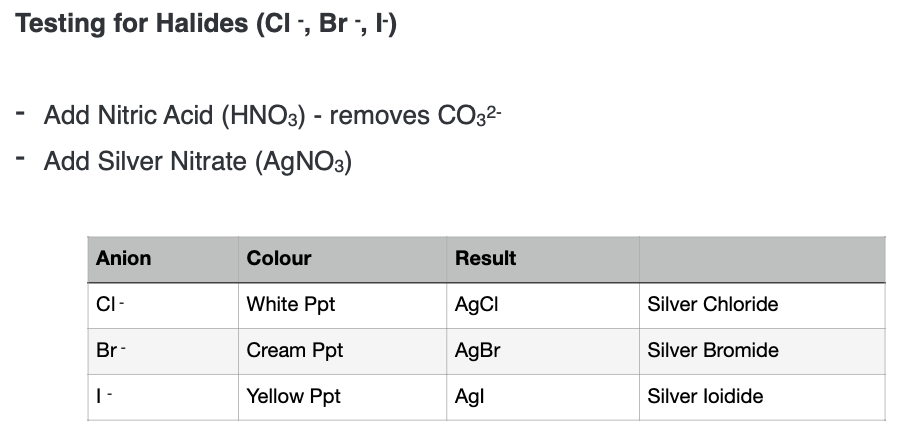

# 2.44

### Test for gas

# 2.45

### Flame tests are carried out with blue flame

# 2.46

### Flame tests:

# 2.47

## test for cations

# 2.48

# 2.49

### Presence of water tested by anhydrous copper (II) sulfate

# 2.5

### If water is pure, it boils at 100 C
