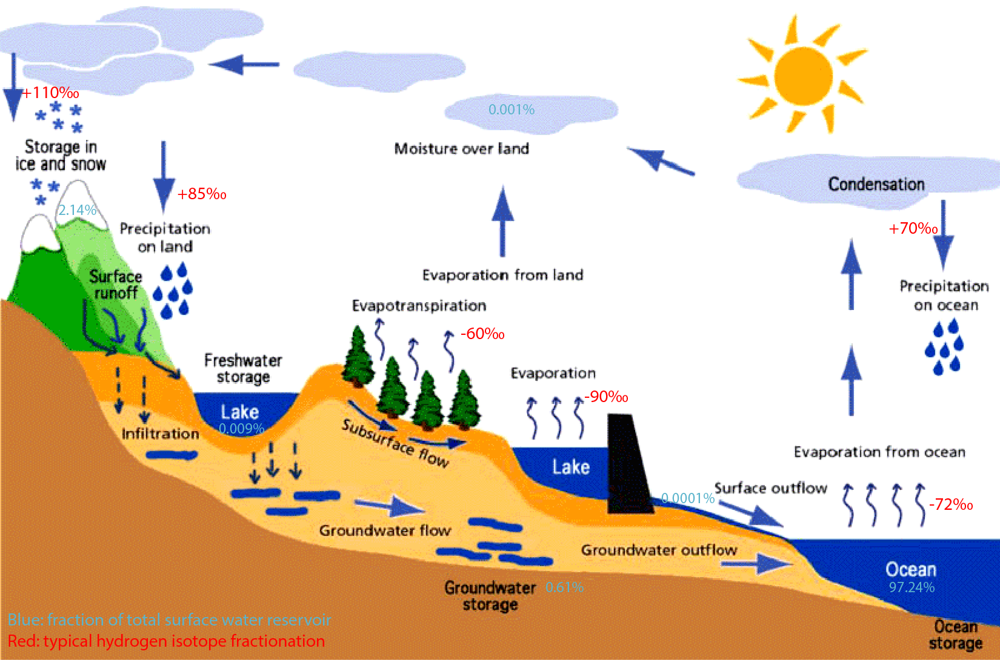
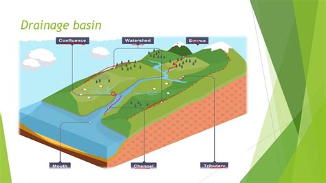
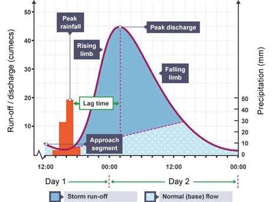
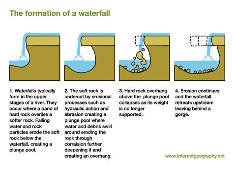
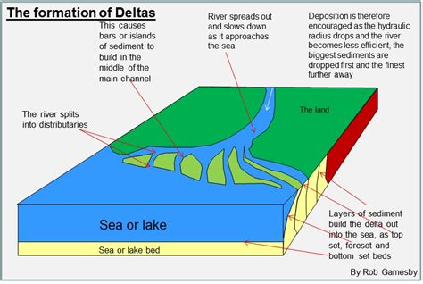
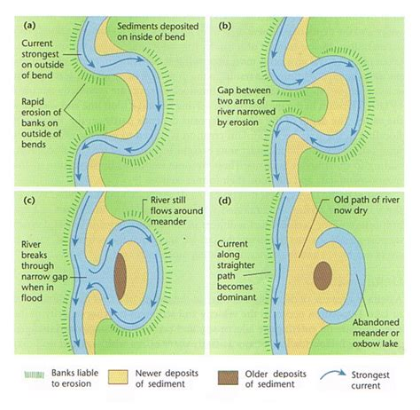

# 1.1 Hydrological Cycle

- closed system

- Water is held in number of stores and then moves between them by flows called transfers

## Stores

- Atmosphere - water exists either as water vapor
- Land - water is stored on surface of
    - rivers, lakes and reservoirs
    - below ground in the bed rock
    - Taken in by plants and stored in vegetation for short period
    - ground water below ground and aquifer
    - snow and ice as slid form in glaciers and snowfields
- The sea - estimation of over 95 percent of water is stored in sea

\*\* the water in the hydrological cycle cannot change but the proportions held in different locations can caused by sun's energy

## Flows (transfers)

- Evaporation - starts with evaporation due to the heat of the sun
- transpiration - plants take up liquid water from the soil and released as vapor
- Evapotranspiration- the loss of moisture from the ground by direct evaporation from water bodies and the soil, plus transpiration from the plants
- Condensation - change in atmosphere when water vapor cools to become liquid
- Precipitation - rain, hail or snow from atmosphere to the land or sea surface
- Overland flow - most precipitation flows into stream, river or lake, known as run off
- Infiltration and percolation - downwards through the soil and rock into aquifer or groundwater store
    - infiltration happens on surface and percolation happens afterwards
- Throughflow - between the ground surface and the top of the ground water store
- Groundwater flow - in the rocks of the aquifer and transfer water to rivers, lakes and sea underground

# 1.2 Drainage Basin

### open system and small scale hydrological cycle

### inputs:

- energy from the sun
- precipitation formed from moisture picked up outside the basin
- water from tributary drainage basins

### outputs:

- river's discharge
- water in basin from evaporation and transpiration happen
    - (water falls as precipitation in another drainage basin)

Def:

- Watershed: tops of the hills that separate drainage basins
- Tributaries - smaller streams
- Confluences - where smaller river merge or enter the main river channel
- mouth/estuary - where water flows into the sea
- Channel network - system of surface and underground channels that collect and transports the precipitation falling on the drainage basin

### types of drainage basin:

- simply connect and deliver water directly to the sea
- parts of much larger drainage basins
- lead to 'inland' seas or lakes such as Caspian Sea

### factors affecting run off:

- rapid run off - steep slopes; impermeable rock
- little run off - permeable rock: rivers have disappeared underground
- woodland - slow rate of run off
- urban area - speeds up rate of run off

# 1.3 River Regimes and Hydrographs

Def:

- River regime - Variation of discharge throughout the year
- hydrograph - graph with the variation of river discharge

## Storm Hydrographs

def - records the changing discharge of a river after a rainstorm

- bar graph - shows rainfall
- line graph - shows discharge of river
- base flow - 'normal' discharge of river
- storm flow - additional discharge of the river as a result of the rainstorm

## Factors Affecting River Regimes

- Amount and intensity of rain.
    - heavy rain will not sink into the ground and become overland flow
- Temperature affect the form of precipitation
    - if temperature is below freezing, precipitation will be snow and take slower to melt
- Steep slows cause rapid surface run off
- Rock type - impermeable rocks will not allow rainwater to sink into
- Vegetation and land use - trees and other plants intercept and delay the rain reaching the ground
- Human intervention - dams and reservoirs are interventions in river regimes

# 1.4 Fluvial Processes

Three processes that shape land forms erosion, transport and deposition
These partner with two other processes - weathering and mass movement

Def:

- Physical weathering - breaks rocks down into smaller and smaller pieces
    - done by changes in temperatures and by rainfall freezing and thawing in rock cracks
- Chemical Weathering - Causes rocks to decay and disintegrate
    - Largely done by slightly acidic rain seeping into porous rocks
- Biological weathering - roots of plants, especially trees, growing into cracks in the rocks gradually split the rock apart
- Slumping - occurs when
    - bottom of valley slide slope is cut away by the river flowing at its base.
    - makes the slope unstable and weathered material slumps down towards the river
    - also happens when slope is saturated by heavy rain
- Soil Creep - weathered material moves slowly down slope under the influence of gravity

## Erosion:

Def:

- Hydraulic action - Water hits the river bed and banks with force that material is dislodged and carried away. (most likely to happen when river discharge is high)
- Abrasion - Material being carried by river is rubbed against the side and floor of the channel. (sandpaper action widens and deepens the channel)
- Corrosion/Solution - Minerals in the rock forming the sides of the river channels are dissolved by the water flowing past them
- Attrition - Particles of material being carried by a river, and becoming rounder and smaller as they collide with each other

## Transport

def: movement of material (load) by the river

Def:

- Solution - material dissolved in the water
- Traction - Large boulders rolled on the bed
- Saltation - Small boulders bounded along the bed
- Suspension - lighter material carried along by river flow

### Deposition:

def: laying down of material previously transported by the river. Happens when there is a decrease in the energy, speed and discharge of the river
(mostly like to happen when a river enters a lake or the sea)

# 1.5 Downstream Changes in River Characteristics

| Factors | Upstream | Downstream |
| --- | --- | --- |
| Discharge | Less | More |
| Occupied Channel Width | Less | More |
| Channel Depth | Less | More |
| Average Velocity | Less | More |
| Load Quantity | Less | More |
| Load Particle Size | More | Less |
| Channel Bed Roughness | More | Less |
| Slope Angle (Gradient) | More | Less |

## Upper stream Landforms (mainly formed by erosion)

- steep V-shaped valleys - river has cut down by vertical erosion
- waterfalls - vertical erosion and falls back, soft rock and hard rock, makes plunge pool
- gorges - made when waterfalls retreat
- steep and river flows fast (not fastest)
- Hydraulic action and abrasion erode the bed rocks
- Valley floor is narrow
- Interlocking spurs - formed where the river swings from side to side

## Lower Stream Landforms

- River Velocity and discharge increase
- Gentler gradient
- Floor occupied by a flood plain
- valley cross section wider and flatter
- Flood plain spreads out to become a delta or an estuary
- Levees Thickness of sediment in river from flooding and sediment movement
- Delta - vast areas of alluvium at the mouths of rivers
- Distributaries - Smaller channels made from river flow blocked by deposition

## Mid Stream Landforms

- Meanders - Erosion and deposition due to swinging of river. Difference in speed of outer and inner part of the river
- Ox Bow Lake - Meanders flood and the river shortcuts to isolate part of the river

# 1.7 Water Uses, Demand and Supply

## Uses

Although only 3 percent of water on earth is fresh water, fresh water is:

- essential to all life
- vital to economic
- Unevenly distributed, with some areas 'water-rich' and 'water-poor'

Fresh water is needed for:

- Domestic use - bathing and showering
- Industrial use - producing goods from beer to steel, generating electricity
- leisure use - sport fishing on rivers

All forms of water use revolve around two key elements:

- Demand - need for water for range of uses: also often referred as consumption
- Supply - meeting the demand for water by tapping various sources, such as ground water, lakes and rivers

### For any area, comparison of water demand and water supply is water balance

## Demand

### water demand and consumption have increased in the last 100 years with global demand more than trebling over the last 50 years.

This is because of

- growth of world's population, houses use piped water, toilets, and showers.
- rise in agricultural productivity needed to fee a growing population increases the use of water, particularly for irrigation
- Industrialization require water to cool machinery

## Supply

- Rivers and lakes - source used by the earliest humans
- Reservoirs - artificial lakes created by building a dam across a valley allowing it to flood
- Aquifers and wells - much of the world's fresh water supply lies underground

## Water Surplus and Defect

We can have three types of areas:

- area where the water balance is negative - water demand exceeds supply
- area where the water balance is positive - water surplus areas where the supply or availability of water exceeds demand
- areas where water demand and supply are roughly the same - water neutral areas

## Sources of water pollution

### Agriculture

- Liquid from farms silage and slurry from farm animals enter rivers
- Fertilizers and pesticides seep into the ground water
- Deforestation - run off carries soil and slit into rivers, with serious effects on aquatic life and humans who drink the water

### Industry

- Taking cooling water for an electric power station and returning it at a higher temperature damages ecosystems
- Spillage from industrial plants such as oil refineries can enter rivers
- Working on metallic minerals can produce toxic substances

### Domestic

- The discharge of untreated sewage from houses - even treated sewage pollutes
- User of river for washing and bathing contaminates water
- Emptying highly chlorinated water from swimming pools

## Access to Safe Water

def:
Safe Water - water fit for human consumption, it is not contaminated by pollutants and is free from disease.

\*\*\* Estimated that more than 1 billion people do not have access to safe water

## Managing The supply of Clean Water

### Three Stages

- Collection
- Treatment
- Delivery

Collection - main sources of water are rivers, reservoirs and lakes, aquifers and wells

Treatment - rivers are often highly polluted. Important to remove suspended solids, bacteria, algae, viruses, fungi and chemical pollutants. The process include:

- chlorination - to control any biological growth
- aeration - to remove dissolved iron and manganese
- sedimentation - to remove very fine sediments
- disinfection - to kill bacteria

### Delivery

In developed countries, water is delivered by standpipes in the streets.
In villages, water from wells are often used untreated

# Case Study

## River Management Lessons from Spain:
- Mediterranean climate means that Spain's annual rainfall is small
- most of it falls in the winter half of the year
- Tagus-Segura Project
  - 286 km long aqueducts and canals completed in 1978 to carry water from two reservoirs in the upper Tagus valley to a large reservoir in Alicante Province
  - Problems
    - most of irrigation water has gone to agribusinesses rather than local people
    - much of the water has been consumed, not by agriculture, but by the 'urban developments' and tourist resorts along coasts
    - availability of transferred water has encourage a wasteful or extravagant use of it
- Ebro Project
  - even more ambitious river management plan proposed in 2001
  - to divert and dam the longest river in Spain: Ebro
  - project abandoned in 2004 due to:
    - bad experience of the Tagus-Segura Project
    - huge threat it posed to the Ebro Delta, an important agriculture area and wildlife wetland
  - Spanish government decided to meet the growing water shortages by constructing coastal desalinization plants.

## River Management Lessons from China
- Three Gorges Project:
  - started in 1997
  - mainly to generate electricity and to control flooding
  - middle of China and on longest river, Yangtze
  - dam finished in 2009 and longest in the world
  - 185 m high and almost 2km wide
  - reservoir of water is nearly 600km long
  - produces 10% of China's total electricity
  - problems:
    - one million people lost their homes and had to resettle to make way for the dam and reservoirs
    - reservoir flooded some of the country's most fertile land for farmers
    - water quality is reducing as huge amounts of human and industrial waste are trapped in the dam

  - South-North Water Transport Project (SNWTP)
    - most of China's population growth is concentrated on the North China plain
    - this makes huge demand for water in the plains near Beijing and Tianjin
    - SNWTP created to meet water demand in the North
      - balance the water surplus in the south with the water deficit of the North
    - problems:
      - growing awareness of the 'cost' which are now thought to outweigh the benefits
      - leveling off in a demand for water because population/economy has slowed down

    | Costs | Benefits |
    | --- | ---- |
    | South is likely to suffer water shortages as it is exporting too much of its water to the North| North remains the powerhouse of Chinese economy|
    | Large numbers of people have been displaced to make way for the transfer routes | Much-needed water is being supplied to important industries|
    | Wildlife and ecosystems are badly distributed by the water transfer routs | More water for irrigation to help food production |
    | Loss of water as a result of evaporation from the open canals used to transfer water | Health risks are reduced because more people have access to safe water |
    |Very expensive project and a burden on tax payers | A showcase for Chinese engineering and technology |

    - China has tried to reduce water demand by:
      - reducing the amount of water lost through evaporation from inefficient irrigation systems and from the open canals that transfer water
      - increasing the recycling of water by modern water treatment techniques
      - tightening controls on water pollution so that water may be more easily re-used
      - recharging groundwater stocks that have been greatly lowered by overuse
      - increasing the price of water and so discouraging people and businesses from using it wastefully

## Plans to Manage the Blue Nile, Etheopia:
- shortage of resources in Ethiopia, especially water and energy
- Grand Renaissance Dam started construction in 2011
- generates 6000 megawatts of electricity and provides water for irrigation
- problems:
  - Sudan and Egypt, both located downstream feared that their water resrouces would be cut off and Ethiopia would 'steal' too much of Nile's river

  
