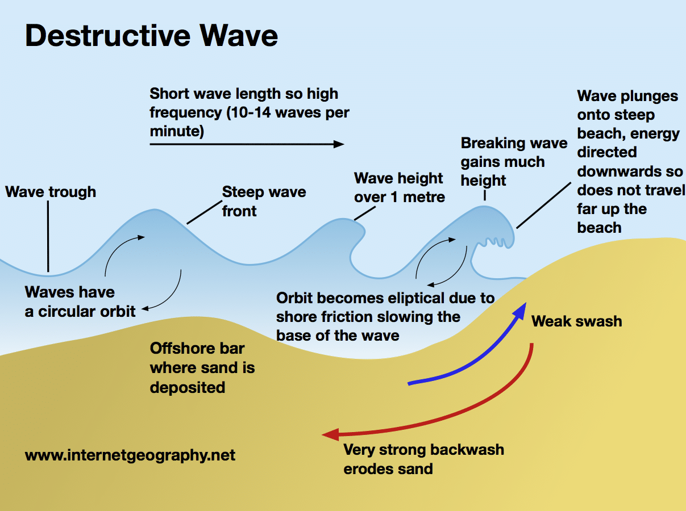
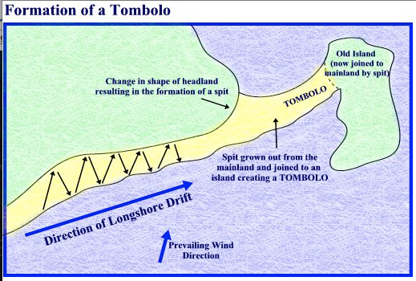

# 2.1 Coastal Processes

### Two parts of coastal environment - Onshore & Offshore

Much of marine processes involve waves
### Waves friction between the wind and the water set the wave's motion
### The strength of waves depends on the strength of the wind

Fetch - length of time and distance over which which has been blowing at the wind

Constructive wave - Long wavelength, shallow gradient waves, strong swash, weak backwash, beach built up by deposition of material brought up in wash
Destructive waves - tall waves with short wavelength, steep gradient waves, weak swash, strong backwash, beach eroded

### In constructive waves, the swash is stronger than the back wash so material is moved up the beach
### In destructive waves, back wash is stronger so material is dragged back down the beach and moved along the coast by long shore drift (LSD).

### Destructive Waves cut away at coastline through:
* Hydraulic action - result from force of waves hitting the cliffs and forcing pockets of air into cracks and crevices
* Abrasion - caused by waves picking up stones and hurling them at cliffs and so wearing the cliff away
* corrosion (solution) - dissolving of rocks by sea water

## Land Processes
### Main processes at work on landward side of coastline:
* weathering - breakdown of rocks which is caused by freeze-thaw and growth of salt crystals, by acid rain and by growth of plant roots
* Erosion - wearing away of rocks by wind and rain
* Mass movement - removal of cliff-face material under the influence of gravity in the form of rock falls, slumping and landslides

# 2.2 Coastal Landforms
## Erosional Landforms:
==alteration of headlands and bays== -most common coastal landform, gives coastline irregular appearance

* Concordant coasts - costs where the rock outcrops run parallel to the sea, makes straight coastline
* Discordant coasts - coasts where the rocks outcrop at right angles to the sea, makes headlands and sea

Weak rocks (such as clay) are easily eroded by sea to become bays
More resistant rocks, that are able to withstand the destructive waves, protrude as headlands

Most headlands are edged by cliffs

Process of cliff erosion from destructive waves:
* Headland
* Caves
* Arch
* Stack
* Stump

## Depositional Landforms - made by constructive waves
Beaches - most common depositional landform, resulting from accumulation of material deposited

Spit - long narrow beaches of sand or shingle that are attached to the land at one end, extend across a bay, an estuary or where the coastline changes direction. Formed by longshore drift in one dominant direction.

Bar - formed from spit development in a bay, building across it and link two headlands. Any water on the landward side is trapped to form a lagoon.

Tombolo - spits that have continued to grow seawards until they reach and join an island

Sand dunes - dunes made from wind accumulating sand. Gradually, the older ridges become colonized by vegetation and helps to stabilize them

# 2.3 Factors Affecting Coastal Environments
## Geology
|Feature|Hard Rocks|Soft Rocks|
|-|-|-|
|shape of cliffs|high and steep|generally lower and less steep|
|cliff face|bare rock and rugged|smoother; evidence of slumping|
|foot of cliff|boulders and rocks|few rocks;some sand and mud|

plan view - headlands and bays
vertically - height and profile of cliffs

## Vegetation
Longer existing landforms have greater chance of vegetation. They can support structures such as sand dunes and mangrove swamps

## Sea level changes
Low lying coasts will be drowned by rising sea levels can be drowned from global warming and climate change
Falling sea level can cause raised beaches made from old wave-cut platform

## Human activities
* Settlement - coastal lowland attracts people and many of the world's most populated cities are located on the coast.
* Economic development - people have taken advantage of economic opportunities provided by the coast such as land for agriculture, industry, and tourism
* Coastal management - people trying to control coastline. (ex. building sea walls and groynes)

# 2.4 Coastal Ecosystems of the World
coasts are rich in biodiversity

## Coral Reefs
Reefs are huge deposits of calcium carbonate made mainly of corals
### Global distribution factors:
* Temperature - coral growth needs a minimum water temperature of 18C; they grow best between 23C and 25C
* list - needed for coral to grow, corals only grow in shallow water
* water depth - needs light, most reefs grow where the sea is less than 25 meters deep
* salinity - only survive in saltwater
* wave action - need oxygenated water made by strong wave action
* exposure to air - if exposed to air for too long, they die
* sediment - need clean air, clean water, any sediment in the water blocks their normal ways of feeding and reduces the amount of light

Ex. Great Barrier Reef in Australia

## Mangroves
* Most common in South-East Asia
* Found within 30 degree altitude of the equator
* live on the coastline, in the intertidal zone (consistent changing environment)
* can cope with great heat and mud
* range in size from small shrubs to trees over 60m high
* clever at adapting to environment
* filtration system to keep much of the salt out
* complex root system adapted for survival in intertidal zone
* some have snorkel like roots that stick out of mud to take in air
* fruits and seedlings of all mangrove plants can float to drift with the tide to spread

## Salt Marshes
* occupy midway location between mudflats that are permanently submerged by water and terrestrial (land) vegetation lying above the high tide mark
* ecosystem of intertidal zone
* develop in locations sheltered from the open sea, heads of bays and in estuaries
* water is brackish, in bays, the water is salty
* vegetation depend on salinity
* criss-crossed by meandering creeks, allow tidal water to drain in and out

## Coastal Sand Dunes
Develop with:
* wide beach and large quantities of sand
* prevailing wind is onshore (from the sea to the shore)
* suitable locations for the sand to accumulate

Over time, vegetation grows and becomes 'fixed' vegetation. Older, inner parts have greater vegetation cover. They need to cope with:
* salinity
* lack of moisture as sand drains quickly
* wind
* temporary submergence by wind-blown sand

Plant succession - vegetation process

# 2.5 Coastal Ecosystem Characteristics
Def
Biotic components - living parts (plants and animals)
Abiotic components - parts of the ecosystem that are not living, but are essential to life (climate, minerals, etc)

* Ecosystems survive by nutrient cycling - transfer of nutrients within ecosystems
	* involves circulating minerals around three stores:
		* Nutrient source (ex. soil)
		* biomass (living matter of the ecosystem)
		* litter (nutrients released back to the source)

### Nutrient cycle in coral reef ecosystem:
* Sea water - 'soil' of ecosystem. Supply of nutrients in the sea water is maintained by on-shore ocean currents
* Biomass - three main components:
	* Coral itself
	* seaweeds attached to the coral
	* fish and invertebrates
* Litter - dead coral and fish

Food chain - organized food web

# 2.6 Coastal Ecosystem Under Threat

|Goods|Services|
|-|-|
|fish and shellfish|protection from storms|
|fish meal and animal feed|harbors|
|sea weed for industrial use| shelter|
|salt|recreational opportunities|

## Coral Reefs
Value of coral reefs:
* biodiversity
* protection they give to low-lying coasts from the impact of tropical storms
* rich fish stocks - supply basic food requirements of many developing countries
* appeal to tourists

### Threats:
* contact with human body
* pollution, over fishing
* quarrying of coral for building stone
* coral bleaching - rising water temperatures associated with global warming

## Mangroves
### Threats:
* human deforestation due to lack of education about importance of having mangroves for lumber

## Salt marshes
### Values:
Collectors of silt and organic matter
nursery areas for fish and crustaceans
protection against wave erosion and sea-level rises

### Threats:
* Reclamation to create farmland and sites for industrial port developments
* industrial pollution particularly in water
* agricultural pollution - fertilizers
* pressure from developments such as marinas & recreational facilities

### Coastal Sand Dunes
least threatened

# Case Study
## Management of Mangroves
- Bangladesh - low lying country
	- long coastline vulnerable to tropical storms and storm surges
- part of Coastal Zone Policy:
	- taking advantage of mangroves trapping sediments and stabilizing shores
	- deliberately planting mangroves on delta sediments
	- gained 120,000 hectares of new land in the Bay of Bengal
	- vast tidal mangrove woodland known as Sundarbans
	- creates new land and protects Bangladesh from coastal Flooding
	- also permitting local people to make use of its resources

	

# 2.7 Coastal Conflicts
## Coastal System
### Inputs:
* Sediment - from rivers by weathering & erosion

### Stores:
* beaches
* spits
* forelands
* sand dunes

### Transfers:
* movement of sand and shingle along the coast by longshore drift (lsd)

## Conflict Between Development and Conservation

There is a overriding coastal conflict between conservationists and developers

## Conflict between coastal users

Stakeholders - users of the coasts:
* local residents - good choice of housing, clean environment
* employers - access to labor
* farmers - well-drained land, shelter from strong offshore winds
* fishers - harbors, unpolluted wars
* port authorities - harbors and space for port side services and terminals
* transport companies - good roads and terminals such as ports and airports
* tourists - beaches, hotels, recreational amenities, heritage sites
* developers - greenfield sites

# 2.8 Coastal Flooding
Tsunami - tidal wave caused by the shock waves originating from an earthquake
## Reducing The Coastal Flooding Risk
### Prediction:
* Look back at historic records and identifying those areas that have been flooded most often and most seriously
* Relying on an accurate forecasting of possible hazard events

Prevention:
* building flood defenses along those stretches of the coast most at risk
* building emergency centers where people can be safe from flooding
* removing housing and human activities from high-risk areas
* plan new development with risk consideration
* educate local people

# 2.9 Coastal Management Strategies
Coastal cells - mini systems

## Coastal erosion and retreat
Some coasts are retreating at the rate as high as 10 meters per year

## Coastal flooding
* can result from coastal erosion
* occur along low lying coasts
* occur from storm surges and tsunamis

## Hard - Engineering Management
### Involves some type of sea defense, usually from rocks or concrete
* Most structures are expensive to build and maintain - repair of sea wall coast up to 3000 Pounds a meter
* Effective defense in one place can have serious consequences for a nearby stretch of coastline
* Defense structures such as sea walls, gabions and rip-rap cannot keep with rising sea levels
* structures can spoil the natural beauty of coastline

### Ex:
* Groyne - concreet wall with wood or steel ping to stop LSD
* Wooden revetment
* recurved steel wall
* gabion - steel wire mesh cage filled with small rocks
* rip-rap - large boulders dumped on beach

## Soft-Engineering management
### Tries to work with natural processes
## Ex:
* Beach replenishment - pumping/dumping sand and shingle onto beach to replace eroded material
* building bars - underwater bars located just offshore to reduce wave energy
* Fencing, hedging and replanting vegetation - reduces erosion
* cliff regrading - angle of cliff is reduce so that is not so steep - no retreat

## Managed Retreat
### Abandoning existing coastal defenses and allowing low-lying coastal areas to flood and develop into salt marshes

# Case Studies
## Coastal Management in the Gambia
- coastline to the south of estuary has been suffering from coastal erosion for a long time
	- rate of erosion has increased recently (last three decades)
	- attributed to the rising sea levels
- Gambia is being threatened:
	- most of its capital city, Banjul, located at the mouth of the Gambia river
	- much tourist infrastructure located close to the coast south of the river
		- this is main tourist area
		- for a country heavily dependent on tourism, coastal erosion is becoming a disaster
- for a growing country like Gambia:
	- coastal management is a luxury
	- it can only do little to protect its costs

## Coastal Management in Sri Lanka
- island state with a 1560km long coastline
- nearly half of population live in coastal zone
- problems:
	- pollution on insure waters
		- caused by discharging of untreated sewage from coastal towns and cities and from tourist developments
	- reclamation of mangroves and coastal wetlands to create land for tourism, housing and agriculture
	- loss of degradation of coral reefs as result of pollution, the 'mining' of coral and sand for building materials, and unsustainable fishing and recreational diving
	- damaging impacts of aquaculture of the marine environment
- physical challenges:
	- serious coastal erosion along the south-west coast where many people live and where much of the country's economic wealth is concentrated
	- exposure of much of the coastline to tsunamis and storm surges
		- result of global warming
		- 1.5 million have become homeless due to tsunami in 2004-5

- Sri Lanka's Coastal Management Plan (CZMP)
	- improve quality of coastal environment
	- promote economic development based on coastal resources
	- recognizes it would be physically and economically impossible to completely defend the coast
	- emphasis is on improving early warning systems and educating the public
		- promoting awareness of the hazard
		- practicing emergency routes
		- building and manning watch towers
		- identifying the areas most exposed to tsunami's threat
w

## Coastal Management in the UK
- three different types of action:
	- do nothing
		- along stretches with few if any risks
	- hold the line
		- hard engineering needed to continue to protect stretches of coast
	- managed retreat
		- three low lying areas recognized as being threatened by flooding
- East coast is sinking at 6mm per year

