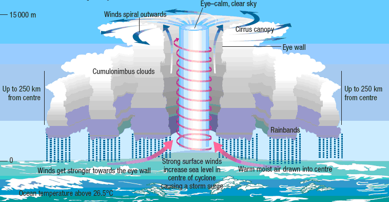
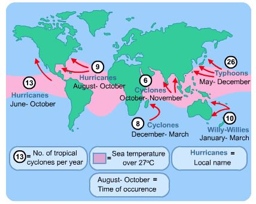
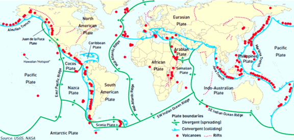
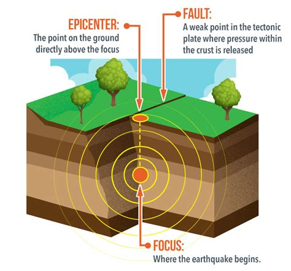
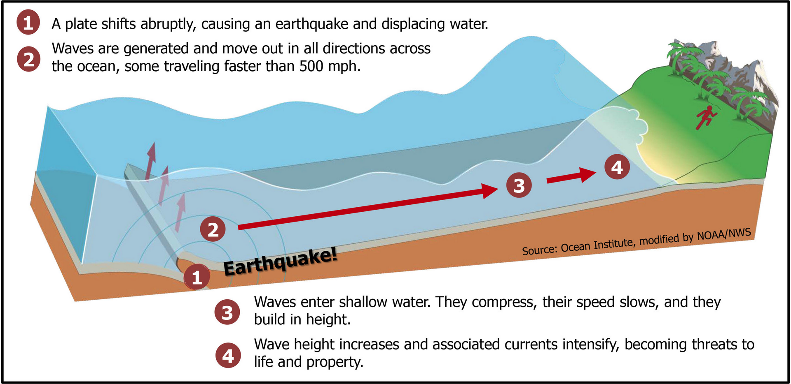
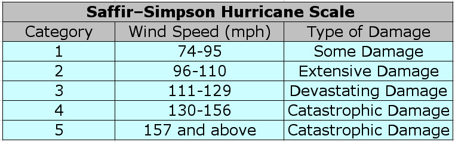
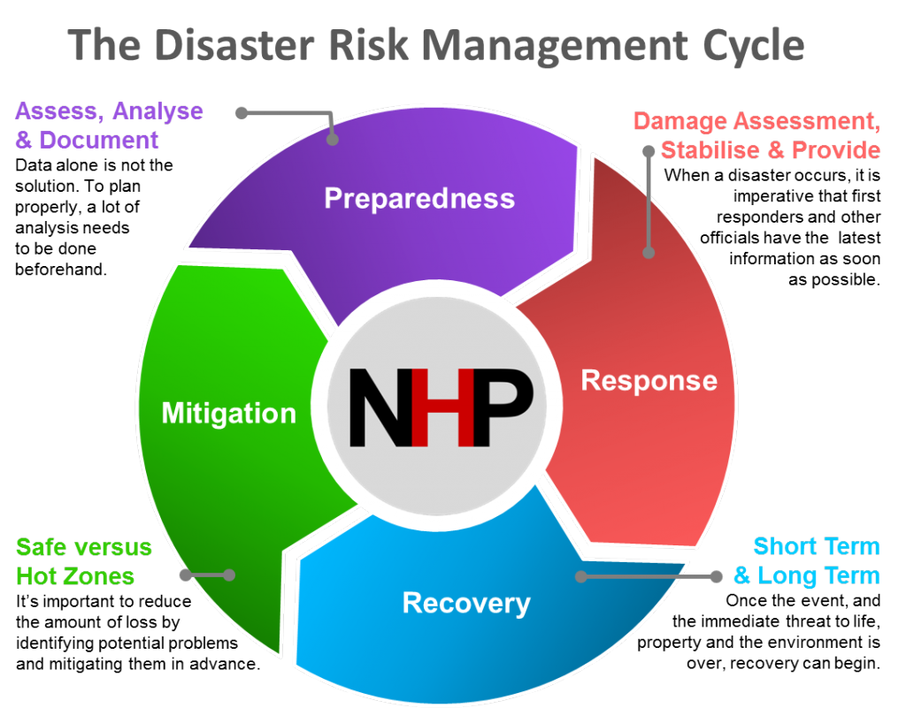

# 3.1 Different Types of Hazard

Hazard - event that threatens, or actually causes damage and destruction to people, their property and settlements

Hazardous differ because:

- some places experience more than one type of natural hazard event
- some laces experience natural hazards more frequently
- some places experience hazards that are stronger and more destructive
- some places are better able to cope with the damaging impacts of natural hazards

Ex:

| Geological(natural) | Climatic(natural) | Biological(natural) | Technological(non-natural) |
| --- | --- | --- | --- |
| Earthquakes | Storms | Fires | Nuclear Explosion |
| Volcanic Eruptions | Floods | Pests | Transport accidents |
| Landslides | Drought | Diseases | Pollution |

# 3.2 Tropical Cyclones

## Causes:

- starts when high temperature causes air to rise from the surface air
- rising air causes local thunderstorms
- small storms come together
- they create a strong flow of warm, rapid, raising air,which produces an area of increasingly low pressure

### Requirements:

- deep layer of humid, warm >27C and unstable air
- supply of energy from surface of sea
- sea must be at its warmest
- circulatory motion of air, caused by earth's rotation (Coriolis force)
- Small changes in wind speed and direction with increasing altitude

They are named by meteorologists from alphabetical list. They alternate in six year cycle

## Distribution

Cyclones are named differently depending on where it occurs

## Characteristics

- very low air pressure (less than 950mb)
- often 600-700 km across
- bring torrential rain
- thunder and lighting and very strong winds
- they follow the prevailing winds
- gathers energy throughout the sea
- when it reaches land, they loose strength because energy is cut off

damages caused by:

- very strong wind
- torrential rain - floods
- storm surges - coastal flood

## 3.3 Volcanic Eruptions and Earthquakes

Plate movements cause both volcanic eruptions and earthquakes

## Causes:

Tectonic plates - a rigid segment of the Earth's crust which can 'float' across the heavier, semi-molten rocks below

- places move over the surface of the globe
- movement create four different types of plate margin
    - constructive/divergent plate margin - two plates are moving apart
    - destructive/convergent plate margin - two plates are moving towards each other
    - conservative/transform - two plates are sliding past each other
    - collision - two plates meet head on and are of equal density and strength

## Distribution

Occur along tectonic plate boundaries

## Characteristics:

### Volcanic Eruptions:

Forms:

- Lava flows - since few lava flows reach much beyond 10km from the volcanic center, do not cause as much death and destruction
- Ash - may be thrown into the air during a violent eruption. Often ash is carried in the wind and therefore it can affect a large area
- Gas emissions - sulfur gasses are not the only type emitted ruing an eruption. Particularly lethal dense gas are known as pyroclastic flows

### Earthquakes:

Earthquake - sudden and brief period of intense shaking of the ground

- Measured on Richter Scale
- Focus/hypocenter - center of the earthquake underground
- shock waves travel outwards from the focus
- waves are strongest close to to the epicenter, the point of the surface directly above the focus
- amount of damage depends on the depth of the focus and type of rock
- shock waves 'liquefy' soft rocks so that they behave like liquid, buildings can simply collapse
    
    

# 3.4 The Scale Of Tectonic Hazards

## Volcanic Eruptions

- Measured by Volcanic Explosivity Index (VEI) Logarithmic scale of 1-8

## Earthquakes

- Richter Scale 2.4-8.0, 1 point up on the scale represents a 30 times increase in released energy
- Mercali scale - based on what people experience and the amount of damage done
- Moment Magnitude Scale (MMS) most commonly used method, based on amount of rock movement

Factors:

- size of area affected
- density of population in the area affected
- how long the event lasts

# 3.5 Impacts of Tectonic Hazards
Earthquake primary Impacts:

- collapsed buildings and the people killed or injured by falling masonry
- broken water, gas and sewage pipelines
- downed electric power lines

Earthquake secondary impacts:

- tsunamis
- aftershocks
- fires due to ruptured gas mains

Volcanic eruption primary impacts:

- buildings, roads and crops destroyed by lava
- death and injury directly from outpouring lava, ash and gas
- contamination of water

Volcanic eruption secondary impacts:

- lahars created by mixing of volcanic ash and mud with rainwater or melting snow
- fires started by lava and pyroclastic flows
- psychological trauma

# 3.6 Reasons for living in high risk areas

# People live in hazardous areas because of:

- lack of education and information may mean that residents are unaware of the rear risks, particular in hazards occur infrequently
- people may be aware of the risks but decided to live there anyway
- people may be unable to move away
- many people are optimists and think they will never be a disaster victim
- areas of high population density have gradually grown up over many centuries, and have momentum to still exist
- cities in high risk areas represent centuries of investment

# Volcano benefits:

- minerals
- fertile soil
- geothermal energy
- tourism

# 3.7 Tropical Cyclones and Their Impacts

## Measurement

## Impacts:

Short term:

- Physical - damage to property
- social - number of people killed or injured
- economic - disruption and destruction of businesses
- environmental - landslides; soil erosion; upset ecosystem; prolonged flooding

# Case Study

# 3.8 Predicting and Preparing for Earthquakes

Way of reducing destructive impact:

- know when and where the hazard will occur (prediction)
- take precautions before the event actually occurs (preparation)

### Steps in the management of natural hazards:

- identify natural hazards threats in particular location
- risk assessment
- prediction
- preparation
- hazard event
- recovery
- appraisal

## Risk Assessment

risk - probability of a particular event happening and the scale of its possible damage

Factors to assess;

- Distribution
- frequency
- scale
- predictability

## Prediction

Allows:

- give people time to move into what are thought to be 'safe' locations
- puts the emergency services on immediate alert

## Preparation

- construction
- warning systems
- remote sensing and GIS
- education

# 3.9 Responding to Hazards

## Emergency Response

Response teams might specialize in:

- releasing people from dangerous locations
- using lifting gear and diggers to clear debris
- restoring basic services
- etc

## Appraisal and Long-Term Planning

Ask questions such as:

- do the risks need to be reassessed?
- do the warning systems need to be improved?
- can buildings in the area be made more hazard-resistant?
- etc
