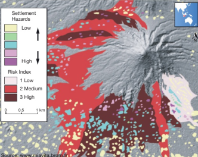

# 3.1 Different Types of Hazard

Hazard - event that threatens, or actually causes damage and destruction to people, their property and settlements

Hazardous differ because:

- some places experience more than one type of natural hazard event
- some laces experience natural hazards more frequently
- some places experience hazards that are stronger and more destructive
- some places are better able to cope with the damaging impacts of natural hazards

Ex:

| Geological(natural) | Climatic(natural) | Biological(natural) | Technological(non-natural) |
| --- | --- | --- | --- |
| Earthquakes | Storms | Fires | Nuclear Explosion |
| Volcanic Eruptions | Floods | Pests | Transport accidents |
| Landslides | Drought | Diseases | Pollution |

# 3.2 Tropical Cyclones

## Causes:

- starts when high temperature causes air to rise from the surface air
- rising air causes local thunderstorms
- small storms come together
- they create a strong flow of warm, rapid, raising air,which produces an area of increasingly low pressure

### Requirements:

- deep layer of humid, warm >27C and unstable air
- supply of energy from surface of sea
- sea must be at its warmest
- circulatory motion of air, caused by earth's rotation (Coriolis force)
- Small changes in wind speed and direction with increasing altitude

They are named by meteorologists from alphabetical list. They alternate in six year cycle

## Distribution

Cyclones are named differently depending on where it occurs

## Characteristics

- very low air pressure (less than 950mb)
- often 600-700 km across
- bring torrential rain
- thunder and lighting and very strong winds
- they follow the prevailing winds
- gathers energy throughout the sea
- when it reaches land, they loose strength because energy is cut off

damages caused by:

- very strong wind
- torrential rain - floods
- storm surges - coastal flood

## 3.3 Volcanic Eruptions and Earthquakes

Plate movements cause both volcanic eruptions and earthquakes

## Causes:

Tectonic plates - a rigid segment of the Earth's crust which can 'float' across the heavier, semi-molten rocks below

- places move over the surface of the globe
- movement create four different types of plate margin
    - constructive/divergent plate margin - two plates are moving apart
    - destructive/convergent plate margin - two plates are moving towards each other
    - conservative/transform - two plates are sliding past each other
    - collision - two plates meet head on and are of equal density and strength

## Distribution

Occur along tectonic plate boundaries

## Characteristics:

### Volcanic Eruptions:

Forms:

- Lava flows - since few lava flows reach much beyond 10km from the volcanic center, do not cause as much death and destruction
- Ash - may be thrown into the air during a violent eruption. Often ash is carried in the wind and therefore it can affect a large area
- Gas emissions - sulfur gasses are not the only type emitted ruing an eruption. Particularly lethal dense gas are known as pyroclastic flows

### Earthquakes:

Earthquake - sudden and brief period of intense shaking of the ground

- Measured on Richter Scale
- Focus/hypocenter - center of the earthquake underground
- shock waves travel outwards from the focus
- waves are strongest close to to the epicenter, the point of the surface directly above the focus
- amount of damage depends on the depth of the focus and type of rock
- shock waves 'liquefy' soft rocks so that they behave like liquid, buildings can simply collapse
    
    

# 3.4 The Scale Of Tectonic Hazards

## Volcanic Eruptions

- Measured by Volcanic Explosivity Index (VEI) Logarithmic scale of 1-8

## Earthquakes

- Richter Scale 2.4-8.0, 1 point up on the scale represents a 30 times increase in released energy
- Mercali scale - based on what people experience and the amount of damage done
- Moment Magnitude Scale (MMS) most commonly used method, based on amount of rock movement

Factors:

- size of area affected
- density of population in the area affected
- how long the event lasts

# 3.5 Impacts of Tectonic Hazards
Earthquake primary Impacts:

- collapsed buildings and the people killed or injured by falling masonry
- broken water, gas and sewage pipelines
- downed electric power lines

Earthquake secondary impacts:

- tsunamis
- aftershocks
- fires due to ruptured gas mains

Volcanic eruption primary impacts:

- buildings, roads and crops destroyed by lava
- death and injury directly from outpouring lava, ash and gas
- contamination of water

Volcanic eruption secondary impacts:

- lahars created by mixing of volcanic ash and mud with rainwater or melting snow
- fires started by lava and pyroclastic flows
- psychological trauma

# Case Study:
## Earthquakes in Nepal (2015)
- April 25, 2015:
  - massive earthquake (magnitude 7.8 Richter Scale) devastated much of the small Himalayan country of Nepal
  - caused over 8500 deaths and nearly 17000 people injured
  - nearly 3 million people displaced
  - primary impacts:
    - thousands of families instantly lost access to household energy for cooking, lightning, and heating
      - without power to charge phones, people could not contact family members or help
      - road network providing only means for access were destroyed
        - made it impossible for emergency services to reach many communities
      - small airport didn't allow for large scale help from outside
- three weeks later:
  - another major earthquake occurred
  - aftershock caused mass panic because people were living in the open after the April earthquake

## Earthquakes in Central Italy
| Date | Magnitude | Epicenter | Location | Focus Depth |
| -- | -- | -- | -- | --- |
| 24 August | 6.2 | Amatrice | 4km|
|26 October | 6.1 | Visso | 8km|
| 30 October | 6.6 | Norcia | 4.5km|
| 3 November | 4.8 | Pieve Torina | 8km|

- August earthquake:
  - killed 300 people
  - 360 injured
- last three earthquakes killed no one
  - because Italy was alerted
- these events indicate that:
    - even developed countries cannot make themselves completely quake-proof
    - damage and destruction caused by earthquake depends not only on its magnitude and its focus depth

# Mount Merapi Eruption
- Mount Merapi is located on densely populated island of Java, Indonesia
- one of the most active and dangerous volcanoes in the world
- main phase of eruption took place between 26 October and 12 November, 2010.
- impacts:
  - volcanic bombs - landed 11km away
  - ash plumes blasted up to 5 km into the sky with ash landing up to 30km away
  - pyroclastic flows spreading 3 km down the volcano
  - sulfur dioxide, dangerous gas, blown into as far south as Australia
  - lahars, ash, rock and lava deposited on the volcano was washed down into rainfall
- secondary impacts:
  - emergency shelters could not be located closer than 15 kilometers of the volcano due to ash
  - danger area extended 20 km from the volcano
  - nearly 300,000 people have to leave their homes
  - flights canceled

## Mount Ontake Eruption (2014)
- 27 September 2014:
  - Mount Ontake, active volcano and second highest volcano in japan, suddenly erupted without a warning
  - around 50 hikers killed by toxic gasses and heat of a large, fast moving pyroclastic flow
  - nearly 100 people were injured

# 3.6 Reasons for living in high risk areas

# People live in hazardous areas because of:

- lack of education and information may mean that residents are unaware of the rear risks, particular in hazards occur infrequently
- people may be aware of the risks but decided to live there anyway
- people may be unable to move away
- many people are optimists and think they will never be a disaster victim
- areas of high population density have gradually grown up over many centuries, and have momentum to still exist
- cities in high risk areas represent centuries of investment

# Volcano benefits:

- minerals
- fertile soil
- geothermal energy
- tourism

# 3.7 Tropical Cyclones and Their Impacts

## Measurement

## Impacts:

Short term:

- Physical - damage to property
- social - number of people killed or injured
- economic - disruption and destruction of businesses
- environmental - landslides; soil erosion; upset ecosystem; prolonged flooding

# Case Study

## Hurricane Katrina:
- formed over the Bahamas in Aug. 2005
- moved westwards across tip of Florida as a Category 1 Hurricane
- reached Category 5 at sea on 25 Aug.
- cyclone doubled in size and wind speeds were over 300 kph
- eventually, it swung north-eastwards, weakened to Category 3 and made its landfall at New Orleans at 6 A.M on 29 Aug.

- one of the deadliest and costliest hurricanes in history
  - nearly 2000 people were killed
  - thousands injured
  - damage estimated at 84 Billion Dollars
  - displaced 1 million people
- destroyed many buildings in downtown New Orleans, including hotels and the roof of Superdome
- produced storm storm surge with 8m waves
- 80 percent of city flooded up to 6m depth

Critical problems:
- levee and coastal flood protection walls were aging and neglected
- slow emergency response by the authorities
- relief efforts of a large number of organizations were poorly coordinated
- food and water shortages were evidence that emergency aid was poorly organized
- despite large scale evacuations, many were left behind
- much looting of abandoned properties
- some of the money raised by public appeals around the world 'disappeared' so could not be used to good use

## Typhoon Haiyan Hits the Philippines (2013)
- November 8 2013, Category 5 typhoon struck the Philippines
- Winds over 300kph were recorded
- Approximately 800,000 people were evacuated
- 1.9 million were left homeless
- more than 6000 people killed
- Delivery of emergency aid was difficult due to damaged airport and roads.
- serious shortages of food due to crops wiped out
- 3 million people were receiving food assistance including rice, high-energy biscuits and emergency items
- Management of hazard has now moved on to:
  - rebuilt structures will be upgraded and made more hazard proof
  - 'no build' zones were made along stretches of coasts that were hit by storm surge
  - new storm surge warning system
  - mangroves replanted to help natural protection
- Given that Philippines is not a rich or technologically advanced country, the management of Typhoon Haiyan, its immediate aftermath and the subsequent recovery, reflects well on the country:
  - it has learned useful lessons from the typhoons that hit them every year
  - they implemented simple but effective forms of hazard preparation
    - including reliable warning systems and holding regular emergency training exercises in local communities.

# 3.8 Predicting and Preparing for Earthquakes

Way of reducing destructive impact:

- know when and where the hazard will occur (prediction)
- take precautions before the event actually occurs (preparation)

### Steps in the management of natural hazards:

- identify natural hazards threats in particular location
- risk assessment
- prediction
- preparation
- hazard event
- recovery
- appraisal

## Risk Assessment

risk - probability of a particular event happening and the scale of its possible damage

Factors to assess;

- Distribution
- frequency
- scale
- predictability

## Prediction

Allows:

- give people time to move into what are thought to be 'safe' locations
- puts the emergency services on immediate alert

## Preparation

- construction
- warning systems
- remote sensing and GIS
- education

# 3.9 Responding to Hazards

## Emergency Response

Response teams might specialize in:

- releasing people from dangerous locations
- using lifting gear and diggers to clear debris
- restoring basic services
- etc

## Appraisal and Long-Term Planning

Ask questions such as:

- do the risks need to be reassessed?
- do the warning systems need to be improved?
- can buildings in the area be made more hazard-resistant?
- etc

# Case Study
## Preparing for Earthquakes in India:
- Huge challenge for India because:
  - country where half the land area is prone to damaging earthquakes:
    - number of its largest cities are located in Zones 4 and 5
    - north-eastern region of India has a record of earthquakes with a magnitude of 8.0 or more
    - caused by the movement of the Indo-Australian plate towards the Eurasian plate
  - vast country:
    population of around 1.3 billion living at an average density of 400 persons per km^2
- 2016 Nepal earthquake was a wake up call for its larger and more developed neighbor (India)
  - National Disaster Management Authority has been set up along with a National Disaster Response Force
  - challenge is mainly 'seismic retrofitting'
    - involves modifying existing buildings so that they meet present-day standards of earthquake resistance
    - schools and hospitals are given a priority, but blocks of apartments are also prioritized
    - but it still leaves a huge backlog of millions of unsafe homes

