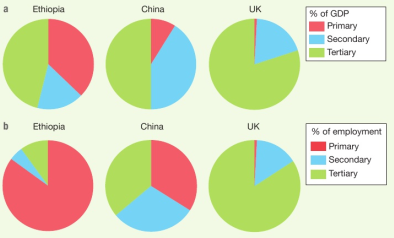
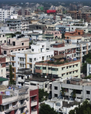
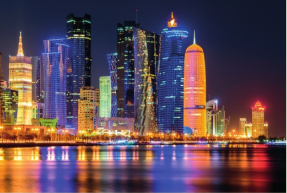
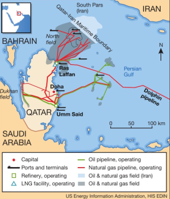
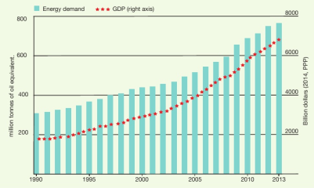
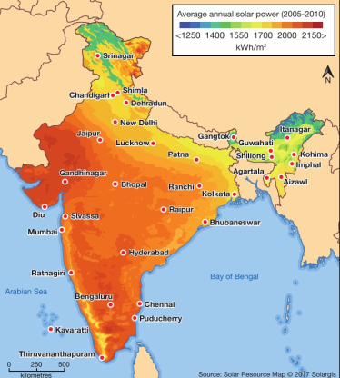
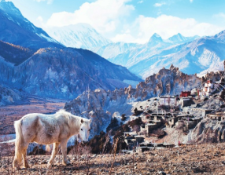
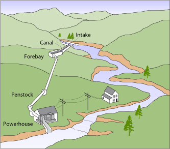
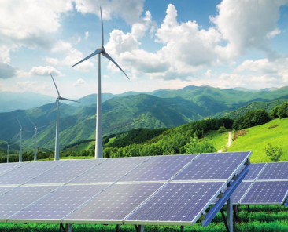

# 4.1 Economic Sectors and Employment

Economic activity does three things:

- creates jobs (employment)
- generates income (wealth)
- produces something for sale or consumption

## Four Economic Sectors

Def:

- Primary sector - working with natural resources. (ex. farming, forestry, fishing, mining, and quarrying)
- Secondary sectors - processing things such as food or minerals (ex. manufacturing cars, microchips, or building)
- Tertiary sectors - providing services. (ex. transport, restaurants, cinemas, doctors, schools, etc.)
- Quaternary sector - concerned with information and communications (ICT) and research and development (ex. universities)

### Economy of a developing country relies heavily on the primary sector while economy of a developed country depends most on the tertiary sector

Economic Measurements:

- GDP (Gross Domestic Products) - total value of goods and services produced by economy of a country during a year
- GNI (Gross national income) - GDP of a country plus all the income earned by investments abroad

As a country develops, proportion employed in the primary sector decreases and the proportion in the secondary and tertiary secors increase.

### Industrialization - Process by which an economy is changed from a primarily agricultural one to one based on the manufacturing of goods

### Stages of Industrializtion:

- Pre-industrial phase - primary sector leads the economy and may employ more than two-thirds of the working population. Agriculture is by far the most important activity
- Industrial phase - secondary and tertiary sectors increase in productivity. Primary sector declines in relativity.
- Post-industrial phase - tertiary sector is the most important sector. Primary and secondary sectors continue their relative decline. Quaternary sectors begin to appear.

Subsistence farming - type of agriculture concerned with the production of items to meet the food and living needs of the farmers and their families

Commercial farming - type of agriculture in which production is intended for sale in markets

# 4.2 Factors Affecting The Locations of Economic Activities

### Factors influencing location:

- Raw materials
- Amenities
- Cheap land
- Employees
- Infrastructure
- Customers
- Good transport

Example of importance of location:

- Heavy industry - raw materials are the top priority for industries such as steel, shipbuilding and chemicals, as well as the supply of energy. Good transport links are needed for assembling the raw materials and distributing the finished goods
- Research and development - it relies most on a highly-skilled workforce and access to the latest research being undertaken, usually in universities.

Accessibility - ease with which one location is reached from another
CBD (Central Business District) - Includes skyscrapers and office buildings. Great accessibility
Decentralization - movement of people, jobs and activities from the center of major cities to the suburbs and beyond

# 4.3 Changes in Sector Employment

Clark-Fisher model is based on idea that as a country develops, the relative importance of the economic sectors change in terms of:

- their contribution to a country's economic effort ( GDP or GNI)
- Percentage of a country's labor force employed in each sector

## Causes of Change

- Raw Material - source of raw material often become exhausted. Manufacture may change their location.
- New Technology - Advances are constant and technology and impact directly on the economic sectors.

### Technology also reduce friction of distance thanks to modern communications and cheaper transport

- Globalization - process by which the countries of the world are being gradually drawn together into a single global economy by a growing network of links and organizations
- Government policies - degree of government intervention
- Demographic and social change - populations change over time, mostly they grow

Tertiary sector:

- allows people to earn more money
- allow people to have left over money (disposable income) to spend on non-essential goods
- people's preference change and impacts the tertiary sector

# 4.4 Sectors Shifts in Three Countries (Case Study)

Sector shifts - changes in the relative importance of the economic sectors that takes place as countries develop

## Ethiopia - A pre-Industrial Country
- Located in the sub-Saharan region of Africa:
  - Ethiopia is ranked 173 out of 186 countries in level of development
  - one of the poorest and least developed countries in the world

  
- Picture above shows that Ethiopia's economy is focused on the primary sector accounts for 75 percent of all employment but slightly less than 50 percent of national GDP
  - shows that agriculture in Ethiopia is mainly subsistence farming
  - beginning to change due to growth of commercial agriculture taking over land that was once used for subsistence farming
  - in turn, this makes increasing food shortages in country that has regularly suffered from famines
  - also influenced people to move to Addis Ababa, the capital city, and to other urban cities in search of work
- Until now, secondary sector has played a small part but it's changing
  - processing of agricultural products in addition to making of textiles and leather goods as the country's leading industries
  - exports are growing
  - government investing in country's infrastructure:
    - particularly in improving the road network and supply of energy
  - foreign investors want to be involved in ethiopia:
    - affordability of labor is a strong attraction for Transnational Corporations (TNCs) to set up factories in Ethiopia
  - Over 75 per cent of people live in rural areas
    - but the number is starting to fall
    - migration is increasing
    - cities and towns are few and far between
      - causes little employment in the tertiary sector
      - poor, largely rural population has little or no money to spend on urban services
      - However, as services are more valuable than cheap crops, the small tertiary sector accounts for much of the country's GDP
  - Ethiopia is beginning to make economic progress
    - economy is still rooted in the primary sector
    - shifts improving the quality of life and living standards of some Ethiopians
    most negative impact is displacement of subsistence farmers by the growth of commercial agriculture

## China - A Rapidly Emerging Country
- Giant country in terms of its area and its population
- over the last 10 years, its economy has grown very quickly
- now the largest economy in the world
- in per capita terms, it is still a lower middle-income country
- shift from primary to secondary sector drove much of China's recent economic development and prosperity
  - result of government's decision to become part of the global economy
  - before that, China was only involved in the communist world
  - it only traded with what was the Soviet Union and the countries of Eastern Europe
  - secondary sector now accounts for half the country's GDP but quarter of the labor force
  - industrial success has been based mainly on the availability of cheap labor and energy
- agriculture in the primary sector still employs larger number of workers
  - sector's contribution to GDP is shrinking fast
  - rural population is being left behind
  - widening gap between them and urban people in terms of quality of life
- problems:
  - pollution produced by the heavy industry and urban traffic
  - while the economy has opened up, access to internet is still carefully controlled

## The UK - A Post Industrial Country
- UK was world's first industrial nation
- lead the industrial revolution
- fifty years ago:
  - manufacturing produced 40 percent of country's economic wealth and employed one-third of the workforce
- Now:
  - manufacturing produces slightly less than 25 percent of the wealth and employs less than 20 percent of the workforce
- As result of global shift in manufacturing, country has experienced de-industrialization
- many of the goods once manufactured in UK are now made in China, India and other LICs
- Today, UK's economy is very much a service-based economy
  - tertiary sector is employing 80 percent of UK workers and creates 75 percent of national economic wealth
- UK farming produces about 60 percent of the country's food supply
- De-industrializtion created problems:
  - unemployed people who worked in the secondary sector
  - large urban areas were laid waste as factories were closed and demolished
  - industrial towns and cities in the north of the UK had to reinvent and re-image themselves which is expensive and difficult

# 4.5 Informal sector

Informal sector - fifth sector that is not recognized in the official figures produced by governments, also refereed as the 'black economy' because it is unofficial and unregulated

## Causes (Steps)

1.  Search for work and regular wage
2.  belief that the quality of life is better in towns and cities
3.  surplus labor means that there is underemployment and unemployment
4.  employers can only pay their workers very low wages
5.  wages are so low that they are not enough for a worker and their family
6.  to avoid poverty, many people must find other ways of making a living outside the normal job market

## Characteristics

Examples:

- Selling matches, shoelaces and ice cream in streets
- begging
- petty crime
- prostitution
- paratransit (arise because of the inadequate official transport in towns and cities in developing countries)

# Case Study
## Dhaka, Bangladesh
- Megacity has population of 16 million
- one of the fastest growing cities in the world
- 25 percent of the capital's population live in crowded slums
- by far the most densely populated megacity in the world
- informal activities have some benefits:
  - provide wide range of cheap goods and services that would otherwise be out of reach of many people
  - provide means of survival
- But, informal sector does nothing to break the cycle of poverty in urban areas in developing countries because the earnings are slow
- Other costs:
  - no healthcare or unemployment benefits
  - high exposure to work-related risks
  - uncertain legal status
  - discrimination
- children in economic activity rather than receiving formal education:
  - estimated that half a million children in the informal sectors
  - most of them work from dawn to dusk, earning on average equivalent of 50 cents a day to help support their families
  - jobs range from begging and scavenging to domestic service and paratransit
  - Dhaka is known as the rickshaw capital of the world
- Dangerous conditions:
  - work condition, exposed to hazards such as street crime, violence, drugs, sexual abuse, toxic fumes, etc..
  - children often suffer extremely poor health and a range of development problems

# 4.6 Population and Resources

### Three different Views on growth:

- Malthus (1798) - first person to put forward a pessimistic view. Population growth proceeded at a faster rate than the increase in food supply. So there would come a time when there was no longer sufficient food to feed the population. Population growth would stop, either by a lowering of birth or a rise in death rate as a result of famine, disease and war.
- Boserup (1965) - Increase in population stimulate an improvement in food production. So developments in technology would solve the problem
- The Club of Rome (1972) - limits to global population growth would be reached within the next 100 years if population and development continued at the rate of growth seen in the 1970s. However, they suggested that it would be possible to reduce the trends by means of growth-regulating processes. If this happened, sustainable triangular balance between population, development and resources might be reached. Presumably modern technology could also be used to reach the equilibrium

overpopulation - population numbers exceed resources; this is unsustainable
underpopulation - resources exceed population numbers; a rare situation
optimum population - population and resources are in a balance which is sustainable

## Achieving the right balance depends on:

- Controlling population growth, by family planning
- Reducing our own resource consumption by using resources much more efficiently and cutting out waste
- Using technology to discover and exploit new resources
- making sure that development is less based on natural resources

# 4.7 Rising Energy Demand

### Def:

Primary energy - fuels that provide energy without undergoing any conversion process (ex. coal, natural gas, fuelwood)
Secondary energy - include electricity, petrol, coke, made by processing of primary fuels
Non-renewable energy - Energy that cannot be replaced once used up
Renewable energy - can be used again and again

## Energy Demand

Demand for energy across the world is constantly rising

## Energy Productions

Three quarters of the world's energy production comes from three sources: oil, natural gas and coal (all non renewable)
Major producers of energy are the USA, Canada, Western Europe, Russia, etc

## Energy Security

Energy security - when a country is able to meet all of its energy needs and reliability, preferably from within its own borders.
Today, most countries face an energy gap between energy demand and energy supplies.

## 4.8 Renewable Versus Non-Renewable Energy

### Non Renewable sources:

| Energy Source | Status | Description | Lifespan | Uses | Advantages | Disadvantages |
| --- | --- | --- | --- | --- | --- | --- |
| Coal | non-renewable fossil fuel | formed underground from decaying plant and animal matter | over 200 years | Electricity, heating, coke | high world reserves, newer miners are highly mechanized | pollution: CO2, causes global warming. SO2 caues acid rain. mining can be difficult and dangerous. Bulky to transport |
| Oil | non-renewable fossil fuel | formed underground from decaying animal and plant matter | about 50 years | electricity, petroleum, diesel, fuel oil, liquid petroleum gas, etc | variety of uses, fairly easy to transport, efficient, less pollution than coal | low reserves, some air pollution, danger of spills and explosions |
| Fuelwood | non renewable / renewable | trees, usually in natural environment, but can be grown specifically for fuel | Variable within each country | heating, cooking | easily available, collected daily by local people, free, replanting possible | trees are used up quickly, soil erosion, desertification, deforestation |
| Nuclear Energy | Classified by some as non renewable because of reliance on uranium as fuel: others regard it as renewable in that nuclear fuel may be re-used | heavy metal (uranium) element found naturally in rock deposits | unknown | used in a chain reaction to produce heat for electricity | clean, fewer greenhouse gasses, efficient, uses very small amounts of raw material | dangers of radiation, high cost of building |

## Renewable Sources

#### Often referred to as alternative energy

| Energy Source | Status | Description | Uses | Advantages | Disadvantages |
| --- | --- | --- | --- | --- | --- |
| Hydro | renewable | good, regular supply of water needed, water held in reservoir, channeled through pipes to a turbine | electricity | very clean, dams can control flooding, often in remote areas | large areas of land flooded, visual pollution |
| Geothermal | Renewable | Boreholes can be drilled below ground to use the Earth's natural heat to turn turbine | electricity, direct heating | Many potential sites, but most are in volcanic areas | sulfuric gasses, expensive to develop, high temperature |
| Wind | Renewable | wind drives blades to turn turbines | electricity | very clean, no air pollution, smalls scale and large scale schemes possible | winds are unpredictable, visual and noise pollution |
| Tidal | renewable | tidal water drives turbines | electricity | large schemes could produce a lot of electricity, clean, barrage can also protect coasts from erosion | very expensive to build, few suitable sites |
| Solar | renewable | solar panels or photovoltaic cells using sunlight | direct heating, electricity | could be used in most parts of the world, unlimited supply | expensive, needs sunlight and cloud/night mean solar energy is reduced |
| Biofuels and waste | renewable | fermented animal or plant waste or crops, refuse incineration | Ethanol, methane, electricity, heating | widely available, especially in LICs, uses waste products, can be used at a local level | can be expensive to set up, waste cannot be recycled |

# 4.9 Sustainable Energy

### Approach to sustainable energy:

- Energy must be used sparingly and with the utmost efficiency
- Non-renewable sources of energy are finite and must be conserved.

### Reduce energy consumption:

- walk or cycle
- Insulation in houses
- Pack the empty spaces in freezers
- 'hibernate' electronics to save electricity

# Case Studies
## Energy Resource Management in Qatar
- enjoys energy security
- one hundred years ago, it was one of the lowest income states in the Middle East
- from discovery of oil and natural gas:
  - it is now the largest exporter of liquefied natural gas (LNG)
- export of crude oil and LNG accounts for half of the GDP
- country has the world's highest per-capita income

- physical geography and location of Qatar makes it a large consumer of electricity
- desert climate means it has a short mild, pleasant, winter and long, very hot and humid summer
- high demand from population of 2 million for AC
- heavy industry, using electricity for desalinization plants and transport
- from 2000 to 2012, Qatar's electricity consumption grew from 8 billion to 32.7 billion kilowatt-hours
- Building solar panels to replace the carbon emissions
- by 2020, expected to account for around 15 percent of total electric power generation

## Energy Resources Management in India
- annual energy consumption doubled since 2000
- energy is vital for India's ambitions:
  - maintain an expanding economy
  - bring electricity to the large number of people, particularly in rural areas, who remain without it
  - improve transport
  - provide the infrastructure needed by expanding population

- three quarter of Indian energy demand is met by fossil fuels
  - coals remains most important fossil fuel, accounting over half of the primary energy
  - it has coal deposits of own but increasingly relies on imports
  - the growth of the country's economy means they will not move away from fossil fuels
- hydro power starting to be used
 - generates 20 percent of country's electricity
- nuclear generate 5 percent of Electricity

## Energy Resource Management in Nepal

- one of the lowest income countries
- fuel wood was traditional source of energy for heating and cooking
- country is trying grow but the energy demand is currently low
- Nepal's government wants to supply electricity to 28 million people but has no oil, coa, or natural gas deposits

- uses micro-hydro plants
  - creating micro-hydro plants across rural Nepal
  - do not need a dam or reservoir to be build
  - instead it they divert water from stream or river
  - over 1000 built so far in 52 districts
- also trying solar panels but the country's mountains don't allow for long sunshine

