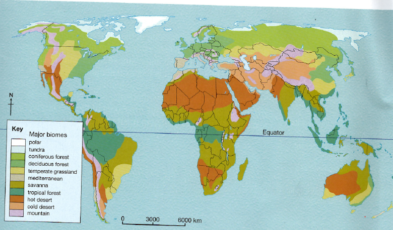
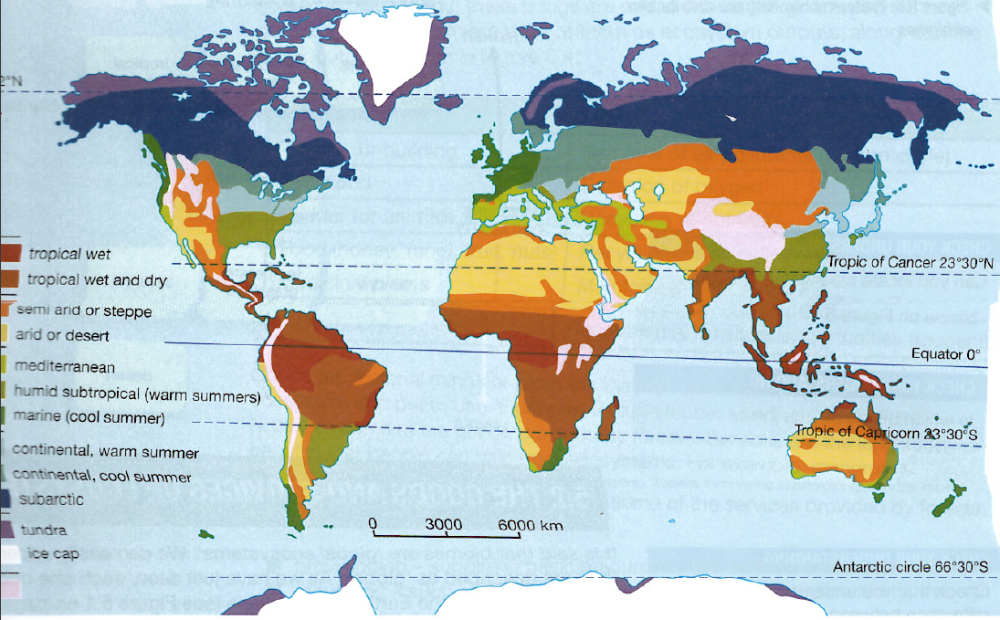

# 5.1 Biomes and Their Global Distributions
Biosphere contains all the world's plant and animal life
Biodiversity - number of variety of species found within a specific region

### Biomes - a large naturally occurring community of flora and fauna occupying a major habitat, e.g. forest or tundra.
#### Tropical Rainforest:
* Climate is warm and humid
* along the equator
* constant high temperature and rainfall
* vegetation grows more quickly
* great amount of living matter - primary productivity
* largest area in Amazon basin of South America

#### Savanna:
* along and close to the equator
* climate is much drier
* primary productivity is lower
* scattered bushes and grasses
* most extensive in Africa

#### Desert:
* general lack of vegetation due to lack of rainfall
* extends over a wide range of latitude
* Sahara Desert of Africa
* Other parts located in Asia
* range of different temperature conditions

#### Mediterranean:
* distinctive climate of winter rain and summer drought
* plants have adjusted to cope with drought conditions
* mixture of trees, low scrub and grassland

#### Deciduous forest:
* low winter temperatures
* trees shed their leaves in winter
* Three main areas: North America, Europe and East Asia

#### Temperate Grassland:
* grasses dominate the biome
* unsuitable for trees
* dry continental interiors of North America and Eurasia

#### Boreal (Coniferous) Forest:
* high latitudes and stretches as a belt across North America and Eurasia
* Leaves of trees area needle like to withstand the cold weather and loss of moisture

#### Tundra
* long and bitterly cold winters
* short hours of winter sunshine
* strong winds and the small amounts of precipitation are not favorable to plant growth
* Stretches around the north poll

#### Highland
* high mountains of the world
* similar to tundra
* very cold because temperatures decrase with altitude

# 5.2 Goods and Services of Ecosystems:
| Forest Goods | Forest Services |
| ------ | ------- |
| Timber for building| Removal of air pollutant|
| Fuelwood | Emission of oxygen |
| Fodder for animals | Recycling of nutrients |
| Medicinal plants | Maintaining biodiversity |
| Water | Recreation and leisure opportunities |

#### Def
* Provisioning - supplying basic resources such as food and water
* Regulating - such as controlling climate (temperature and humidity) through the carbon cycle and disease
* Supporting - such as cycling nutrients between biomass, litter and soil, and the water cycle
* cultural - such as the recreational and spiritual benefits provided by an ecosystem

# 5.3 Impacts of Ecosystem Exploitation
#### Different types of farming:
* Subsistence farming or commercial farming - impact of subsistence farming on ecosystems may be just about tolerable. However, whole ecosystems are obliterated by commercial farming as of its scale, its modern and powerful technologies and the pressure to maximize profits
* Arable farming or pastoral (livestock) farming - both involve ecosystem clearance and change. In general, however, a hectare of arable farmland can feed more people than if it were used for rearing livestock
* Intensive or extensive farming - both highly destructive. Intensive farming (such as market gardening) involves such as concentration of inputs that 'artificial' ecosystems are created, for example with glasshouses or poly-tunnels. Extensive farming uses large areas for example, in the USA.

*** Tropical rainforest is the most damaged out of all of the biomes due to human activities.
Caused by:
	* demand for hardwood timber
	* wish to use the land originally covered by trees for totally different purposes

# 5.4 Characteristics of Rural Environments
* Landscape - scattered settlements separated by open spaces - mainly greens paces given over to farming
* Population density - low
* Settlement - pattern is typically made up of villages, hamlets and farmsteads.
* Employment - most jobs in the primary sectors. Sometimes poorly paid which is why people live the country side to get a higher paid jobs in the urban areas
* Land use - farming is biggest use of land. Forestry, and new ones include leisure and tourism
* Accessibility - lack of development makes lack of accessibility
* Development - population pressure forces more use needs to be made of rural spaces. Involves more producing of food.
* Conservation - Rise of leisure and tourism is example of rural environments are valued and why it is maintained for the world's biodiversity.

# 5.5 Rural Changes in UK
### 4 Types of Rural Areas
* Urban Fringe:
	* suburbanization
		* building of new homes most often in the form of large housing estates
		* people need services like schools and healthcare along with parks (greenfield sites)
	* Commuter Belt
		* change due to arrival of commuters
		* people who work in nearby city or town and use its services
		* attraction of cheaper and more spacious housing
		* availability of fast transport to the place of work
		* better quality of life and is better environment to bring up a family
	* Accessible Countryside
		* still very much a rural area
		* farming, recreation and retirement migration
		* Farming: no longer major employer due to mechanization
			* farmers find other ways to produce profit
			* turning their farms into completely different businesses
				* Recreation, leisure and tourism (nature reserve or pony riding)
		* Retirement migration with people who want to enjoy 10 or more years of retirement
			* they have money
			* no longer necessary for them to live close to what their place of work was
			* downsize to a smaller home
			* sell their home for something cheaper and to use the difference in price as a sort of pension
			* move into a quieter, calmer and more attractive environment
	* Remote Countryside
		* almost totally rural
		* suffer from rural isolation due mainly to poor transport
		* depopulation and dramatic decline in farming
			* less agriculture means less jobs
			* counter urbanization
		* challenges:
			* making changes in farming
			* finding new sources of rural income
			* improving the quality of rural life
			* protecting and upgrading the rural environment

# 5.6 Rural Change in China and Kenya

Strongly influenced by:
* Economic development
* technological development
* population growth
* rural - urban migration

# 5.7 Diversification of Farming and Farms
## China
* more economic growth than any other emerging country
* economy is largest in the world
* villages have lost most of their young adults
* farming lost labor force and output declined
* urbanization worsened food supply situation:
	* growing urban population needs feeding but where is the food coming?
	* farmland is being lost as the build up areas spread rapidly
* Chinese agriculture is renowned for low productivity
	* little mechanization
	* limited availability for fertilizers
	* changing political ideas about the efficient food production
	* smallness of present farms
	* natural disasters
* change is leading to poverty and deprivation spiral

## Kenya
* GDP of 20 per cent of China
* subsistence farming leading to malnutrition and starvation
* push factors:
	* low productivity of farming
	* poor access to basic education and healthcare services
	* corruption
	* increasing droughts
	* lack of help with HIV/AIDS
	* Spread of commercial agriculture

# 5.7 Farm Diversification in the UK
* Farming accounts for 1 per cent of GDP and 1 per cent of employment due to:
	* mechanization
	* making farms larger
	* specializing in particular lines of farm produce
	* taking advantage of many advances in farm technology
* Advances including fertilizers and genetic engineering

| Arguments for | Arguments against |
| ----- | ------ |
| Higher crop yields | possible contamination of other plants|
|cheaper food | possible adverse impact on human health|
|better quality food | Expensive feed stock|
|less use of herbicides | Some crop plants do not produce seeds |

* customer beliefs:
	* cheap food is a must
	* seasonal foods must be on shelves throughout the year
* UK imports are made up of:
	* cheaply grown food from outside
	* food that can only be grown in the UK during the summer months
* Diversification
	* Farm Shops
	* Organic Farming
	* Pick - your own
	* Novel products
	* B & B (bed and breakfast)
* non-farm diversification:
	* leisure and recreation
	* redevelopment
	* energy

# 5.8 Sustainable Rural Living

#### Environmental:
* form of rural living that makes use of the environment and its resources but does little damage
* future generations will be able to continue to live there
* aim to achieve a harmony between people and the land ie. the environment

#### Economic:
* economic activities to support the local population and contribute to the regional or national economy
	* might be subsistence farming and self sufficiency or commercially might be contributing products or services to the regional or national economy

#### Social
* offers a good quality life for all, not just a selected few
* physical services such as clean water and sanitation, and social services such as education and healthcare
* unpolluted environment

#### Sustainable living needs a low ==carbon footprint== and ==ecological footprint==

## China
* China needs to :
* * increase the productivity of its agriculture in an environmentally friendly way
* retain labor in the countryside
* raise the quality of rural life

| extend the farmed area | Increase use of pesticides and herbicides |
| ---- | ---|
| enlarge farm holdings | Increase mechanization|
| Improve irrigation | Improve plant and animal breeding|
| Set up crop rotation | Grow GM crops |
|Increase use of fertilizers ||

## Kenya

* Horticulture (growing of vegetables, fruit and flowers) became one of most important export industries
	* half a million people depend on the activity and 135,000 workers
	* seventy five per cent of the flowers are grown on large farms
* land near lakes are fertile so they are used
* people live there and sewage is released without being treated
	* local fisherman decrease
* food mile requires carbon footprint to transport
* irrigation schemes are obvious but expensive solution
	* obvious obstacle lack of money
* tourism is important for Kenya's economy

# 5.9 Managing Rural Challenges
table 5.4 A in the text book about rural stakeholders in three countries:

| Level | Kenya| China | UK|
|---| ----| ----| ---|
| international | IGOS (World Bank, OECD, WHO) NGOs (Aid agencies, conservation organizations)| None| Eu, Common Agricultural policy, Environmental directives|
|	National			| Governmental departments | Government departments | Government departments, especially DEFRA and Voluntary organizations|
|Local| Farmers | Local communes, Farmers | Local government: planning controls, services & Local communities: Farmers, landowners, tourist boards|

#### Intergovernmental Organizations (IGOs)
* World bank - provides financial and technical help to countries to fight poverty and promote development
* United Nations Educational, Scientific, and Cultural Organization (UNESCO) Every child should have access to education
* World Health Organization (WHO) primary concerned with promoting healthcare and fighting diseases

Non-Governmental Organizations (NGOs)
* Conservation organizations: WWF & Friends of the Earth
* Aid agencies: Oxfam, waterAid, Save the Children

Government Departments - Focus on solutions of rural problems which include development and conservation issues
Local communities - people have different viewpoints and perspectives

Kenya - some international organizations are more powerful than the government itself as the poorest places need outside help

China - as it is a communist regimes, the power for decision should be on its people but it's clearly centralized in Beijing. Most of the stakeholders of the rural areas are not in the local level.
