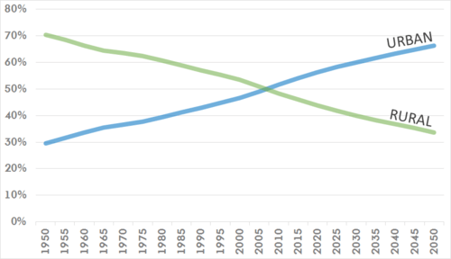
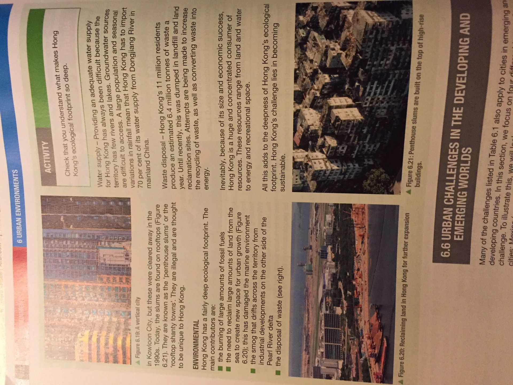
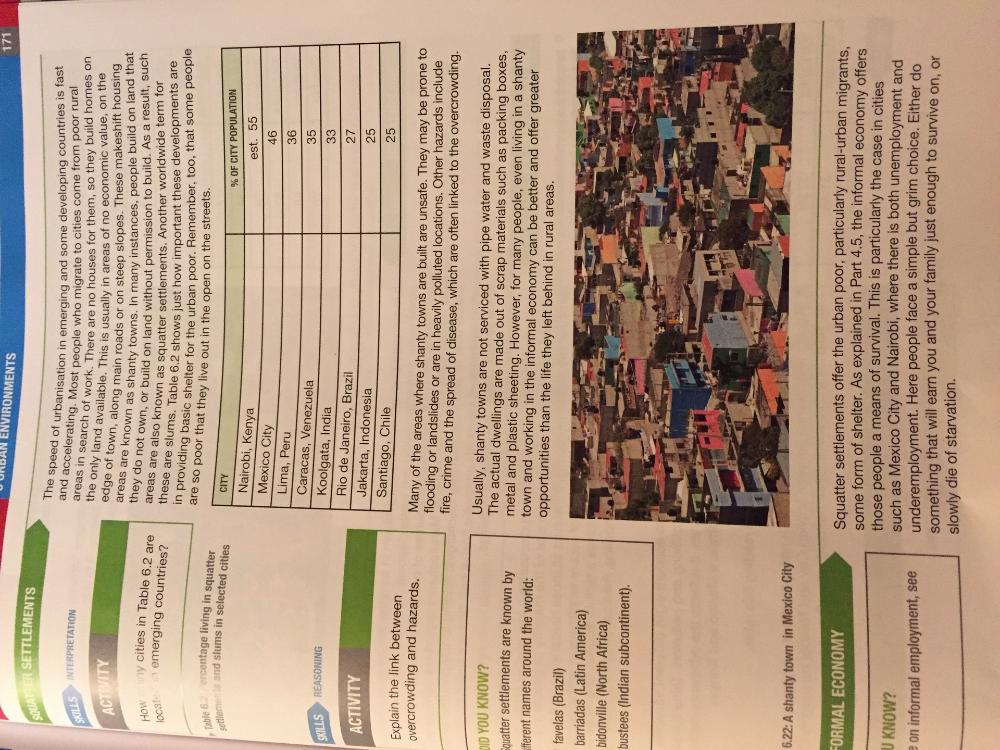

# 6.1 Urbanization and its processes
Difference of Urban areas from rural areas:
* economy: residents make a living from manufacturing and services rather than agriculture
* size: much larger in population
* density of people and buildings: generally higher
* their way of life

As the world population is increasing, the urban population is increasing at a much faster rate

High rates of urbanization occur in developing and emerging countries due to:
* Most economic development is concentrated in the big cities
* push-pull factors leading to high rates of rural to urban migration
* cities are experiencing high rates of natural increase in population

In developed countries, rates of urbanization is slower as much of the population already live in big cities. As transportation and internet allow for an urban life in rural areas, county sides are experiencing rural dilution and counter urbanization.

def
* agglomeration: concentration of people and their activities at particular locations
* suburbanization: outward spread of the urban area, often at lower densities compared with the older parts of a town or city
* urban re-imaging: changing the image of an urban area and the way people view it
* urban re-branding: developing a town or city to re-image it and change people'd idea of it; prompting a town or city to a target audience or market

## Processes
* Urban settlements are result of agglomeration
	* describes the concentration of people and economic activities at favorable locations such as river crossing points, estuary or close to mineral resource
* creation of new suburbs is encouraged by:
	* improvements in transport that allow people to move easily between the new suburbs and the town center
	* overcrowding, congestion and rising land prices in the older parts of the town
	* general decline in the quality of residential environments near the center
	* arrival of more people (mainly rural areas) and new businesses
* Due to agglomeration and suburbanization some towns grow into cities and join together into one vast continuous build up of conurbation.
* dormitory housing: people move out of the town or city altogether and live instead in smaller, often rural settlements. only normally used for sleeping and people commute from there
* urban regeneration: involves re-using areas in the old parts of cities abandoned as people and businesses have moved to the suburbs or beyond
	* allows urban re-imaging or urban re-branding, not just of city centers, but whole cities
* Urbanization of suburbs: typically areas of low density development. Ex. Vacant building plots and open spaces are being developed and large detached house are replaced by flats and maisonettes

# 6.2
## Rate of Urbanization
Main factors affecting the rate of urbanization:
* pace of economic development: economic growth that drives urbanization. When the growth of the secondary and tertiary sector is fast, so is the pace of urbanization
* rate of population growth: economic growth needs an increasing supply of labor. Demand for more workers can be met in two ways: by either natural increase in urban population or by rural-urban migration

There is a multiplier effect with economic growth encouraging population growth and population growth makes labor available and more people need more services

## Megacities

Megacity: city with population over 10 million
	* in the 1970s, there were only four
 * but there is now 35, over half in asia
 * factors encouraging megacities:
	 * economies of scale: advantages from cramming as much as possible into one megacity rather than into a number of smaller cities. There are financial savings due to the crammed distance and communication is easier
	 * multiplier effect: economic growth encouraging population growth and population growth makes labor available and more people need more services

Megacities create many problems. They tend to become powerful cores that create large peripheries around them.

Def. Periphery:area remote or isolated from the center/core of a country, it generally lags in terms of development and influence

## Global or world cities
Global and world cities can be any size
Global cities: recognized worldwide as places of great prestige, status, power and influence

# 6.3
Problems:
* Housing:
	* When people arrive, there are nowhere for them to live, especially as many are looking for low-cost housing.
	* Millions live in temporary shanty towns or squatter settlements.
	* Even for people with money, the housing market might exceed supply.
	* Most sought out housing is in the center do to the lack of transport links.
* Access to water and electricity:
	* often the provision of basic services does not keep up with the growth of population.
	* Hence, not all parts of a build-up area will be provided with running water, sanitation or electricity.
	* Many rely on fire for cooking and lighting and on polluted streams for water and sewage disposal
* Traffic congestion and transport:
	* Provision of proper roads and public transport is another aspect of city life that lags behind the growth in population.
	* Transport systems become overloaded and overcrowded, and traffic congestion becomes a major problem for everyone.
	* High number of automobiles also cause air pollution with many suffering regularly from smog.
* Health:
	* not enough doctors, clinics or hospitals to deal with the rapid increase in population.
	* Large parts of mushrooming city have little or no access leading to infections to spread quickly.
	* Atmospheric pollution leads to widespread breathing problems
* Education:
	* lack of schools. most cities manage to provide some primary education but not all children go to secondary schools due to cost and having to work
* Employment:
	* many are unable to find proper paid work
	* they are then either unemployed or become part of the massive informal sector
		* including selling goods, working as a cleaner, cooking and selling food
* Social problems:
	* high crime rates
		* murder, rape and robbery are three common crimes
	* poorest areas are often inhabited by violent street gangs involved in drug trafficking
* Environment:
	* traffic, industry and housing are among the worst polluter of air and water
	* also noise and visual pollution might occur
	* cities produce large quantities of waste and waste disposal is another cause of environmental pollution

# 6.4

## Land values
* main cause of segregation is the urban land market
* particular site within the built-up area will normally be sold to the highest bidder
* highest bidder will be that activity that can make best use of a site
* usually retail shops can make the best financial use of land and property
* depends on land value and locational needs
	* land values vary within the urban areas
		* value decline outwards from the center, from the peak land value intersection
		* relatively high land values found along major roads leading from the center and around ring roads
		* small land value peaks occur where radial and ring roads cross each other
		* businesses will pay extra for sites in these locations, because they are locations enjoying good accessibility

## Locational needs and accessibility

* Similar activities or land uses come together:
	* same locational needs: these may be large amounts of space or being accessible to customers and employees
	* can afford the same general level of land values
* retailing and other commercial businesses will cluster in and around the center
	* most accessible part of the built-up area
	* as a result of clustering, they help define a central business district
* manufacturing also needs accessible locations for the assembly of raw materials and dispatch
	* less capital intensive use of space than shops or offices
	* less buying power
	* found outside of CBD and most often along major roads that provide good accessibility and transport links
* Housing is even less competitive on the urban land market
	* pushed away from the center
	* land becomes cheaper towards the urban fringe, so houses become more spacious
* cities show concentric zoning because they grow outwards
	* def. concentric zoning: series of rings wrapping around the historic nucleus or core
	* core: oldest part of the city which normally contains the CBD and some of the earliest buildings
	* inner city ring: early suburbs so this has old housing and often some non-residential land uses
	* suburban ring: present suburbs with housing as the dominant land use
	* urban fringe: countryside being 'eroded' by the outward spread of the built-up area to provide space for housing and some non-residential uses
* Generalization for as the cities move outwards:
	* general age of the build up area decreases
	* style of architecture and urban design changes
	* overall density of development decreases

## Residential pattern
* people, like land uses, also become sorted within the urban areas
* they become segregated into groups within residential areas on the basis of social class, type of occupation and ethnicity
* people prefer to live close to those who they think are of the same status
* wealthiest people are able to buy smart and large homes in the best locations
* poorest people have to live in crammed or sub-standard housing in the worst residential areas
	* many are unable to buy a home
	* instead, they have to rent
	* they don't have space so lead to crowded and dense residences

# 6.5
* many cities in developed countries face challenges which threaten both general prosperity and quality of urban living.

|Economic|Social|Environmental|
|--|--|--|
|deindustrialization|social services and housing|ecological footprint|
|globalization|poverty and deprivation|pollution and waste disposal|
|food supply|ethnic segregation|resources: energy,land,water|
|transport and traffic|quality of life|green space|
|energy supply|ageing population| hazard risk|
|service provision|terrorism and crime|sustainability|

# 6.6 Urban challenges in the developing and emerging worlds

## Squatter settlements
* no houses for poor people coming from rural areas in search of work so they build homes on the only land available
	* usually in areas of no economic value, on the edge of town, along main roads or non steep slopes
* shanty towns: makeshift housing
* people build on land that they do not own or build on land without permission to build
	* such areas are also known as squatter settlements (same as ==slums==)
* Many of the areas where shanty towns are built are unsafe
	* may be prone to flooding or landslides or are in heavily polluted locations
	* hazards include fire, crime and spread of disease which are often linked to overcrowding
	* not serviced with pipe water and waste disposal
	* actual dwellings are made out of scrap materials such as packaging boxes, metal and plastic sheeting
* But shanty towns are better than the life being left behind in rural areas for many

## Informal economy

* informal sector provides jobs for the people in slums
* particularly the case in cities such as Mexico City and Nairobi, where there is both unemployment and underemployment

## Urban Population
* Sources
	* lack of piped water, proper sanitation and waste disposal
	* burning of fuel-wood pollutes the air
	* sources of pollution outside the slums
		* manufacturers exploit lax controls and pollute both air and rivers
	* visual pollution including graffiti, unsightly buildings and garbage in streets

## Low quality of life
* deprivation: low quality of life, standard of living below that of the majority of people in a particular city, region or country
* involves poor and congested housing, lack of secure employment, polluted environment, access to proper diet, schooling, medical treatment, leisure and recreation
* Quality of life index (QLI) takes into account eight different variables (safety, healthcare, cost of living and pollution, etc)
* two questions:
	* how would city values compare with national values: higher or lower?
	* would the differences between Mexico City and Nairobi be roughly the same as the difference between their national values?

## 6.7
Def.
greenfields: land that has not been developed on
brownfields: land that has been previously built on

* greenfield sites are normally open land around the edge of cities in demand for housing, industry, shopping, recreation and the needs of public utilities
* push factors (dissatisfaction of the urban city to move people to fringe):
	* housing is old, congested and relatively expensive
	* various forms of environmental pollution: air quality is poor, and noise levels are high
	* companies find that there is a shortage of land for building new shops, offices and factories. Unused land is costly
* Pull factors on the urban fringe
	* land is cheaper so houses are larger
	* factories can be more spacious and have plenty of room for workers to park their cars
	* closeness to main roads and motorways allows for quicker and easier customer contacts
	* new developments on the outskirts are favored by the personal mobility allowed by car drivers
* Four significant non housing developments:
	* Retail Parks
		* large increase in out-of-town retailing, with large purpose-built superstores and shopping centers located at or just beyond the urban fringe
		* number of superstores has increased dramatically
		* access is easy because the shopping centers are located next to main roads and motorway junctions
		* compared to city center shoppers don't face traffic and congestion
		* other facilities are located nearby most of the time
	* Industrial estates
		* modern light industries and service industries with a planned layout and purpose built road networks
	* Business Parks
		* areas created by property developers to attract firms needing office accommodation, rather than industrial units. Often include leisure activities such as bowling alleys, ice rinks and cinemas
	* Science parks
		* usually located close to a university or research center with the aim of encouraging and developing high-tech industries and quaternary activities

## Greenfields versus brownfield debate
|site|advantages|disadvantages|
|----|----|----|
|Brownfield| |
| | reduces the loss of countryside and land that might be put to agricultural or recreational use| often more expensive because old buildings have to be cleared and land made free of pollution|
| | helps to revive old and disused urban areas|often surrounded by rundown areas so does not appeal to more wealthy people as residential locations|
||services already in place| higher levels of pollution, less healthy|
||located near to main areas of employment| may not have good access by road|
|Greenfield| ||
||Relatively cheap and rates of house building are faster| valuable farmland, recreational space and attractive scenery lost|
|| layout is not hampered by previous development so can easily be made efficient and pleasant| development causes noise and light pollution in the surrounding countryside|
||healthier environment|wildlife and their habitats lost|
||proximity of countryside, leisure and recreation|encourages further suburban sprawl|

# 6.8 making Urban Living More Sustainable
activities to make more sustainable cities:
* use renewable rather than non renewable resources
* using energy more efficiently
* relying on public rather than private transport
* improving the physical infrastructure: clean water and proper sanitation
* improving social services and access to them
* improving the quality of life, particularly of the urban poor

==most of this adds up to single challenge: to reduce the ecological footprints of towns and cities. added to that is the aim of reducing social inequalities==

# Case Studies

# 6.9 Managing Urban Challenges
* slum management options:
	1. bulldoze and clear away
	2. clear away but relocate
	3. redevelop
	4. improve by self-help or site and services schemes
	5. ignore

## Local
* stakeholders:
	* slum residents: support anything that improves their conditions
	* residents living nearby: keen on options to clear of redevelop
	* utility suppliers: provide services and be sure about being payed
	* representatives in parliament or on city councils: keen that city dwellers get a better quality of life
	* city councils: most influence in the choice of option. they can be lobbied
	* Landowners and property developers: sites away from the squatter settlements on which replacement high density housing might be build
	* employers: interests in the supply chains due to workers working from slus
	* planners: vision for future

## National
* stakeholders:
	* Government: financial resources to support a program of action?
	* National charities: most countries have a home grown charities or small charities set up by foreigners to help people living in slums

## International
* stakeholders:
	* international charities: many international charities supporting actions aimed at particular settlement programs. Mainly to improve quality of life to target water, sanitation, health, education, food and child labor
	* inter governmental organizations (IGOs): World Bank, UNESCO and WHO sponsor projects helping the poor. channeled through national governments. Corruption can get in the way
