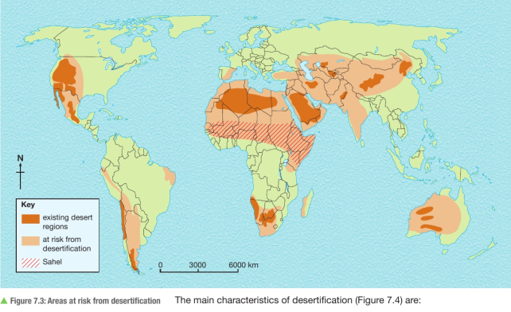
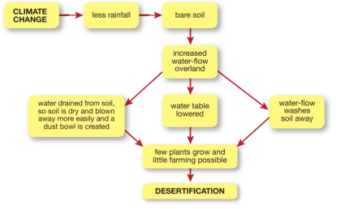
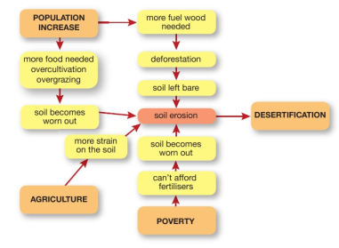

# 7.1 Fragile Environments
### Distributions:
* ecological footprint - measure of the mark that humans make on the natural world
  * considers how much land and sea are required to provide people with water, energy and food to support lifestyles
* global distribution of fragile environments is most influenced by impacts of three processes:
  * desertification
  * deforestation
  * climate change

### Desertification
- def: once producing land gradually changes into a desert-like landscape
  - process is not necessarily irreversible
  - usually takes place in semi-arid land on the edges of already existing hot deserts

Main characteristics of desertification:
  - absence of surface water
  - dried up watercourses and ponds
  - lowering of water table
  - vegetation becomes degraded or completely lost
  - increased soil erosion as bare soil is exposed to wind
  - soil becomes less usable
  - increasing presence of dry, loose land

### Deforestation
- def - cutting down of trees

# 7.2 Causes of Desertification and Deforestation

### Desertification:
- result of both natural and human causes:
- Natural causes
  - changing rainfall patterns
    - rainfall has become less predictable over the past 50 years and occasional drought year sometimes extends to several years
    - vegetation cover begins to die and leaves bare soil
  - soil erosion
    - removal of soil means less support for vegetation
  - intensity of rainfall
    - when rain does fall, it is often for very short, intense periods
    - makes it difficult for the soil to capture and store the rain
    - water store is reduced

  - Human Causes:
    - Population growth
      - rapid population increase puts more pressure on the land to grow more food
    - migration
      - local people migrate elsewhere in search of food and water
      - location where they settled increases in population which increases the pressure on the environment
    - Overgrazing
      - too many goats, sheep and cattle can destroy vegetation
    - over-cultivation
      - intensive use of marginal land exhausts the soil and crops will not grow
    - Deforestation
      - trees are cut down for fuel, fencing and housing
      - roots no longer bind to the soil, leading to soil erosion

# Case Study:
### Desertification of the Sahel, Africa

- Sahel is a narrow belt of land in Central Africa
  - borders southern edge of Sahara Desert
  - semi-arid climate
  - temperatures are always hot
  - long dry season from June through January
  - just enough of rain for grasses to grow
    - some shrubs and trees
- some years have less rainfall than others
  - fewer grasses grow and trees die
  - landscape becomes much like a desert
- climate change is one of the causes
- human activity is also speeding up desertification:
  - until 1960s, water was plentiful and crops and livestock did well in Sahel
  - then population increased
  - more and more trees were used for fuel
- despite the climate being driver, people tried to grow the same crops and rear the same number of animals
  - quickly led to over-cultivation and Overgrazing
  - absence of vegetation meant that no humus was added to the soil
