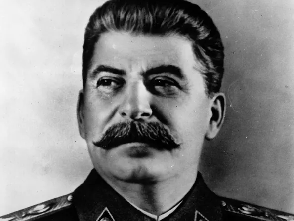
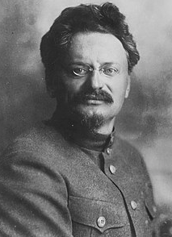
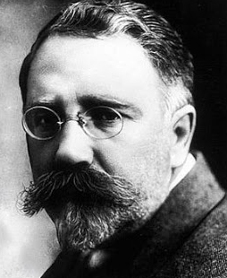
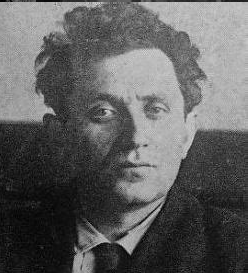

# 1.1 Soviet Union in 1924
* Soviet Union was twice the size of the USA
* Only 4 percent of the Soviet people were Industrial Workers
* Most people (80 percent ) were peasants
* Peasants - poor farmers who own or rent a small amount of land
* Created world's first communist society
* Lenin was leading the Soviet Union followed by civil war
* War communism was replaced by New Economic Policy (NEP) - Moderate advancements
* Lenin wounded in assassination attempt, died in January 1924
* States of Marxist theory
	* primitive communism
	* feudalism
	* Capitalism
	* communism

# 1.2
## Lenin's Testament:
* Communist party had to decide:
	* should the party spread ==worldwide revolution== of concentrate on building socialism in one country
	* should the party follow a policy of rapid industrialization and quickly develop Russia or keep the NEP
* Lenin wrote testament after second stroke in Dec 1922
	* Recognized that successor is likely Trotsky or Stalin
	* Trotsky was brilliant but too arrogant
	* Lenin worried that Stalin had abused positioning of General Secretary to control appointments with his supporters
	* Stalin assaulted Lenin's wife, so Lenin strongly thought that Stalin had to go
	* Mentioned Bukharin - not fully understand Marxism
* Following Lenin's death, testament was put aside and Stalin, Trotsky, Kamenev, Bukharin and Zinoviev announced they would share power

## Leadership Contenders

* Stalin
	* born in Georgia
	* had tough childhood and grew up in poverty
	* father was a shoemaker, alcoholic and often violent
	* Stalin was sent to church school to train as a priest but instead hated Tsarist system and became Communist Revolutionary
	* Joined the Bolshevik party in 1903
	* Became tough activist
	* organized bank robberies to raise Party funds
	* Arrested and twice exiled to Siberia, but escaped each time
	* Didn't play a big role in October Revolution but worked hard on many committees
	* Refused Trotsky's orders, Stalin hated Trotsky
	* Lenin admired him for humble origins
	* made general secretary, boring job but ran the administration of the Communist Party
	* regarded as political moderate, generally kept a low profile i n meetings

* Trotsky
	* born to a wealthy Jewish farming family in Ukraine
	* Talented university student
	* arrested in 1898 for revolutionary activities and sent to Siberia, escaped
	* Made him famous in 1905 unsuccessful revolution, he escaped Russia and spent 12 years abroad in many countries
	* until 1917, refused to join the Bolsheviks
	* Lenin's right hand man, together planned and led the October Revolution
	* 1918 became Commissar of war, created and Controlled the red army
	* highly regarded for charisma and inspiration speech, but disliked for personality of arrogance
	* promoted worldwide revolution
	* suffered fever attacks frequently

* Kamenev
	* working class upbringing
	* joined Bolsheviks early in 1903
	* spend time in Siberia with Stalin
	* Head of Moscow Communist Party and acting head of Soviet government
	* Supports rapid industrialization and end of NEP
	* opposed Lenin's plans for October Revolution
	* Played little part in the Civil war
	* too cautious

* Bukharin
	* family of teachers
	* exiled as a Bolshevik in Tsarist times
	* Helped in October Revolution
	* popular and young, Lenin called him "golden boy"
	* brilliant thinker and writer
	* Editor of Pravda, party's most important political newspaper
	* supports the NEP instead of rapid industrialization
	* inexperience
	* disagreed on Marxism with Lenin
	* Strong support for NEP, unpopular with many

* Zinoviev
	* son of a prosperous farmer
	* Early Bolshevik in 1903
	* Fear of arrest made him flee Russia, where he join Lenin in Exile
	* viewed by Lenin as a close friend
	* Head of the Comintern and the Communist party in Leningrad
	* Favor of rapid industrialization, opposes NEP
	* not popular, seen as not so talented
	* stayed in luxurious hotels during civil war instead
	* opposed October revolution

# 1.3 Strengths and Weakness of Stalin and Trtsky
* Stalin
	* Advantage
		* ordinary members like Stalin
		* Lenin called him "wonderful Georgian"
		* General Secretary
		* people tired of war, they prefer "socialism in one country" instead of Worldwide Revolution
	* Weakness
		* Testament called for removal of Stalin
		* dull and no personality
		* didn't enroll in revolution
* Trotsky
	* Advantage
		* long revolutionary background
		* Lenin's right hand man
		* Planned Oct Revolution
		* war hero, created the Red Army
		* popular among younger, more radical people
		* brilliant organizer and can get things done
		* intelligent, party's greatest thinker
		* powerful as the leader of Red Army
	* Weakness
		* late Bolshevik
		* arrogant
		* anti-Semitic members don't like that he's Jewish
		* spent time outside too much and people think he's too 'western'
		* don't like political tactics
		* people oppose worldwide revolution

# 1.4 Stalin's Steps to Power
### Positions on the political spectrum:
* Left wing - radicals who wanted rapid building of communism. Require ending of NEP, launch rapid industrialization and spread worldwide revolution. ==Trotsky, Zinoviev, Kamenev==
* Right wing - lead by ==Bukharin==, supported the NEP and slow industrialization of Russia. Wanted socialism in one country
* Stalin avoided taking extreme positions

Steps:
* Stalin used funeral to present himself as Lenin's loyal follower
	* main the main speech
	* Stalin told Trotsky the wrong date of the funeral
	* Trotsky so appeared rude to now show up in the funeral
* Stalin didn't want Testament published
	* May 1924 Lenin's wife gave testament to the Central Committee
	* Zinoviev and Kamenev also didn't want it published because
		* Testament contained embarrassing remarks that they didn't support the revolution
		* did not see Stalin as a threat in the power struggle
		* thought that the testament would help boost Trotsky
	* Trotsky and Stalin stayed quiet and went along with the decision to not publish the testament
* Defeat of Trotsky
	* seen as the most likely to win power struggle
	* Stalin, Kamenev, Bukharin and Zinoviev formed anti-Trotsky alliance supporting the NEP
	* alliance dominated the party
	* Trotsky's disagreements with Lenin was highlighted in speeches and articles
	* Claimed that Trotsky exaggerated his role in Oct Revolution
	* Stalin rarely contributed to the Alliance, Zinoviev and Kamenev took out Trotsky
	* Trotsky made a speech about industrialization but Stalin appointed his supporters so all of Trotsky's proposals were rejected
	* Trotsky lost position as head of the Red Army and left politics
* Defeat of the United Opposition
	* Anti-Trotsky alliance split apart
	* Bukharin and Stalin shared view of the NEP and socialism in one country as it was popular and patriotic
	* Stalin and Bukharin controlled the Media and dominated the party
	* Zinoviev and Zinoviev with Trotsky made the United Opposition
		* called for rapid industrialization
		* worldwide revolution
		* but they made mistakes:
			* lost respect, looked bizarre that Kamenev and Zinoviev suddenly allied with Trotsky
			* Congress was packed with Stalin's supporters, who weren't nice to Zinoviev and Kamenev
		* Stalin accused them of =='Factionalism'==, banned from Lenin era
		* so congress expelled all three from the party
* Defeat of Bukharin
	* 1928 Stalin made dramatic U-turn to leftist ideas
		* rejected the NEP in favor of rapid industrialization
		* general mood in party shifted against the NEP as people saw its failures
		* people got afraid of western countries invading Russia and relied on faster development
		* Stalin was no longer a 'gray blur' and had a clear viewpoint in the party
	* Bukharin was outvoted and had nothing he could do

## Reasons behind Stalin's victories
* importance of policies
* Position as general secretary
* political skill and personality
* weakness and mistake of opponents

# 2.1 Stalin and Industrialization
* began twin economic policies
	* rapid industrialization
	* collectivization
* Aims:
	* wanted to create a modern economy based on heavy industry and highly mechanized farming sector
	* wanted economy to be compete with Western countries
	* economically self-sufficient in order to prepare it for war

## Reasons for Industrialization:
* seemed to offer better alternative to the NEP economically
* Ideologically, would remove class enemies and move the country towards communism
* Militarily prepared the country for war
* Political promise to increase Stalin's power
* Failures of NEP
	* money was introduced
	* forced grain seizures from peasants were stopped
	* peasants independently sold crops for profit
	* small businesses an factories were privatized
	* business could make and keep profits
	* only large industries were state owned
	* although it recovered from damage of civil war, but couldn't catch up to Tsarist economic achievements
	* high rates of unemployment
* Ideological Reasons
	* soviet union had capitalist economy
	* two groups of hated NEP people
		* Nepmen - insult used for people who had set up businesses under the NEP and became successful
		* Bourgeois experts - for former factory owners and managers from Tsarist times
* Fear of invasion
	* Britain, France, USA, Japan had all intervened on the side of the White Armies
	* Churchill spoke about strangling 'Bolshevism in the cradle'
	* Events that convinced danger for Soviet Union
		* British government accused Soviet officials spreading revolutionary propaganda and searched the Soviet trade mission in London and then broke off diplomatic relations
		* Chinese Communists under Mao Zedong were attacked by nationalists
		* Soviet diplomat was assassinated in Poland
* needed an armaments industry to make tanks and planes
* Political motives
	* divide Stalin's opponents on the right wind
	* placed Stalin alongside Lenin

## Nature of Industrialization
* State Committee for Planning (Gosplan) was given the task of creating series of five year plans
* command economy was admired
* First Three Five Year Plans focused on:
	* heavy industries, coal, oil, steel, electricity
	* consumer industries were overlooked
	* plans were declared complete ahead of schedule
	* targets were rarely met, important advances in industry were made
* Goals for Five Year Plans
	* First Oct 1928 - Dec 1932
		* Plan
			* expand heavy industries
		* Successes
			* economy grew by 14 percent each year
			* coal and iron output doubled
			* steel production increased by 1/3
		* Weaknesses
			* many targets not meat because unrealistic
	* Second Five Year Plan Jan 1933 - Dec 1937
		* Plan
			* expand heavy industries
			* develop new chemical industries
			* improve railway, canal and road transportl inks
		* successes
			* more realistic targets
			* advance in heavy industry
		* Weaknesses
			* consumer industries received little investment
	* Third Five Year Plan Jan 1938 - June 1941
		* Plan
			* Expand heavy industry
			* Armaments production
		* Successes
			* one third of government investment was spent on defense
			* basis of powerful arms industry was laid
			* aircraft factories established
		* Weaknesses
			* Stalin's purges led to arrest of experienced people
			* Nazi invasion of Russia in June 1941 cut the plan short
* Stahkhanovites
	* Five year plan gave sense of excitement and purpose
	* Alexei Stakhanov mined 14 times the output of a normal miner
		* he was praised by the government
		* new apartment
		* 1 month of wage
		* holiday
		* campaigned for the 'Stakhanovite movement'
			* Propaganda posters and news reports held him up as a model of Soviet worker
			* statues were built
			* toured the country, encouraging other workers to follow his example
			* workers were promised rewards for working hard

## Success and Failures of Industrialization:
* Success:
	* heavy industry, oil output had doubled, coal, iron, electricity and steel production multiplied
	* advances in transport with large expansion of railway
	* modern armaments industry
	* increased size of the working class
	* gain for the workers, unemployment vanished
* Failures:
	* quality of goods were not prioritized
	* high levels of waste
	* targets set by the Gosplan were unrealistic
	* People lied everywhere on the economy
	* show piece projects (special projects like the Moscow underground, designed to impress the rest of the world) relied on forced labor
	* gave little thought to improving ordinary lives
	* shortage of consumer goods
	* working conditions were bad
* Magnitogorsk
	* steelworks construction made new city Magnitogorsk
	* remote, uninhabited area next to mountain with unusually high levels of iron ore
	* became symbol of soviet achievement
	* majority of workers lived in mud huts
	* built by political prisoners

# 2.2 Stalin and Collectivization
Smychka (collaboration in society) - idea of alliance between the urban workers and peasantry

## Economic Reasons:
* modernize the inefficient and outdated farming system
	* most farms were small and divided into strips
	* most crops harvested by hand
	* machinery was never used
	* fertilizers were unknown
* Collectivization can use combine harvesters because collective farms would be much larger
* it would increase in food production to aid:
	* workers in towns
	* government could sell more food abroad and pay for expensive foreign technology
	* by mechanizing the farms, fewer people would be needed to work on the land

## Ideological Reasons:
* NEP pushed capitalist beliefs
* Collectivization would rebuild communist values:
	* private landownership would be abolished, everyone would be of the same status
	* all the produce would go to the sate, peasants would no longer be motivated by desire to make money
	* instead of working on individual farms, farmers work together

## political reasons:
* opposing NEP was one way of gaining the upper hand in power struggle against Bukharin
* gave power to the communist party

## Gain Procurement Crisis
* short term cause of collectivization
* government could not buy enough grain to feed the urban workers
	* peasants had reduced grain production because of the low prices
	* farmers were withholding their grain from the market in order to push prices up

## Nature of Collectivization:
* Dec 1929 Stalin called for all out collectivization
* showed it as a voluntary process but never worked
* Stalin was forced to send in the army and secret police to enforce policy violently
* Opposition & removal of the kulaks
	* Kulaks rebelled the hardest because they worked hard under the NEP and made enough money to buy additional farm land and even hire other worker
	* communists believed kulaks were dangerous and greedy capitalists
	* 1929 Stalin gave a order to 'Liquidate the kulak as a class'
	* kulaks were forbidden from joining farms but was rounded up by dekulakization squads made up of army units and secret police
	* around 2 million were loaded onto cattle trucks, transported to siberia for forced labor
	* Kokhozes and Motor Tractor Stations:
		* kolkhoz - state farm
		* peasants were paid a fixed wage by the government
		* most peasants ended up working on collecve farms
		* Kolkhozes features:
			* 50-100 familes
			* ran by chairman, who was a communist member
			* hours are set by the state
			* money was shared
			* not allowed to leave
			* small private lands provided
		* Motor Tractor stations (MTSs) were sent up for renting tractors
			* 1940 MTSs for every 40 collective farms
			* never had enough tractors
			* unreliable
			* badly maintained
			* mechanics lacked necessary skills
			* became hated by peasants because MTS had officials who handed over their grain quotas and had the job to spread communist propaganda and spy on the peasants

## Success and Failures
* by 1935 over 90 percent of soviet farmland collectivized
* Failures
	* collapse in food production in short term
	* between 1928 and 1933 crop production fell by 7 percent
	* livestock decrease, cattle numbers halved
	* motor tractor stations did not have enough machinery
	* Dekulakisation removed most skilled workers
	* productivity was poor, people worked on their own farms
	* remained a major weakness in economy
* Great Famine 1932-33
	* contributed to a widespread famine
	* 4-5 million people died
	* Ukraine was hardest hit
	* people even ate their kids
	* when quotas was not met, Stalin claimed it was deliberate sabotage
	* collective farm managers came from towns and din't know what they were doing
	* peasants bitter about losing their land put little effort into their work
	* during famine, state kept the food seizures
	* hiding corn was exiled or shot
	* people could not leave due to military checkpoints
	* Holodomor - Ukraine hunger
	* Stalin could have done it to punish peasantry for their heavy resistance
* Success
	* fed workers in the towns and cities - by 1934 rationing of bread and many other foods ended
	* sell crops abroad to pay for industrial equipment
	* over 19 million peasants had moved to the cities
	* countryside was under communist control
	* system of internal passports to stop leaving farms
	* peasants complained about a 'second serfdom' realizing that they got a new landlord just like the Tsarist times who didn't care much
	* class division was removed
