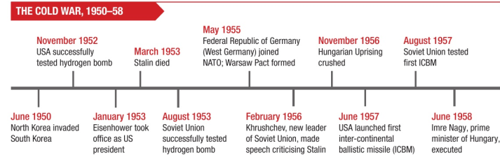
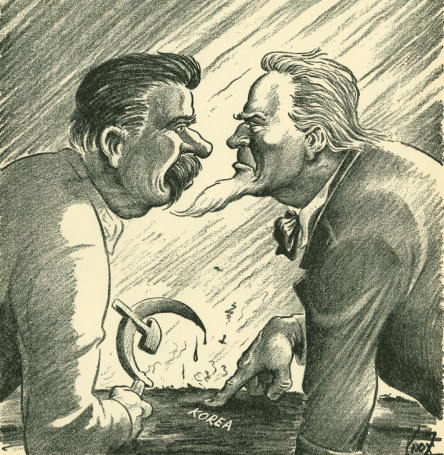
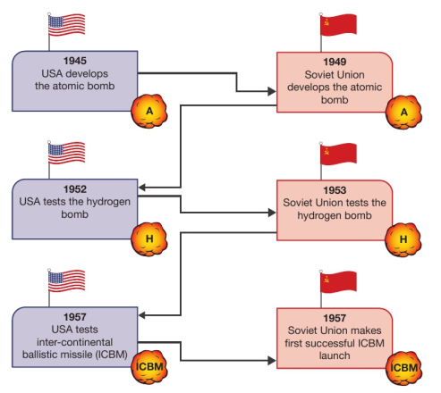

# 3.1 From Korea to Hungary

## Impacts of Korean War
- Korea was freed from Japanese control in 1945
  - forces from the Soviet Union entered the north of the country and those from the south entered the south
  - division was agreed between 'North' and 'South' Korea along the 38-th Parallel
  - People's Democratic Republic of Korea (North Korea)
  - Republic of Korea (South Korea)
  - North Korea received aid and military equipment from the Soviet Union
  - South Korea received similar support from USA
  - Both nations claimed to be the rulers of the whole country
- President Truman was determined that South Korea should not become communist
  - Americans were already trying to stop the spread of communism in Europe
  - feared that there would be a domino effect in Asia if South Korea becomes communist

### War
- June 25, 1950 - North Korean forces invaded South Korea
  - Security council of the UN met to consider actions at the request of the USA
  - Soviet Union was not attending the meeting at the time
    - was unable to stop the decision being made to support South Korea
  - North Korea was told to withdraw from South Korea
    - failed to do so
  - UN force from 16 countries put together to help South Korea
    - Vast majority of the troops were Americans
    - Commander - General Douglas MacArthur
  - pushed the North Koreans back across the 38th parallel
    - continued advance until close to the Chinese border
  - Communist Chinese entered the war and pushed the UN forces out of North Korea
    - Mao Zedong did not want to see American led forces defeat communist colleagues
  - MacArthur disagreed with Truman on how the war should be fought
    - MacArthur dismissed in April 1951
  - war continued for 2 more years
  - Final peace left the border at 38th Parallel
  - UN claims the operation successful as North Korea has been pushed back to the border

### Impacts of the War
- War had major impacts on relations between East and West
  - USA now committed itself to supporting other countries in Asia that were trying to resist communism
    - strengthened its land forces in Europe
    - encouraged Greece and Turkey to join NATO
    - Defense budget of the US tripled after the Korean war
  - September 1954 - USA, Britain, France, New Zealand, Australia, Thailand, and Pakistan joined together in the Southeast Asia Treaty Organization (SEATO)
    - purpose to stop spread of communism in Southeast Asia
  - Soviet Union was worried about the US strengthening its armed forces
    - 1950 - 2.8 million Red army soldiers
    - 1955 - 5.6 million Red army soldiers
  - West Germany joined NATO in 1955:
    - USSR brought tother eight communist countries in the Warsaw Pact
    - expected members to come to defense of any member attacked by an outside force

## Impacts of the Arms Race

- USA felt secure knowing it was the only country in the world with a powerful weapon after developing atomic bomb in 1945
- President Truman knew that the atomic bomb was important counter to the Soviet Union's much larger stocks of conventional weapons
- Stalin instructed his scientists to put all their energies into developing a Soviet Atomic bomb
  - achieved in 1949
- US developed hydrogen bomb in 1952
  - 1000 times more powerful than the atomic bomb
  - restored American advantage
- Soviet Union had hydrogen bomb in 1953

- 1957 - US develops a ICBM (inter-continental ballistic missile)
  - cold fire a nuclear weapon at a target approximately 5,000 km away
- USSR was testing first ICBMs few months later 
